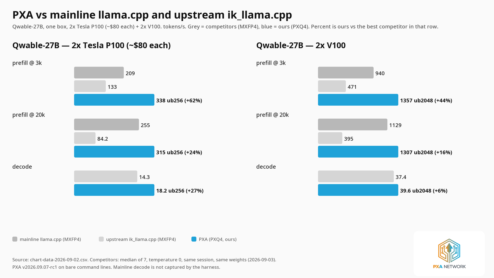
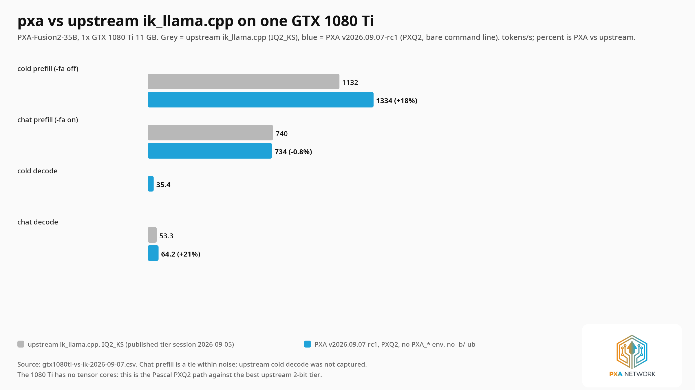
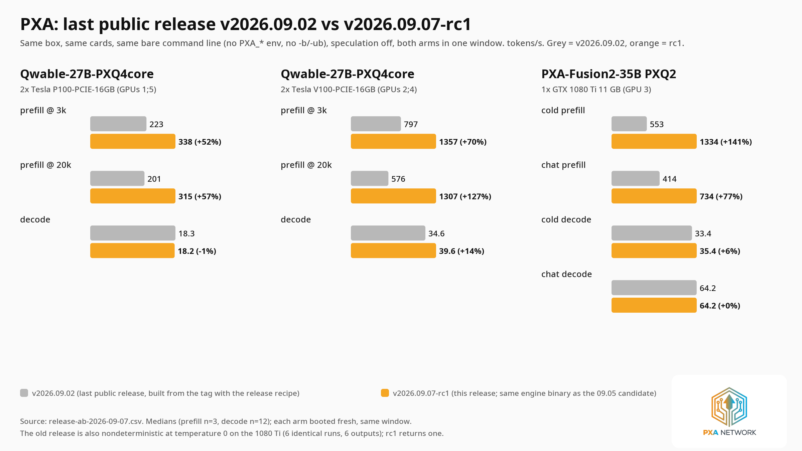
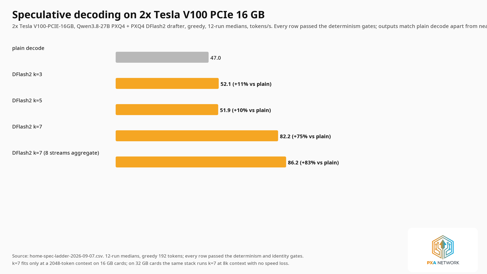
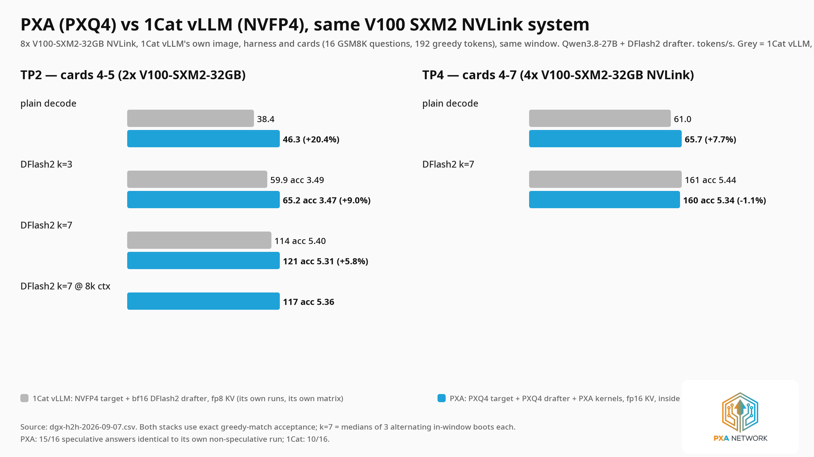
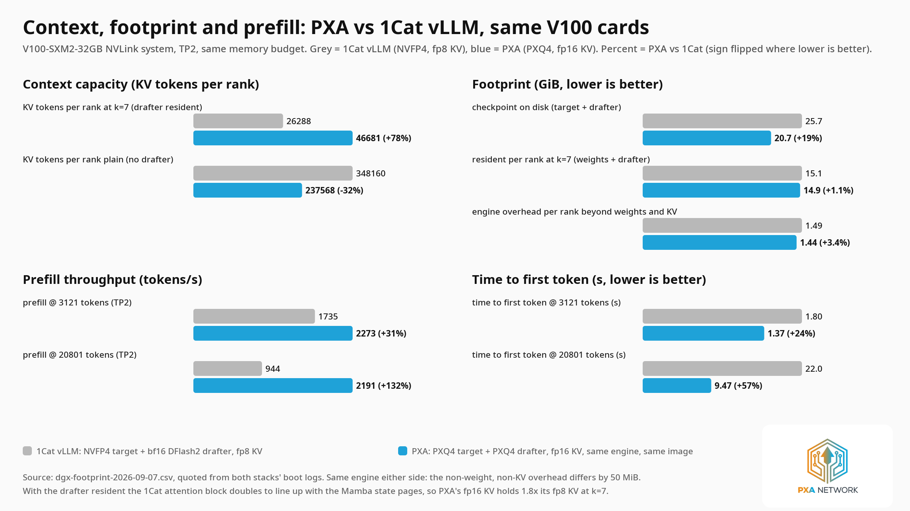
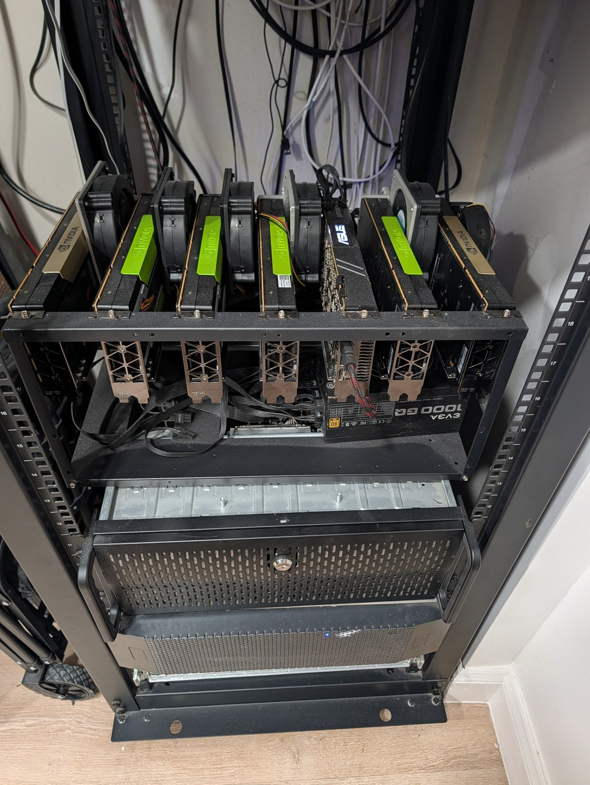

<p align="center"></p>

<h1 align="center">PXA — the set-and-forget LLM engine for Pascal and Volta</h1>

<p align="center">
<a href="https://github.com/poisonxa16/pxa/releases/tag/v2026.09.07-rc1"><b>v2026.09.07-rc1</b></a> ·
<a href="https://discord.gg/EqazvV9tf"><b>Discord</b></a> ·
<a href="https://huggingface.co/poisonxa"><b>Weights</b></a> ·
<a href="RELEASE-NOTES-2026-09-07.md"><b>Release notes</b></a> ·
<a href="docs/ENGINE.md"><b>Engine reference</b></a>
</p>

<p align="center">
<a href="https://github.com/poisonxa16/pxa/releases/tag/v2026.09.07-rc1"></a>
<a href="LICENSE"></a>
<a href="tools/vllm-pxq4/LICENSE-NOTICE.md"></a>


<a href="https://discord.gg/EqazvV9tf"></a>
<a href="https://ko-fi.com/shatteredrealms1"></a>
</p>

<p align="center">
<b><a href="#5-against-1cat-vllm-on-its-own-hardware">2.3× the long-prompt prefill of the next-best Volta engine — on that engine's own hardware</a></b><br>
<b><a href="#models-and-cards">A 177B-class MoE with 150k of context, on four Tesla P100s</a></b><br>
<b><a href="#3-against-our-own-last-public-release">Prefill roughly doubled since my last public release — with zero flags</a></b>
</p>

---

**You name your cards and your model. The engine decides everything else, prints why, and
serves.** No `-b`, no `-ub`, no `-sm`, no cache-type, no environment variables, no lever
spreadsheet. On the card topologies this project has measured, the server fills in its own
batch geometry from a measured table, arms the levers that are known to pay on *that* silicon,
declines the ones that do not, and prints the whole decision before it starts. Every number on
this page was taken that way — bare command line, nothing exported — against competitors that
were given their best hand-picked flags in the same session.

That is the whole pitch. It runs on a Tesla P100 you can buy for the price of a game, on a
V100, and on a GTX 1080 Ti; it runs 27B dense-hybrid and 122B/177B-class MoE models with their
weights in VRAM — Flash-Next keeps its 51B-parameter per-layer embedding table in host RAM by
design — and it is the only engine family in these comparisons that runs these models on Pascal
at all.

```bash
python3 tools/pxa-launch.py     # lists your cards, lists your models, asks nothing else
```

---

## Try it in five minutes

Download the tarball from [the release](https://github.com/poisonxa16/pxa/releases/tag/v2026.09.07-rc1),
untar it, get one GGUF, run one command. Model files and their sha256 are listed in
`bench/fair/weights/MANIFEST.sha256` inside the package; the weights live at
[huggingface.co/poisonxa](https://huggingface.co/poisonxa).

```bash
tar xzf pxa-v2026.09.07-rc1-linux-x86_64-cuda12.8-sm60_61_70.tar.gz && cd pxa-v2026.09.07-rc1
cat START-HERE.md                    # requirements, model links, three steps
./pxa-launch -m /path/to/model.gguf  # picks everything; --explain to decide and run nothing
```

If you would rather see the exact command for your cards, this is what the launcher picks — and
what you can type yourself:

| your cards | model to grab | the command |
|---|---|---|
| 1× GTX 1080 Ti 11 GB | `PXA-Fusion2-35B-PXQ2.gguf` | `./run-server.sh -m PXA-Fusion2-35B-PXQ2.gguf -ngl 99 -c 8192 --ctx-checkpoints 0` |
| 1× Tesla P100 16 GB | `fusion2-35b-U16-q8head.gguf` | `./run-server.sh -m fusion2-35b-U16-q8head.gguf -ngl 99 -c 8192 -fa on` |
| 1× Tesla V100 16 GB | `fusion2-35b-U16-q8head.gguf` | `./run-server.sh -m fusion2-35b-U16-q8head.gguf -ngl 99 -c 8192 -fa on` |
| 2× Tesla P100 | `Qwable-27B-PXQ4core.gguf` | `./run-server.sh -m Qwable-27B-PXQ4core.gguf -ngl 99 -c 32768 -t 16 -fa on -sm layer` |
| 2× Tesla V100 | `Qwable-27B-PXQ4core.gguf` | *the same line* — the engine picks `-b 8192 -ub 2048` here and `-b 8192 -ub 256` on the P100 pair |
| 4× Tesla P100 | Flash-Next hybrid MoE, PXQU mixed tiers | `./run-server.sh -m <model>.gguf -ngl 99 -c 150016 -np 2 --kv-unified --no-context-shift` |

Notice what is **not** in those lines: no `-b`, no `-ub`, no `PXA_*` environment. The per-card
table the launcher chooses from, with the measured result and the source for every row, is
[`docs/LAUNCHER.md`](docs/LAUNCHER.md); the hand-written equivalents are
[`docs/COOKBOOK.md`](docs/COOKBOOK.md).

---

## The measurements

Six charts. Each one is generated from a CSV in [`docs/data/`](docs/data), so every bar is checkable;
the protocol behind each is in [How these numbers were taken](#how-these-numbers-were-taken).
Dark variants of every chart sit next to these in [`docs/assets/`](docs/assets).

### 1. Against mainline llama.cpp and upstream ik_llama.cpp



Same weights family, same session; competitors at their best hand-picked flags, PXA on a bare command line.

### 2. Against upstream ik_llama.cpp on a single GTX 1080 Ti



Chat prefill is a tie and is drawn as one.

### 3. Against my last public release



Identical command line, both arms in one window. The one regression, P100 decode at -0.9%, is real and stays on the chart.
The old release also returned six different outputs for six identical greedy runs on the 1080 Ti; this one returns one.

### 4. Speculative decoding on two V100 PCIe 16 GB cards



Lossless: exact greedy match, zero logit spread at 1 and 2 concurrent sequences. `k=7` fits at a 2,048-token context on 16 GB
cards; these rows need the `sm70` sidecar image and the drafter release asset, not the tarball.

### 5. Against 1Cat vLLM on its own hardware



8x V100-SXM2-32GB NVLink, 1Cat vLLM's own image, benchmark script and contract (16 GSM8K questions x 192 greedy tokens).
Both stacks accept drafted tokens by the same exact-match rule. The TP4 `k=7` row is inside 1Cat's own run-to-run spread and is not
claimed as a win; the TP2 `k=7` medians were not taken in one alternating window. Their checkpoint enables fp8 KV by itself, so this is
their stack as shipped against PXA as shipped, not NVFP4 against PXQ4 in isolation. Speculative output matched plain decode on
15/16 prompts for PXA and 10/16 for 1Cat.

### 6. Context, footprint and prefill on the same memory budget



Quoted from both stacks' boot logs and the same server window. Without the drafter resident, 1Cat's fp8 KV holds more tokens than
PXA's fp16 KV; that row is on the chart too.

---

## What you get

Three ways in. All three end at the same binaries.

**Tarball — untar and run.** No Docker, no toolchain, no `pip install`. Built in a CUDA 12.8 /
Ubuntu 22.04 image so the **glibc floor is 2.35**, and proven booting in a bare `ubuntu:22.04`
container with no `python3`, `curl`, `gcc`, `cmake` or CUDA toolkit present.

```bash
tar xzf pxa-v2026.09.07-rc1-linux-x86_64-cuda12.8-sm60_61_70.tar.gz
cd pxa-v2026.09.07-rc1
cat START-HERE.md          # requirements, model links with hashes, three steps
./run-server.sh -m your-model.gguf -ngl 99 -c 8192
```

**Container.**

```bash
docker run -d --name pxa --gpus '"device=0"' -p 8080:8080 \
  -v /path/to/models:/models:ro \
  ghcr.io/poisonxa16/pxa:v2026.09.07-rc1 \
  -m /models/your-model.gguf -ngl 99 -c 8192
```

The vLLM sidecar images are `ghcr.io/poisonxa16/pxa-vllm:sm70` (Volta, with the speculative
stack above) and `:sm60` (Pascal). See [`docs/VLLM.md`](docs/VLLM.md).

**From source.** One `cmake` pair inside the CUDA devel container —
[`BUILD-FROM-SOURCE.md`](BUILD-FROM-SOURCE.md).

**And then run the launcher, not a flag list:**

```bash
python3 tools/pxa-launch.py
```

It lists the NVIDIA cards in the box with VRAM and whether something else is already resident on
each; lists the model files it can find with family and PXQ tier read out of each file's own
header, and whether each fits the cards you ticked; asks what the seat is for (chat / serve /
long documents) — the one performance question a human has to answer on these cards; and then
picks the engine, the batch sizes, the tensor split, the flash-attention regime, the chat
template and the environment, **printing the evidence line behind every choice before anything
starts**. `--explain` decides and runs nothing. Full details in
[`docs/LAUNCHER.md`](docs/LAUNCHER.md); the same table written out as copy-paste commands is
[`docs/COOKBOOK.md`](docs/COOKBOOK.md).

**Leaving PXQ.** A PXQ file only loads on this engine — stock llama.cpp and stock ik_llama.cpp
cannot load a PXQ tensor, full stop. `llama-pxq-export` turns one back into a plain GGUF so any
stock reader can open it:

```bash
./build/bin/llama-pxq-export in.gguf out-f16.gguf --cpu
./build/bin/llama-quantize --allow-requantize --i-know-this-is-double-lossy out-f16.gguf out-Q4_K_M.gguf Q4_K_M
```

Proved end to end on a 5.6 GB PXQ4 file, CPU only: export to F16 (109s) then requantize to
Q4_K_M (87s) produced a file a stock `llama-cli` build loaded and generated from with no PXQ
support compiled in. Details and the full recipe: [`docs/COOKBOOK.md`](docs/COOKBOOK.md#leave-pxq-export-and-requantize-to-a-stock-type).

---

## How it decides for you

**`ENHANCE` is the default level.** Not a flag you discover in a forum thread — the level the
server boots at. `PXA_ENHANCE=0` rolls back to the previous behaviour; `PXA_REFERENCE=1` is the
bit-exact all-levers-off baseline for bisecting.

**It fills in `-b`/`-ub` per topology, from measurements.** 2× V100 → `-b 8192 -ub 2048`;
2× P100 → `-b 8192 -ub 256`; 4× P100 → `-b 2048 -ub 2048`; 1× GTX 1080 Ti → `-b 2048 -ub 768`.
Any explicit `-b`/`-ub` on your command line always wins. Card sets outside the table fall
through to an adaptive-VRAM ladder that now honours the real per-device split instead of
assuming an even one.

**It prints the decision.** At boot you get a `PXA_AUTO` block naming the topology it detected,
the flags it chose and why, so the choice is auditable rather than assumed:

```
PXA config level: ENHANCE
PXA_AUTO: batch defaults for 2x V100 (sm_70) -> -b 8192 -ub 2048
PXA_AUTO: spec DECLINED -- single-card sm_61
```

**It arms levers only where they were measured to pay** — `ROUTER_FUSE` and `CUBLAS64` on the
V100s, `INT8_PREFILL` on the 1080 Ti — and it **declines out loud** where they do not, including
speculation.

**Automatic is not a downgrade from expert.** On the 177B-class MoE seat across four P100s,
with no batch flags and no environment at all:

| | prefill @3.1k | prefill @20.8k | decode |
|---|---:|---:|---:|
| previous automatic choice | 377.9 t/s | 284.9 t/s | 23.62 t/s |
| hand-tuned: 12 environment levers + explicit `-b`/`-ub` | 485.7 t/s | 344.1 t/s | 23.74 t/s |
| **this release, fully automatic** | **487.62 t/s** | **376.71 t/s** | **24.57 t/s** |

**Ten levers were measured this cycle and ship OFF**, each one written up with the number that
killed it, so nobody spends a session rediscovering them — see
[Documented negatives](RELEASE-NOTES-2026-09-07.md#documented-negatives).

**The release gate is 11/11** on both a hybrid MoE and a stock dense GGUF, including a
token-0 logit-reproducibility arm at `np=1` and `np=2`. Determinism is gated, not asserted — and
the gate ships in this repository, so you can run the same one:

```bash
MODEL=/path/to/your-model.gguf ./bench/gate/run-gate.sh
```

It exits `0` only if every check passed, and prints `FAIL` or `SKIP` with a reason for anything
that could not be run honestly. What each check catches is written out in
[`bench/gate/README.md`](bench/gate/README.md).

### How this differs from the alternatives

Mainline llama.cpp and ik_llama.cpp are excellent, broadly compatible engines and this one
descends from both. The difference is not quality — it is **who picks the numbers**. Those
engines expose `-b`, `-ub`, `-sm`, `-fa`, cache types, split modes and a long tail of
environment switches, and leave the operator to find a good combination for their card. In
every chart above, their bars were taken with flags **picked by hand in the same session**;
PXA's were taken with **none**. If you already know your best flags on Pascal or Volta, you can
pass them here and they win. If you do not want to learn them, that is the case this project
optimises for.

---

## Models and cards

**Cards.** Tesla P100 (`sm_60`), GTX 10-series / 1080 Ti (`sm_61`), Tesla V100 (`sm_70`) —
compiled for exactly those three architectures. Kernels are written for a chip with **no DP4A
and no tensor cores**, rather than ported down from one that has them.

**Codec.** PXQ is the quantization codec (the project is PXA; PXQ is the format). PXQ1 through
PXQ6 plus **PXQ_UNIVERSAL** — a mixed-tier layout that sizes a model to the cards you actually
have. PXQ4 and PXQ4-HQ carry a CPU integer-dot path as well; PXQ2 and PXQ3 are 2- and 3-bit
tiers sharing one layout and one kernel family with PXQ4. [`docs/QUANTIZING.md`](docs/QUANTIZING.md),
[`docs/PXQU-CONVERT.md`](docs/PXQU-CONVERT.md).

**Models.** 27B dense-hybrid and 35B MoE fully in VRAM on a single 16 GB card at the low tiers;
multi-card 122B-class MoE spreads; and **Flash-Next, a 177B-class hybrid MoE, on four P100s
with 150k+ of context** via PXQU mixed tiers — the recipe, the budget arithmetic and the
per-bucket tier assignment are in [`PXQU-FLASHNEXT.md`](PXQU-FLASHNEXT.md). Weights:
[huggingface.co/poisonxa](https://huggingface.co/poisonxa).

**Serving.** `llama-server` for the llama.cpp-lineage seat; the PXQ4 vLLM plugin for real data
parallelism and the speculative stack — [`docs/PXA-SM70-SERVING.md`](docs/PXA-SM70-SERVING.md)
(Volta), [`docs/PXA-SM60-SERVING.md`](docs/PXA-SM60-SERVING.md) (Pascal).

**Multi-slot fairness.** A short chat arriving while another slot is 100,000 tokens into a
prefill used to wait **463 seconds** for its first token. It now answers in **~2.7 s**, and the
deep prefill it interrupts loses nothing measurable.

---

## What is *not* here

Stated as plainly as the rest, so nobody is surprised:

- **No `sm_60` token-folded verify kernel.** Speculation on the llama engine is not viable on
  P100 yet, and I measured why rather than guessing: verify at `M=8` costs **7.0× decode at
  `M=1`** on every route the P100 pair has. The DFlash/DFlash2 port ships **default-off** with a
  correctness gate only, and no speed claim.
- **No Pascal vLLM Flash-Next seat.** It boots and serves coherently under the sidecar after a
  loader fix, and passes a 3k needle — but at 14.1 / 138 / 131 t/s it is *slower* than the
  llama-engine seat on the same four cards (24.6 / 488 / 377). A works-on-Pascal milestone, not
  a release speed row.
- **The speculative rows above are the sidecar's**, not the tarball's. They need the `sm70`
  image and the drafter asset.
- **Batched output on Volta can differ at near-ties.** The `m8n8k4` tensor-core route is
  `M`-dependent by design — a token decoded in a 1-token step and the same token verified inside
  an 8-token step can land on opposite sides of a near-tie — so this is a property of this
  plugin's fast path, not only of vLLM's batching on `cc 7.0`. `PXQ4_MMA884=0` and
  `PXA_PXQ4_SMALLM=0` move you off it, at a speed cost; the five route switches are documented
  with their defaults in
  [`docs/PXA-SM70-SERVING.md`](docs/PXA-SM70-SERVING.md#small-m-route-selection-on-sm_70-v17-kernels).
  Single-stream output on the fast path is deterministic (12/12, one hash), and vLLM itself
  offers batch invariance only on `cc >= 9.0`.

Full list: [Known limits](RELEASE-NOTES-2026-09-07.md#known-limits) and
[`docs/KNOWN-ISSUES.md`](docs/KNOWN-ISSUES.md).

---

## The lab

<p align="center"></p>

Every number on this page was measured on this rack: **4× Tesla P100, 2× Tesla V100, 1× GTX
1080 Ti, all on PCIe x4, one 1000 W supply.** Not a datacentre, not a loaner cluster — the
exception is the 1Cat vLLM head-to-head in sections 5–6, which ran on V100 SXM2 NVLink hardware with
their image and their harness, and is labelled as such. When a chart says a box was shared or a
run was single-boot, that is why.

---

## Testers wanted

**I have measured seven card configurations. There are a lot more Pascal and Volta cards out
there, and the engine's auto-table only knows the ones somebody has run.** If you have one of
these, a benchmark report is the single most useful thing you can contribute:

**P40 · P4 · GP100 · Titan V · V100 32 GB · Titan Xp · GTX 1070/1080 · Quadro P-series**

The recipe is three commands and takes about ten minutes:
**[`docs/BENCHMARK-YOUR-CARD.md`](docs/BENCHMARK-YOUR-CARD.md)** — what to run, what to paste, and
where. Reported cards get added to the per-topology auto table, which means the next person with
your card gets the right `-b`/`-ub` without asking. Open a
[benchmark report issue](https://github.com/poisonxa16/pxa/issues/new/choose) or post it in
[Discord](https://discord.gg/EqazvV9tf).

---

## Roadmap

Next release, in the order they are being worked:

- **A persistent-CTA `m8n8k4` variant** — the profile says the last ~1% at TP4 is one kernel
  running out of parallelism at small per-rank panel counts, not the fabric and not the
  architecture.
- **Speculation on Pascal**, which needs the `sm_60` token-folded verify kernel plus acceptance
  work on the drafter; the P100 verify floor is measured and published above, so the target is
  known rather than guessed.
- **More cards in the auto table**, from tester reports.
- **A DFlash drafter for Flash-Next**, so the 177B-class seat gets the speculative path too.

Nothing here is a commitment with a date on it. It is what is next.

---

## How these numbers were taken

Every chart above is generated from a CSV in [`docs/data/`](docs/data). The CSV carries the
harness, the sample count, the spread and the caveats for every cell; a blank means *not
measured*, never *zero*.

| chart | data | protocol |
|---|---|---|
| us-vs-them | [`chart-data-2026-09-02.csv`](docs/data/chart-data-2026-09-02.csv) | [`bench/fair-battle.md`](bench/fair-battle.md), temp 0, median of 7, 1 warmup discarded, unique prompt per repeat, same session/weights for every arm |
| gtx1080ti-vs-ik | [`gtx1080ti-vs-ik-2026-09-07.csv`](docs/data/gtx1080ti-vs-ik-2026-09-07.csv) | n=3, bare command line for PXA; upstream from its own published-tier session |
| before-after | [`release-ab-2026-09-07.csv`](docs/data/release-ab-2026-09-07.csv) | both arms same compiler, same image, same architectures, same container, alternating in one lock hold; prefill n=3, decode n=12 |
| home-spec-ladder | [`home-spec-ladder-2026-09-07.csv`](docs/data/home-spec-ladder-2026-09-07.csv) | 12-run medians of a 192-token greedy completion; every row determinism-gated |
| vs-1cat | [`dgx-h2h-2026-09-07.csv`](docs/data/dgx-h2h-2026-09-07.csv) | 1Cat vLLM's own harness on the same NVLink system: 16 GSM8K × 192 greedy tokens, sequential, `--max-num-seqs 1`, `--max-num-batched-tokens 512`, `--gpu-memory-utilization 0.8`, `--max-model-len 4096` |
| context-vs-1cat | [`dgx-footprint-2026-09-07.csv`](docs/data/dgx-footprint-2026-09-07.csv) | quoted from both stacks' boot logs, same cards, same budget |

**Reproduce the headline table** — no `PXA_*` environment, no `-b`/`-ub`:

```bash
# 2x V100 (and 2x P100: identical command line; the engine picks -b/-ub per card)
./build/bin/llama-server -m Qwable-27B-PXQ4core.gguf -ngl 99 -c 32768 -t 16 -fa on -sm layer

# 1x GTX 1080 Ti
./build/bin/llama-server -m PXA-Fusion2-35B-PXQ2.gguf -ngl 99 -c 8192 -t 16 --ctx-checkpoints 0
```

The server prints the `-b`/`-ub` it chose and why. If a number in
[the release notes](RELEASE-NOTES-2026-09-07.md) does not reproduce from the same command on
the same file, that is a bug report — [Discord](https://discord.gg/EqazvV9tf) or an issue here.

**Longer form:** [`RELEASE-NOTES-2026-09-07.md`](RELEASE-NOTES-2026-09-07.md) (the full release,
every table with its caveats), [`bench/fair-battle.md`](bench/fair-battle.md) (the comparison
protocol), [`docs/ENGINE.md`](docs/ENGINE.md) (the engine reference and the codec-vs-MXFP4
cell-by-cell, including the cell PXA loses), [`CHANGELOG.md`](CHANGELOG.md).

---

## Licensing and lineage

This repository is one clone containing two engines under two compatible but different
permissive licences. Read [`LICENSING.md`](LICENSING.md) first; it is short.

| path | what | licence | upstream |
|---|---|---|---|
| repository root | the PXA inference engine (C/C++) | **MIT** — [`LICENSE`](LICENSE) | llama.cpp → ik_llama.cpp |
| `tools/vllm-pxq4/`, `pxa/pxq4/` | the PXQ4 quantization plugin for vLLM | **Apache-2.0** — [`tools/vllm-pxq4/LICENSE-NOTICE.md`](tools/vllm-pxq4/LICENSE-NOTICE.md) | vLLM → 1Cat-vLLM |

Attribution lives with each side: [`NOTICE`](NOTICE) at the root for the engine, and the plugin's
own notice file for the vLLM side. Apache-2.0 §4 requires that notice be carried into
redistributions — **do not drop it.**

**Lineage, in full.** This engine forked from [`ikawrakow/ik_llama.cpp`](https://github.com/ikawrakow/ik_llama.cpp)
at commit `1520eda98056` (2026-06-04), which itself descends from
[`ggml-org/llama.cpp`](https://github.com/ggml-org/llama.cpp) and `ggml`. All upstream copyright
notices are preserved in full in [`LICENSE`](LICENSE) and [`NOTICE`](NOTICE); the upstream README
is preserved rather than deleted at [`docs/README-upstream-ik_llama.md`](docs/README-upstream-ik_llama.md).
What is PXA, file by file and kernel by kernel, is enumerated in
[`docs/DELTA-SINCE-IK.md`](docs/DELTA-SINCE-IK.md). The vLLM plugin patches no vLLM source — it
registers through the documented `register_quantization_config` hook.

**Thanks.** To the llama.cpp and ggml authors, to `ikawrakow` for ik_llama.cpp, to the vLLM
project, and to the **1Cat vLLM** project — whose sm_70 support this plugin depends on, and whose
container image and benchmark harness made the head-to-head measurements above possible, and whose V100 SXM2 NVLink system they ran on.
Running against a stack purpose-built for the same drafter, on its own hardware, is the only way
those numbers mean anything.

---

## Community

- **Discord — PXA Network:** https://discord.gg/EqazvV9tf — support, the benchmark wall, dev
  talk. If a number here does not reproduce from the same command on the same file, this is where
  to file it.
- **Weights:** [huggingface.co/poisonxa](https://huggingface.co/poisonxa)
- **Ko-fi:** https://ko-fi.com/shatteredrealms1 — entirely optional. **What support buys:**
  used cards to test against (that is how the auto table grows) and the electricity a benchmark
  window burns. Everything here is free, the weights are public, and **nothing in the engine is
  or will be gated behind a donation.**

<p align="center"><sub>Maintained by <b>PXA Network</b> · <a href="https://pxanetwork.com">pxanetwork.com</a></sub></p>
