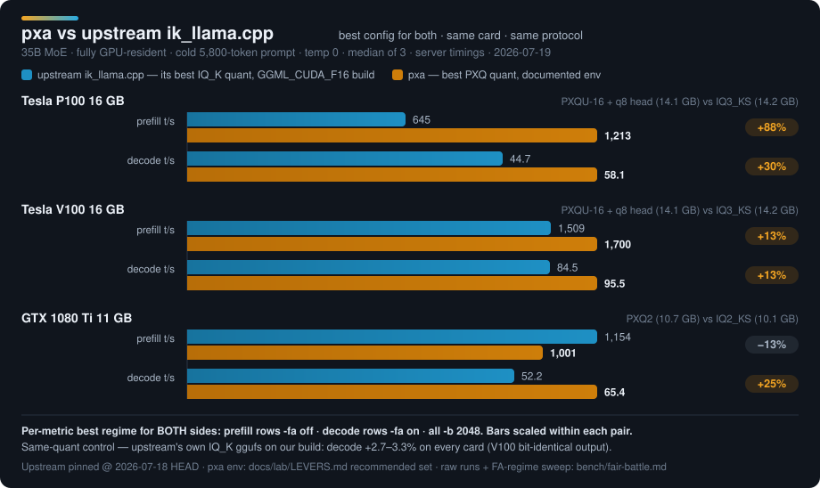

<p align="center"></p>

<!-- GitHub README for pxa. -->
<p align="center"></p>

# pxa — the codec + kernel pack for cards with no DP4A

> Authored and maintained by **PXA Network** (https://pxanetwork.com) — the creator of pxa and the PXQ/PXA kernel family.

**Community: [Discord — PXA Network](https://discord.gg/EqazvV9tf)** — support, benchmark wall, dev talk. Release notes post there automatically.

Models: **https://github.com/poisonxa16/pxa** ← you are here · Weights: [huggingface.co/poisonxa](https://huggingface.co/poisonxa)

> 💛 Support: **https://ko-fi.com/shatteredrealms1**

## Quick start — run the launcher first

You do not have to know any of what follows to run a model on this engine. Build it
(see [Build (CUDA)](#build-cuda)), then:

```bash
python3 tools/pxa-launch.py
```

It lists the NVIDIA cards in the box, lists the model files it can find, asks what you
want the seat for, and then picks the engine, the batch and micro-batch sizes, the tensor
split, the flash-attention regime, the chat template and the environment for you — showing
the measurement behind every choice before anything starts. Full-screen if your terminal
can take it, plain prompts otherwise, and every answer can be given on the command line
instead (`--gpus 2,4 --model /models/x.gguf --yes`).

**→ [`docs/tutorials/`](docs/tutorials/README.md) — twelve step-by-step guides**, from a first
chat answer to quantizing your own model, running the vLLM sidecar, long chats and what to do when
something goes wrong. They ship inside the tarball too, so the instructions sit next to the files
they talk about. Start at [`00-start-here.md`](docs/tutorials/00-start-here.md).

**→ [`docs/LAUNCHER.md`](docs/LAUNCHER.md) — the reference.** The per-topology table it
picks from, and the settings people forget (chat template, `--jinja`, reasoning, sampling,
API key), are in that document. [`docs/COOKBOOK.md`](docs/COOKBOOK.md) is the same table
written out as commands, for when you would rather drive it by hand.

### Three ways to get PXA

- **Tarball.** A prebuilt binary release with a `START-HERE` script, glibc **2.35** floor
  (built in an Ubuntu 22.04 container, not the 24.04 dev image), proven booting on both
  22.04 and 24.04. No Docker, no build toolchain. Grab it from the release's assets.
- **Container image.** `ghcr.io/poisonxa16/pxa` — the same binaries, packaged with
  `libgomp`, the CUDA driver stub and the `LLAMA_ARG_*` environment surface already
  wired up. Rebuilt from the tag commit for every release, gated in-image before it
  ships. As of `v2026.09.20` this release also ships container images for the **whole
  stack** — the engine and both vLLM sidecar images (`pxa-vllm:sm60` for Pascal,
  `pxa-vllm:sm70` for Volta) — plus a Docker Compose file that brings any of them up
  with two or three variables set. See [`docker/COMPOSE.md`](docker/COMPOSE.md).
- **From source.** See [Build (CUDA)](#build-cuda) below — one `cmake`/`cmake --build`
  pair inside the CUDA devel container, if you want to change the code or target an
  architecture the prebuilt assets don't cover.

Whichever one you pick, run the launcher first (above) rather than hand-assembling
flags.

## Where this sits

- **ik_llama.cpp** — best CPU/hybrid/new-quant support on Turing and newer.
- **llama.cpp** — broadest compatibility, the master CUDA backend.
- **pxa** — the codec + kernel pack for cards with HBM2 and no DP4A: **Pascal (P100)**, and Volta.

The pitch in one sentence: **run real models fully in VRAM on a used Tesla P100** — kernels
written for a chip with no DP4A and no tensor cores, not ported from one that has them. Volta
(V100), the 1080 Ti, and multi-card 122B-class MoE spreads all run on the same engine and are
covered below — they're scaling proof, not the pitch.

## Not MoE-only

The engine loads **83 model architectures** (`src/llama-arch.cpp`) — dense (Qwen, Llama, Gemma,
Mistral, …), GDN hybrids (`qwen3next`), MoE, `gpt-oss`, DeepSeek-V4 (`deepseek4`), GLM
(`glm4moe`, `glm-dsa`), MiniMax (`minimax-m2`), Cohere (`cohere2`, `cohere2_moe`), Laguna,
`gemma4` (dense and sparse — the dense 12B measured: retrieval correct to 21k tokens, perplexity 0.988x
stock llama.cpp, chat template applied automatically; the 128-expert sparse Gemma-4 MoE
(`gemma-4-26B-A4B`) is **supported, with no switch to flip**, as of `v2026.09.20` — retrieval to
20k tokens, determinism 12/12 at one slot, a two-slot content check 8/8 and a 20-minute two-slot
soak all pass; the Gemma-4 MTP assistant drafter is opt-in behind `PXA_GEMMA4_ASSISTANT=1`, and
concurrent slots are not bit-reproducible on this architecture — see `docs/KNOWN-ISSUES.md` for
the gate table and the caveats). **Every one of the engine-level fixes below — the sm_60 fp16-GEMM path,
flash-attention regime routing, the MoE path, `np>1` hybrid concurrency, and the wide f16
GEMV — applies to stock GGUF files (Q4_K, MXFP4, IQ_K) with no PXQ file required.** Point this
engine at a stock Q4_K_M, MXFP4, or IQ_K GGUF you already have and the fixes apply as-is; see
`docs/COOKBOOK.md` → "stock-gguf-on-pxq-engine" for the exact command and the engine-only numbers
that back it.

**Our own quants of Gemma 4 26B-A4B:** PXQ4 (13.9 GB, +3.9% perplexity against its own Q8_0 on
chat-templated text) and PXQ3 (11.0 GB, +7.7%). **PXQ3 is the file for one card**: it boots at
16k context on a single 16 GB V100, where Google's own `q4_0` file of the same model only fits
4k context on the same card. Google's GGUF is a QAT (quantization-aware trained) build — different
weights, trained differently — so a comparison against it is a comparison of two shipping files,
not a codec-vs-codec measurement.

## Two products, not one

- **The engine** — architecture support + the Pascal/Volta kernel fixes above. Loads and runs
  **any** GGUF a stock llama.cpp/ik_llama.cpp build reads. You are not locked into PXQ to get
  the engine fixes.
- **The PXQ codec** — the quantizer (`pxq-quantize … PXQ4/PXQ3/PXQ2/PXQ_UNIVERSAL`, a separate
  download — see "Quantize your own" below) and its custom GGUF types, layered on top of the
  engine.
- **Lock-in, stated plainly:** stock llama.cpp and ik_llama.cpp still cannot load a PXQ file.
  That has not changed. What has changed: `llama-pxq-export in.gguf out.gguf [--type f16|f32]
  [--device N|--cpu]` decodes a PXQ GGUF back to plain F16/F32, tensor by tensor, and
  `llama-quantize --allow-requantize --i-know-this-is-double-lossy` now accepts a PXQ source
  directly and requantizes it to any stock type — reading and requantizing an existing PXQ file
  stays in this tree and needs no separate download. Say the quality cost plainly: this is a
  second lossy pass over weights a codec already approximated once, not the same as quantizing
  the original F32/BF16 straight to, say, Q4_K_M. Expect worse quality than a one-pass quantize,
  not equal quality. Recipe: `docs/COOKBOOK.md`, "Leave PXQ".

## Fair-battle protocol

Every head-to-head in this repo is one of three shapes — full methodology, raw runs, and every
number below: [`bench/fair-battle.md`](bench/fair-battle.md).

1. **Engine-only** — same GGUF, two engines (upstream vs pxa). Isolates the kernel/arch
   fixes.
2. **Codec-only** — same engine, PXQ4 vs MXFP4 at matched bytes. Isolates the codec.
3. **Product** — best documented recipe per side (own quant, own levers). What you'd actually run.

**Engine-only, the honest number:** the real kernel/scheduler win is **prefill, roughly 1.7×** at
fixed weights — P100 **+59%** in an interactive `-fa on` server, **+88%** in a `-fa off` batch
pass; V100 +12–13%. Same-quant decode is a near no-op: **+2.7–3.3%**, V100 bit-identical output.
(The 1080 Ti cold-prefill cell used to be a loss on that chart. It is now a 15.4% win — see below.)

**Against mainline llama.cpp and upstream ik_llama.cpp, same cards, same day:** as of the
`v2026.09.05` release this engine is ahead in every cell measured on the V100 pair and the
1080 Ti. Every row below is a **bare command line** — no `PXA_*` environment, no `-b`/`-ub`:
`PXA_ENHANCE` is the default config level and the server auto-picks the batch/micro-batch for
the card set it finds.

| 2× V100, `Qwable-27B` | prefill @3,121 | prefill @20,801 | decode @8 |
|---|---|---|---|
| **pxa** PXQ4, bare command line | **1,369** | **1,300** | **39.5** |
| mainline llama.cpp `9400c89` MXFP4 | 940 | 1,129 | not captured |
| upstream ik_llama.cpp `3c58ae37` MXFP4 | — | — | 37.4 |

| 2× P100, `Qwable-27B` | prefill @3,121 | prefill @20,801 | decode @8 |
|---|---|---|---|
| **pxa** PXQ4, bare command line | **337.6** | **315.3** | **18.1** |
| mainline llama.cpp `9400c89` MXFP4 | 209.1 | 254.7 | not captured |
| upstream ik_llama.cpp `3c58ae37` MXFP4 | 134.5 | 84.0 | 14.3 |

| 1× GTX 1080 Ti 11 GB, `PXA-Fusion2-35B` PXQ2 | cold prefill (`-fa off`) | chat prefill (`-fa on`) | decode, cold / chat |
|---|---|---|---|
| **pxa** PXQ2, bare command line | **1,363.5** | 746.6 | 36.73 / **65.3** |
| upstream ik_llama.cpp `3c58ae37` IQ2_KS | 1,132 | 740 | — / 53.3 |

```bash
./build/bin/llama-server -m Qwable-27B-PXQ4core.gguf -ngl 99 -c 32768 -t 16 -fa on -sm layer
```

Against each competitor's best cell: V100 decode **+5.6%** over ik. On the 1080 Ti, chat prefill
is a tie by the campaign's own rule (both spreads overlap) and decode is **+22%** over ik. On the
2× P100 pair every cell beats both competitors (prefill **+61%** / **+24%** over mainline, decode
**+27%** over ik). See [`RELEASE-NOTES-2026-09-07.md`](RELEASE-NOTES-2026-09-07.md) for the
harness behind every figure, and for the windows that did not run before the tag. Mainline cannot read a PXQ file, so
its row is the MXFP4 build of the same model, which makes this a whole-product comparison; the
codec-controlled tables are below and in [`bench/fair-battle.md`](bench/fair-battle.md).

<p align="center"></p>

## `v2026.09.20` — the tensor split and lossless speculation, re-measured

**A correction first, because it changes numbers this project has already published.** Every
decode figure before `v2026.09.20` came out of a harness that re-sent the same handful of
prompts inside one server run. From the second repetition onward the server was regenerating an
answer it had already written, and the speculative drafter could predict nearly all of it, so the
measured rate climbed with each repeat — on one arm, 37 tokens/s on the first request and 120 by
the sixth, for the same prompt. That affected both sides of every earlier comparison equally, so
the head-to-head shape held, but the absolute numbers were re-generation speed, not first-answer
speed. Every figure below is re-measured with **a distinct prompt for every repetition**, and the
first-pass median is the headline.

**Two Tesla V100 PCIe 16 GB (no NVLink, both cards on PCIe x4)** — Qwen3.8-27B, `-c 16384`/`-c
24576`, `-np 1`, this engine on the stock PXQ4 file, mainline `llama.cpp` at its own best (its
own tensor split with its internal all-reduce) on the stock `UD-Q4_K_S` file, same client, same
bracket, six repetitions per cell, host timing off. Speed in tokens/s.

| class | this engine | mainline, its own MTP config | configuration on our side |
|---|---|---|---|
| decode, prose, no speculation | 47.80 | 46.64 | **out of the box** |
| decode, prose, greedy | **65.60** | 56.33 | `-sm tensor` + MTP depth 2 (both opt-in) |
| decode, prose, temperature 1.0 | **64.54** | 60.17 | `-sm tensor` + MTP depth 2 + `PXA_SPEC_SAMPLED` (all opt-in) |
| decode, code-edit, greedy | **130.50** | 77.68 | the n-gram → MTP cascade (opt-in) |
| decode, long context (~15.4k prompt), greedy | 57.70 | 57.26 | roughly level; plain (no speculation) 41.9 vs 42.0 |
| prefill, ~15.4k prompt | 829 | 593 | **+39.8%**, plain, no speculation |

⚠ A temperature-1.0, code-edit, cascade figure from the same measurement window is deliberately
**not** quoted here: a review found that a cascade (n-gram stage in front of MTP), under the
sampled-acceptance path, can verify an n-gram draft token against a stale distribution left over
from an earlier MTP draft. That is exactly the arm that would produce this cell, so it is withheld
until the fix lands and it is re-measured. The greedy cell above is unaffected — at temperature 0
the exact-match rule runs and the sampled path is never used.

Every speculative cell above is **lossless**: the acceptance rule never emits a token the model
itself did not choose. Speculative output is not byte-identical to non-speculative output on
either engine — see [`RELEASE-NOTES-2026-09-20.md`](RELEASE-NOTES-2026-09-20.md) — and the
byte-reproducibility gates run with speculation off.

**The codec is not the gap.** This engine reading mainline's own `UD-Q4_K_S` file, same cards,
same bracket, no speculation, reads **47.51** tokens/s plain — inside the repetition spread of
the 47.80 it reads on its own PXQ4 file. What the table above shows is the engine, not the
quantization.

**`-sm tensor` — the launcher's default split for two identical cards.** Instead of giving each
card a run of layers, it cuts every big matrix in half and has both cards work on the same token
at once. As of this release **the launcher picks it for you** (`--sm auto`, the default) on a
matched pair, an architecture and tier it has hardware evidence for, with the fused all-reduce
armed automatically at both decode and prefill — it still refuses, by name, any architecture or
quantization tier it has no evidence for, and falls back to the layer split cleanly when it does.
Plain decode, Qwen3.8-27B PXQ4, greedy:

| configuration | 2× V100 | 2× P100 |
|---|---|---|
| layer split (`--sm layer`, the previous default) | 38.1 | 17.8 |
| `-sm tensor` | 44.2 | 23.9 |
| `-sm tensor` + fused all-reduce (**now emitted automatically with it**) | **50.0** | **25.9** |

Output is identical to the layer split's. `--sm layer` still runs when you ask for it by name — see
[`docs/LAUNCHER.md`](docs/LAUNCHER.md#5b-which-split-mode-and-who-chooses) for the exact rule and
[`RELEASE-NOTES-2026-09-20.md`](RELEASE-NOTES-2026-09-20.md) for the measured trade (prefill, and a
busy host) that comes with it.

**Gemma 4 26B-A4B (the 128-expert MoE model), against stock llama.cpp, same file and cards.**
Two V100s, `-sm layer`, greedy, decode tokens/s at 14 / 2,370 / 6,363 / 12,710 prompt tokens:

| | 14 | 2,370 | 6,363 | 12,710 |
|---|---:|---:|---:|---:|
| this engine, Google's QAT `q4_0` file | 112.9 | 107.8 | 103.7 | 99.0 |
| this engine, our PXQ4 file | 106.7 | 101.9 | 97.9 | 93.7 |
| stock llama.cpp, Google's QAT `q4_0` file | 99.6 | 96.0 | 93.8 | 92.9 |

Both files lead stock llama.cpp at every depth measured, decode and prefill (prefill is roughly
2× stock at the depths measured). Gates passed are in `docs/KNOWN-ISSUES.md`.

## Codec-only: PXQ4 vs MXFP4, including the cell we lose

Re-run 2026-09-02 on the `v2026.09.02` engine (see "Engine: what `v2026.09.02` added" below), same cards, same
protocol as the original table (`llama-server /completion`, temp 0, n=7 median, MTP off both
sides). Full tables, the artifact census, and the raw reps: `bench/fair-battle.md`.

| cell | PXQ4 | MXFP4 | result |
|---|---|---|---|
| **Dense prefill** @3k / @20k, 2×P100 | 227.4 / 203.3 | 178.7 / 163.7 | **+27% / +24%** |
| **Dense decode**, 2×P100 | 18.3 | 14.4 | **+27%** |
| **Dense prefill** @3k / @20k, 2×V100 | 798.1 / 577.0 | 364.0 / 312.9 | **+119% / +84%** |
| **Dense decode**, 2×V100 | 34.5 | 37.7 | **−8% — MXFP4 still wins here** |
| **MoE prefill** @3k / @20k, 2×V100 ‡ | 2,093.8 / 1,467.2 | 1,614.6 / 1,256.8 | **+30% / +17%** |
| **MoE decode**, 2×V100 ‡ | 218.4 | 188.0 | **+16%** |

**‡** the MoE row compares a merge (`PXA-Fusion4-35B`, PXQ4) against the stock 35B-A3B model
(MXFP4) — same architecture and size class, not byte-identical base weights. The PXQ4 artifact's
own codec census shows only the expert stacks are PXQ4 (120 of its tensors); everything else is
other types. Call it an expert-codec delta, not a whole-model one. This replaces the earlier
MoE-decode row this repo withdrew for the same underlying reason — this time the composition is
disclosed up front and the number reproduces.

**The Volta dense-decode loss is unchanged and still understood the same way:** MXFP4's block
layout maps onto DP4A with one scale fixup per 32 values; PXQ4's sub-scale hierarchy costs a
second fixup and a second cache line. At equal bit width against a kernel already near HBM peak,
that's a structural tie-or-lose, not a tuning gap. What you get for the loss on that one cell:
PXQ4 is byte-for-byte the same 4.25 bpw file but ~38% lower reconstruction error and **6.0% lower
perplexity** (6.9704 → 6.5527, paired, same bytes) — unchanged from the original measurement.

**Recipe, unchanged:** Pascal (P100) → **PXQ4**, on both axes. Volta, dense, decode-bound →
**MXFP4**. Volta MoE, or long-prompt/interactive workloads → **PXQ4** (prefill win, better
fidelity).

## The reproducible proof: a 35B MoE on one 16 GB P100

One used P100, one downloadable GGUF (PXQU-16, 14.0 GB), fully GPU-resident:
**~62 t/s decode, 827–843 t/s prefill** — reproduce with `bench/speed-bench.sh`, numbers and
protocol in [`bench/README.md`](bench/README.md). This is the on-ramp, not the ceiling — the
same engine and codec scale to multi-card MoE below.

## Named recipes (`docs/COOKBOOK.md`)

| recipe | hardware | tier | result |
|---|---|---|---|
| 35B MoE, single card | 1× P100 or V100 16 GB | PXQU-16 (q8_0 head) | ~62 t/s (P100) / ~101 t/s (V100) decode |
| 35B MoE, 4-bit flagship | 2× P100 or V100 | PXQ4 (18.7 GB, doesn't fit one 16 GB card) | 55.7 t/s decode |
| 35B MoE, budget card | 1× GTX 1080 Ti 11 GB | PXQ2 (int8 prefill tile, armed by default) | 59.2 t/s decode, 1,306 t/s cold prefill |
| 35B MoE, 12 GB card | 1× 12 GB card | PXQU-12 | 58.4 t/s (P100) / 97.6 t/s (V100) decode |
| 4× P100 rig, hybrid MoE | 4× Tesla P100 16 GB | PXQ_UNIVERSAL 4-bit | ~487 t/s prefill @3k, ~19 t/s decode @86k fill |
| 2× V100 rig, 27B dense (vLLM sm_70 line) | 2× Tesla V100 16 GB | PXQ4 | 1,009 t/s prefill @3k, 299 t/s aggregate @16 streams |
| Gemma 4 26B-A4B, one card | 1× V100 16 GB | PXQ3 (11.0 GB, the one-card file) | ~105 t/s decode at short fill, 16k context |

Exact commands and expected numbers for each: [`docs/COOKBOOK.md`](docs/COOKBOOK.md).

## Speculation: an MTP file gets both drafters, by default

If a GGUF carries an MTP / NextN head, the server arms a **cascade** with no flags from you: an n-gram
table stage in front of the trained head. The table answers first — a model quoting its prompt, tool
JSON, a code edit — and the head answers whatever the table cannot. Measured on 2× V100, np1,
temperature 0, one bracketed window, on an abliterated fine-tune of Qwen3.8-27B in PXQ4: **86.7 t/s on
a repetitive class and 83.8 on free prose**, against 39.5 with no drafter at all, and against
64.7–66.3 / 51.7–51.8 for mainline `llama.cpp` `fdb2c11c70` driving its MTP head on stock
Qwen3.8-27B in `UD-Q4_K_S`, same box, same client.

⚠ **That last comparison crosses two variables — codec and weights — so it is an engine-plus-file
result and not a codec one.** The stock-PXQ4 windows that would isolate either have not been run; the
release notes say the same thing in more detail. The 86.7-against-39.5 figure is one file in both
arms and is unaffected.

Two things worth knowing before you quote that:

- **Mainline's own n-gram+MTP cascade wins the repetitive class** — 140.5 against 86.7 — because its
  n-gram stage drafts up to 64 tokens where this one drafts 4. Raising the stage
  (`--spec-type ngram:n_max=64,n_min=48`) flips that cell to **185.9** and costs prose, which falls to
  65.6. Long fixed drafts buy one class and pay in the other, on both engines. Pick by workload; the
  adaptive length that would take both is not in this release.
- **A recurrent model's per-step checkpoints scale with the draft length**, so a long draft is bounded
  by VRAM rather than by taste. The engine computes the capacity the cards can actually afford, clamps
  every stage to it, and prints the answer at every boot. Read that line before comparing two runs.

Full recipes, the boot lines to look for, and **the PXA attention split** (`-sm attn`): +21% control
and, at long drafts, the highest prose figure measured here. The `-sm attn` split mode originated in
`ik_llama.cpp` (`ikawrakow`, 2025-12); the PXA attention split is this project's version of it — the
PXQ panel-aware cut, the hybrid (delta-net) reduce-delivery fixes and demotion, the reduce route
control, the model-exclusive admission and the headroom balance: the parts that make it run on hybrid
models, on the PXQ codec, on Pascal and Volta. Recipes:
[`docs/COOKBOOK.md`](docs/COOKBOOK.md).

## The 2026-09-01/09-02 speed campaign: two rigs, before → after

Twenty-four hours of measurement across both rigs this project runs day to day. Naming: the
**4× P100 rig** runs a Qwen3.8 Flash-Next-class hybrid MoE on this llama.cpp-based engine,
PXQ_UNIVERSAL 4-bit; the **2× V100 rig** runs a Qwen3.8-27B dense-hybrid model, PXQ4, on the
separate vLLM-based sm_70 serving line ([`docs/PXA-SM70-SERVING.md`](docs/PXA-SM70-SERVING.md)).
Full protocol, every raw rep, and everything that didn't pan out:
[`RELEASE-NOTES-2026-09-02.md`](RELEASE-NOTES-2026-09-02.md).

As of the 2026-09-03 build the 4× P100 Flash-Next configuration also serves **more than one slot**:
the per-layer-embedding convolution history is kept per sequence rather than per context, so
`-np 2 --kv-unified` passes the full six-step gauntlet instead of aborting on the first parallel
request. The second slot costs 112 MiB across the four cards and 0.5% decode on a single active
stream. One caveat above one slot, stated where you will need it:
[`docs/KNOWN-ISSUES.md`](docs/KNOWN-ISSUES.md) — the shared-input prefill lever turns itself off
there.

**4× P100 rig** — `llama-server /completion`, temp 0, `cache_prompt=false`, n=7 median (1 warmup
discarded), `-c 150016 -b 2048 -ub 2048 -wgt 8 -ts 5079,12612,12612,11897 -sm layer`:

| metric | before | after | change |
|---|---|---|---|
| decode, low fill | 27.0 t/s | 27.7 t/s | +2% |
| decode, 86,401-tok fill | 13.3 t/s | 19.3 t/s | **+45%** |
| prefill @3,121 | 474.9 t/s | 487.1 t/s | +3% |
| prefill @20,801 | 392.6 t/s | 410.6 t/s | +5% |

The deep-fill decode line is the biggest number here, and it is the **whole twelve-lever enhance set
measured together** — `PXA_FN_MTP_HNORM_GROUPED PXA_FA_GQA_PACK=4 PXA_KQ_MASK_PAD1 PXA_KV_SEQ_SOA
PXA_TOPK_RAW PXA_TOPK_MOE_MULTIROW PXA_GETROWS_NARROW PXA_CPY_FASTDIV PXA_CONCAT_FLAT
PXA_NORM_REGCACHE PXA_SCHED_RESET_LAZY PXA_MOE_DEVICE_MAP`. The control pair behind it is
`13.26 ±2.4% → 19.33 ±6.6%` on the same seat and build; the campaign note annotates that row `+49%`
against a control rounded to `13.0`, which is where the extra points come from. Read it loosely: it is
the noisiest point on the rig, and an independent deep-fill A/B on the same seat reported a ±11.74%
spread with the generation length itself unstable (256/120/5 tokens on one arm, 6/6/6/6 on the other).
Note also that this row does not share a control run with the three above it — the first all-off
control did not take the deep-fill point, so its "before" is a second all-off run in the same session
(the two controls agree within 2% on every point they both took).

A per-lever A/B *does* exist for the one lever that should carry this line — `PXA_FA_GQA_PACK=4`
reads each attention key/value once per query group instead of once per head, so it only pays off once
the re-read volume is large, and at 86,401 tokens it measured `12.52 → 17.54 t/s = +40%` against a
26.08/26.22 low-fill control, output-identical
([`RELEASE-NOTES-2026-09-02.md`](RELEASE-NOTES-2026-09-02.md)). That is the only place the +40% figure
comes from, and it is an *open question, not a settled result*: a later re-measure on a reviewer cell
**did not reproduce it**, and it is recorded there as `VOID — engagement not proven` — the kernel was
never proven to fire at that shape, and the instrument that would settle it (a firing counter in the
dispatch path) is not in this build ([`docs/LEVERS.md`](docs/LEVERS.md), row `PXA_FA_GQA_PACK`;
[`docs/COOKBOOK.md`](docs/COOKBOOK.md), which states the rule as "**Do not quote a throughput number
for either.**"). So treat the +40% as one unreproduced measurement rather than as the decomposition of
the set figure above.

**2× V100 rig** — vLLM `/completion`, `--tensor-parallel-size 2 --dtype float16`, n=7, interleaved
boots (protocol and the NCCL finding: [`docs/PXA-SM70-SERVING.md`](docs/PXA-SM70-SERVING.md)):

| metric | before | after | change |
|---|---|---|---|
| prefill @3k | 919 t/s | 1,009 t/s | +10% |
| prefill @20k | 880 t/s | 984 t/s | +12% |
| decode, single stream | 48.5 t/s | 50.4 t/s | +4% |
| decode, aggregate @8 streams | 129 t/s | 190 t/s | +48% |
| decode, aggregate @16 streams | 129 t/s | 299 t/s | **+132%** |

The aggregate line is mostly one kernel — a Volta tensor-core path for the PXQ4 decode GEMV at
batch sizes of 5 and up (`PXQ4_MMV_MMA=1`, kernel v12b). The prefill line is mostly not a kernel at
all — see the NCCL finding below.

### Engine: what `v2026.09.02` added

Shipped, tagged `v2026.09.02`. The full ship list, every rejected lever, and the known limits:
[`RELEASE-NOTES-2026-09-02.md`](RELEASE-NOTES-2026-09-02.md). Headline items:

- **Pipelined prefill.** Two scheduler bugs — a full graph re-plan on every prompt chunk instead
  of once per request, and a host-side sync inside every batched MoE layer — were hiding the
  overlap a second CUDA stream should have bought. Fixed, byte-identical, opt-in at a reduced
  context (it doesn't fit the 4×P100 recipe's `-c 150016`: compute buffer allocation fails on
  card 1 there, and the no-PP fallback doesn't recover either). Numbers:
  [`RELEASE-NOTES-2026-09-02.md`](RELEASE-NOTES-2026-09-02.md).
- **GQA-packed attention**, above: +40% decode at 86k-token fill, flat at low fill, output-identical
  — one measurement, not reproduced on re-measure and recorded `VOID — engagement not proven`; see
  the deep-fill note above before quoting it.
- **Host-overhead cuts** — bounded top-k sampling off raw logits, a struct-of-arrays KV-sequence
  mask, a trimmed KQ-mask upload, and four more bit-identical micro-fixes: per-token host time at
  deep fill drops from 6.0 ms to 1.6 ms.
- **Device-side MoE row map.** The expert-routing table used to round-trip through the host once
  per batched MoE layer; it's built on-device now, self-checked bit-identical against the old
  host path.
- **PXQ on CPU.** An AVX2 int8 dot product makes CPU-only and partial-offload PXQ inference real
  instead of a technically-working fallback, cross-checked to 0 ULP against the CUDA decode. See
  "Quantize your own" below for which tiers get the fast dot versus a correct-but-slower
  fallback.
- **An export tool.** `llama-pxq-export` turns a PXQ GGUF back into plain F16/F32, and
  `llama-quantize --allow-requantize` now accepts a PXQ source — the lock-in objection in
  "Two products, not one" above has an answer: quantize to PXQ, decide later you want something
  else, export and requantize instead of redoing the original conversion.
- **Correctness fixes.** A get_rows grid-overflow bug at large expert counts, an MMQ fusion-chain
  guard for non-MMQ quant types, and a quantized-cpy launch-config fix, all three ported from
  ik_llama.cpp upstream (`docs/DELTA-SINCE-IK.md`). Plus one found here: a per-slot attention
  state window on the hybrid architecture that was never reset between requests, so a second
  request could inherit the first's window.

### Already shipped

Landed in the launcher on 2026-09-01, no rebuild required: `-ub 2048 -wgt 8` on the P100 rig
(zeroes a vocab-sized logits reservation so the larger micro-batch fits, +5–8% prefill); on the
V100 rig, `--max-num-batched-tokens 4096` (+2.5–3.3% prefill, six interleaved boots, no decode or
KV-pool cost) and `--gpu-memory-utilization 0.92` (+44% KV pool, capacity only).

## No switch

```
(nothing to export)
```

The tune is on by default. The engine auto-selects the measured-good kernel levers per device
(mixed-card boxes get a per-GPU decision, printed at startup so it's auditable, not inferred) and
fills `-b`/`-ub` from the measured cell for the card set it finds, when you have not passed them.
`PXA_ENHANCE=1` is still accepted and is a no-op; `PXA_ENHANCE=0` rolls back to the
pre-2026-09-03 shipped set, and `PXA_REFERENCE=1` is the bit-exact all-levers-off baseline.
Optionally: `PXA_MODE=balance` (default, fa-on serving) or `PXA_MODE=max` (fa-off, max prefill —
not for GLM/MLA models).

Everything else — every other `PXA_*` var — is the lab: experiment records and measured *losses*
kept for the paper trail, gated per-architecture, and usually **slower** if you set them by hand.
The user-facing reference — every lever that is on by default or that you are told about in the
tutorials, what it does for you and how to turn it off: [`docs/LEVERS.md`](docs/LEVERS.md).

## Origin

**Do they rebase? No.** This is the Pascal/Volta engine, not a fork that tracks `ik_llama.cpp`
main: ikawrakow/ik_llama.cpp @ `1520eda98056` is treated as a parts bin — model graphs and bug
fixes are cherry-picked from it on a case-by-case basis, nothing more.

pxa started as a fork of **ikawrakow/ik_llama.cpp @ `1520eda98056`** (2026-06-04). Since
then, measured against that pinned commit: 20 of 340 `ggml-cuda` files are new PXA kernels and 34
more are modified — the MoE GEMM, MMVQ dispatch, flash-attention regime, and dequant paths; 286
are still byte-identical to upstream. Of the 63 per-architecture graph builders, 7 are new
architectures and 4 more are modified; 52 are untouched. `src/llama-quantize.cpp` grew from
1,785 to 2,791 lines, mostly PXQ. The shared ik/llama.cpp lineage carries the rest of the tree —
tokenizer, GGUF I/O, sampling, and every architecture this project didn't need to touch. The
original work is concentrated exactly where cards with no DP4A and no tensor cores need it: the
MoE and PXQ-codec hot paths. (The upstream base commit is in the history now — `git merge-base`
resolves to it, and `git log --oneline 1520eda98056..HEAD` lists this project's own 501 commits
on top of it — diff against that exact commit if you want to see it yourself.)

## Build (CUDA)

**CUDA 12.x is required.** The release is built with CUDA 12.8. CUDA 13.0 dropped offline
compilation for Pascal and Volta, so a 13.x toolkit cannot emit the `sm_60`/`sm_61`/`sm_70`
code this engine targets.

**Full instructions, with every trap and its exact error: [`BUILD-FROM-SOURCE.md`](BUILD-FROM-SOURCE.md).**
The short version, on a machine with the cards in it:

```bash
git clone https://github.com/poisonxa16/pxa && cd pxa

docker run --rm -it --runtime=nvidia -e NVIDIA_VISIBLE_DEVICES=all \
  -v "$PWD":/src -w /src nvidia/cuda:12.8.1-devel-ubuntu24.04 bash
# (--gpus all is the modern equivalent; it needs the container toolkit out of legacy mode)

# --- inside the container ---
apt-get update && apt-get install -y --no-install-recommends cmake git

cmake -B build -S . -DGGML_CUDA=ON -DCMAKE_CUDA_ARCHITECTURES="60;61;70"
cmake --build build --target llama-server llama-cli llama-bench llama-quantize -j"$(nproc)"
```

`"60;61;70"` is P100 + 1080 Ti/P40 + V100, this release's target set. Use
`"60;61;70;86;89"` for the wide list (adds 10-series, 3090/4090-class); `"60"` alone if all you
have is a P100. Two build traps that cost people real
time — building on a GPU-less CI host, and leaving the CUDA stub on `LD_LIBRARY_PATH` at runtime
— are documented with their exact errors in `BUILD-FROM-SOURCE.md` §3.

## Quantize your own

```bash
# pure tier (pxq-quantize is a separate download — see below):
./pxq-quantize model-bf16.gguf out-PXQ3.gguf PXQ3

# PXQU (mixed tier, sized to fit one card):
./pxq-quantize --pxq-universal my-16gb.tiers model-bf16.gguf out-PXQU-16.gguf PXQ_UNIVERSAL
```

**`pxq-quantize` (`https://github.com/poisonxa16/pxq-quantize/releases`) is a separate download as of this release.** The code that
*produces* a PXQ file moved out of this source tree; the command-line arguments are unchanged from
`llama-quantize`'s, only the program name is different. `llama-quantize` in this tree still does
everything else — every stock type, and reading or requantizing an *existing* PXQ file into
something else (see "Two products, not one" above and `docs/COOKBOOK.md`, "Leave PXQ") — and asking
it for a new PXQ file prints one line pointing you at `pxq-quantize` instead of doing the work.
Loading and running a PXQ file you already have, or one someone else made, is completely unaffected.

No `--imatrix` in either command, deliberately: **the PXQ tiers ignore an importance matrix**
(since 2026-08-24 — every way of consuming it measured *worse* than not consuming it on PXQ4,
while the same matrix improved `Q4_K_M`). Pass one anyway and the quantizer says so once and
records `quantize.imatrix.ignored_by` in the file instead of claiming it was used.
[`docs/QUANTIZING.md`](docs/QUANTIZING.md) has the measurement and the lab opt-in.

**PXQ now runs on CPU and under partial offload**, dense and MoE files both, `-ngl 0` included.
This was not true a release ago and the old "aborts" behavior is gone. What's fast versus merely
correct differs by tier: PXQ4 and PXQ4-HQ get an AVX2 integer dot product built for the format
(`ggml/src/pxq-dot.c`), the same class of speedup as the CPU note under "Engine: what
`v2026.09.02` added" above; PXQ2, PXQ3, and PXQ6 fall back to a correct panel dequant
(`ggml/src/pxq-cpu.c`) that works but is not tuned for speed. For a CPU-heavy or partial-offload
deployment, prefer a PXQ4-family tier if you have the choice. Tier by VRAM for a fully
GPU-resident deploy: 16 GB → PXQU-16 or PXQ3; 12 GB → PXQU-12; 11 GB (1080 Ti) → PXQ2.
Recommended: add `--output-tensor-type q8_0`
(+123 MB, +5.2% P100 decode). Quantizing a merged model **to a stock tier**: recompute the imatrix
**on the merge** — imatrix rows are activation statistics of the anchor model, not the weights, so
a parent model's imatrix is off-distribution exactly on the tensors a merge changed. (For a PXQ
target the question does not arise: the tiers ignore the matrix either way.) Full detail, the PXQU tier-map
format, and known traps: [`docs/PXQU-CONVERT.md`](docs/PXQU-CONVERT.md), [`docs/QUANTIZING.md`](docs/QUANTIZING.md), [`docs/KNOWN-ISSUES.md`](docs/KNOWN-ISSUES.md).

## Changelog

Per-release notes: `RELEASE-NOTES-*.md` in the repo root and `docs/`. Latest release,
`v2026.09.20`: [`RELEASE-NOTES-2026-09-20.md`](RELEASE-NOTES-2026-09-20.md) — the PXA tensor
split (`-sm tensor`, now the launcher's default on a matched pair it has evidence for; `-sm layer`
to go back), a genuinely lossless speculative-decode acceptance rule at any temperature (opt-in,
labelled new), Gemma 4 26B-A4B (the 128-expert MoE) fully supported with no switch, a boot with no
`-c` settling on a context that fits instead of failing, container images for the whole stack, a
correction to how decode speed was measured in earlier releases, a head-256 attention kernel that
closes this release's long-context gap on V100s (`PXA_FA_D256_VOLTA_TILE`, on by default, +9–18%
long-context decode), a matched q8_0 K/V cache that reaches a faster V100 prefill kernel
(`PXA_FA_MMA_VOLTA_Q8`, on by default, +16.7% prefill), and `-sm tensor` for Gemma 4
(`PXA_TSPLIT_GEMMA4`, opt-in, +8–21% decode on a P100 pair).
Previous release, `v2026.09.13-rc3`:
[`RELEASE-NOTES-2026-09-13.md`](RELEASE-NOTES-2026-09-13.md)
— the n-gram → MTP cascade measured head to head against upstream for the first time, the MTP head's
graph re-plan removed (242 reserves a boot down to 7, output byte-identical), a per-step recurrent
checkpoint capacity the context can afford rather than one that merely fits, this engine's own
the PXA attention split (this project's version of `ik_llama.cpp`'s `-sm attn` mode, made to run on a
PXQ hybrid on Pascal and Volta) shipped behind a model-exclusive admission lever, dense Gemma 4, the
DeltaNet output projection protected at `q8_0` on every PXQ level, and the sm_60 half2 pair-LUT decode
path for the low PXQ tiers. Previous release,
`v2026.09.09-rc3`: [`RELEASE-NOTES-2026-09-09.md`](RELEASE-NOTES-2026-09-09.md)
— three correctness fixes (an MTP head reading back a reused buffer, a hybrid model's attention
window going empty after a forced re-process, an incompletely-whitelisted KV-removal index), PXQ2
and PXQ3 now converting and serving on the vLLM sidecar rather than PXQ4 alone, a quantizer policy
layer for where the lower-bit tiers go, and a batch of new performance levers that ship off pending
their own speed windows. Previous release, `v2026.09.07-rc1`:
[`RELEASE-NOTES-2026-09-07.md`](RELEASE-NOTES-2026-09-07.md) — the rename, the DeltaNet out-gate
fusion race fix, the vLLM v1.5.0 rebase, PXQ2/PXQ3 landing in the sidecar's kernels and converter,
per-card automatic batch defaults, a ported DFlash that is **default-off and experimental in this
engine binary**, and the first **measured** speculative rows — which were taken on the vLLM
sidecar, not on this binary, and ship in the sidecar images. Earlier tagged release,
`v2026.09.02`: [`RELEASE-NOTES-2026-09-02.md`](RELEASE-NOTES-2026-09-02.md).

## License & credits
**MIT** — this fork inherits the MIT license of its base engines
([ik_llama.cpp](https://github.com/ikawrakow/ik_llama.cpp) / llama.cpp / ggml, © the ggml/llama.cpp/
ik_llama.cpp authors), and the PXQ types + E16-row-scale kernels are contributed under the same MIT terms.
The original LICENSE and AUTHORS are retained unchanged. PXQ quantization and the fused kernels are original
work of the PXA project, built on ikawrakow's ik_llama.cpp.

> Note: the **model weights** published on HuggingFace are a *separate* work under **Apache-2.0** (Qwen3.6
> lineage via Ornith-1.0-35B-AEON / SIQ-1-35B) — see the model card. This repo (code) is MIT; the weights are Apache-2.0.

## Community bug-finders 🏅

Real-hardware testing by the community makes this fork honest. Credits:

- **Last-Guitar-5924** (r/LocalLLM) — found the deepseek2/MLA fa-off context-decay cliff on a Tesla P40 (GLM-4.7-Flash decode collapsing 37 → 3.3 t/s by 36k ctx with flash attention off). His decode curve drove the automatic fa+mla posture for MLA models and the load-time warning shipping in the next release.
- **[bradrlaw](https://github.com/bradrlaw)** — via a rigorous independent benchmark, root-caused the dual-GPU decode collapse to `-sm layer` on a no-NVLink (PHB) topology and showed `-sm graph -ts 1,1` restores full decode; also caught the missing `libnccl.so.2` in the release packaging. Both drove fixes in this release. **Scope note added 2026-09-08:** that decode result stands, and it stands for **stock GGUF** files — it does not carry over to a PXQ file. `-sm graph` splits the attention output and the expert down projections along `K`, and a PXQ tensor cannot be cut on that axis (one fp16 anchor per row lives in the 64-row panel header and covers all of `K`), so the engine now refuses that combination at load instead of running it. On a PXQ file, `-sm layer` is the supported split.
