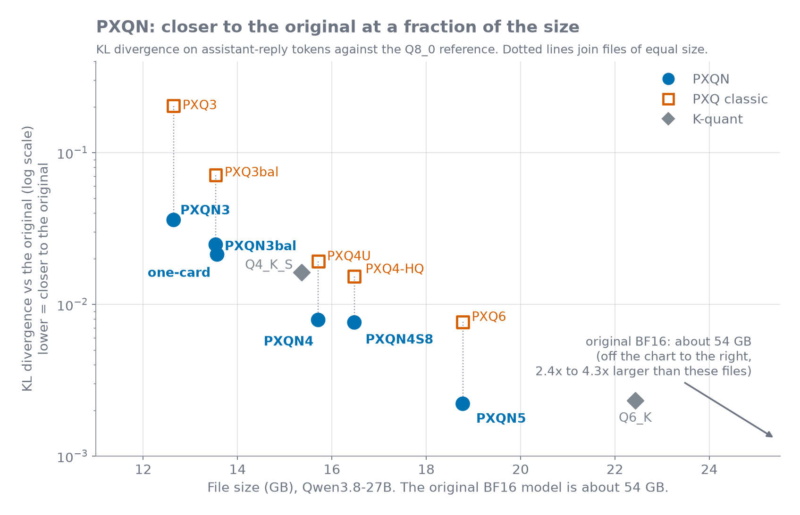
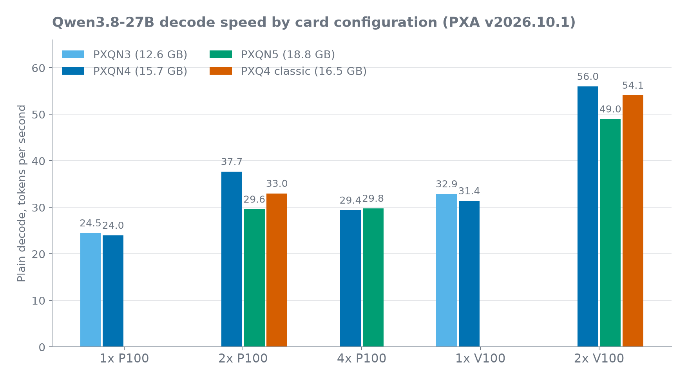
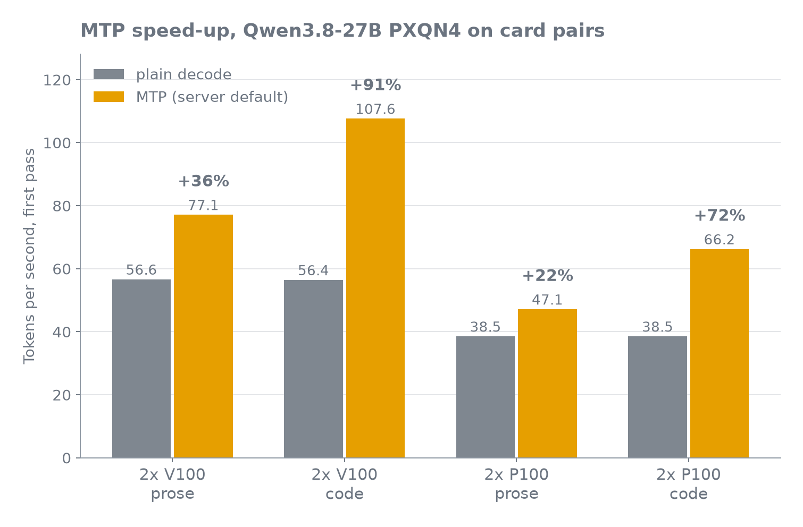
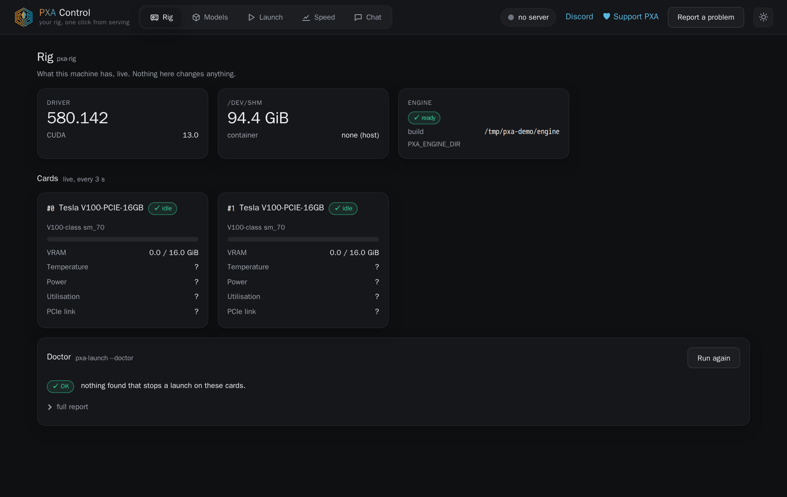
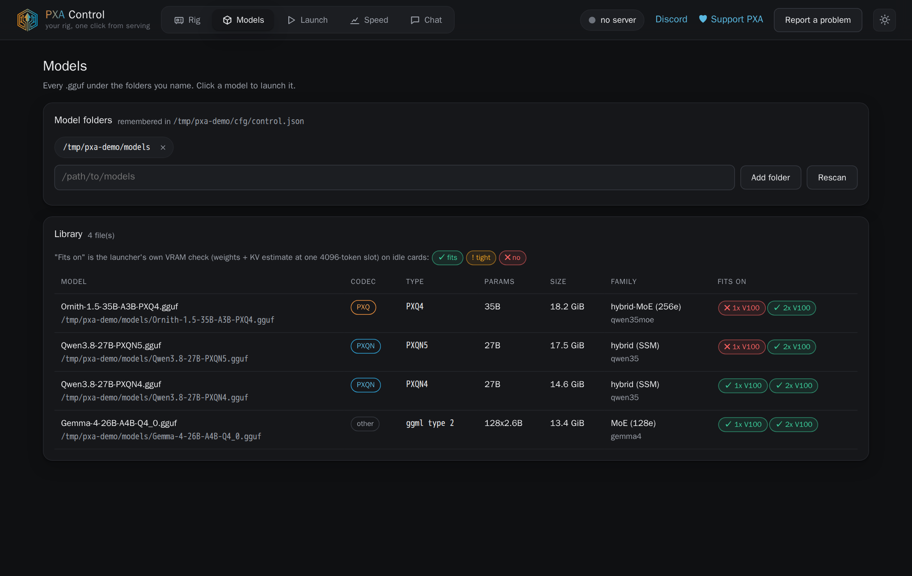
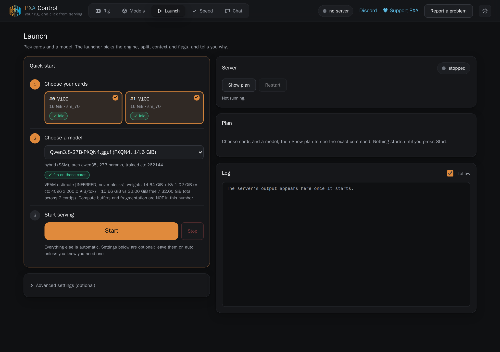
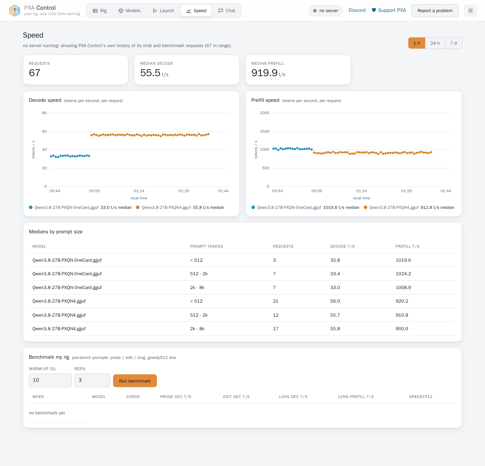
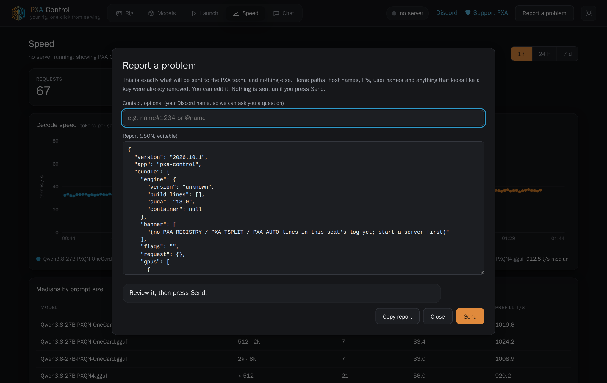
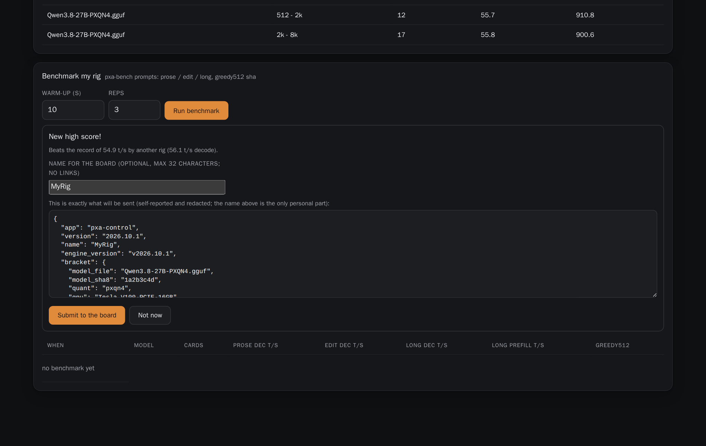
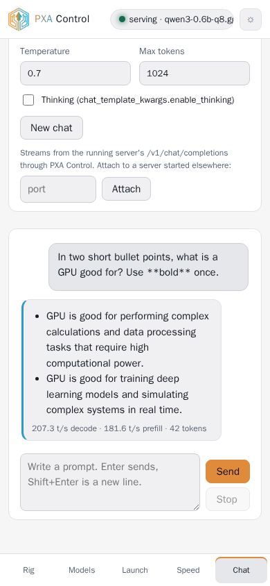

<p align="center"></p>

<h1 align="center">PXA</h1>

<p align="center"><b>The Pascal and Volta speed engine.</b><br>
PXQN quants, tensor split, MTP speculation and one-click PXA Control, for the Tesla P100, V100 and GTX 10-series cards everyone else stopped tuning for.</p>

<p align="center">
<a href="https://github.com/poisonxa16/pxa/releases/latest"></a>
<a href="https://discord.gg/EqazvV9tf"></a>
<a href="https://ko-fi.com/shatteredrealms1"></a>
</p>

```bash
tar xzf pxa-v2026.10.1-linux-x86_64-cuda12.8-sm60_61_70.tar.gz && cd pxa-v2026.10.1   # 1. unpack the release tarball
./pxa-launch --gui                                                                     # 2. open PXA Control in your browser
# 3. pick your cards, pick a model, press Start. Or skip the GUI: ./pxa-launch
```

No Docker, no build toolchain, nothing phones home. Prefer a container? See [Get PXA](#get-pxa).

**On this page:** [PXQN](#pxqn-closer-to-the-original-at-a-fraction-of-the-size) · [Speeds](#speeds) · [PXA Control](#pxa-control) · [Features](#features) · [Models](#models) · [Get PXA](#get-pxa) · [Community and support](#community-and-support)

---

## PXQN: closer to the original at a fraction of the size

PXQN is our quant format for Pascal and Volta. At the same file size it lands far closer to the original model than our classic PXQ tiers, and it is competitive with standard K-quants that are larger. A 27B model that is about **54 GB** in BF16 fits one 16 GB card.

<p align="center"></p>

**How to read it.** The vertical axis is KL divergence between each quantized model and the Q8_0 reference, scored only on the tokens the assistant wrote in a chat-format test set (15,065 assistant tokens). **Lower means closer to the original.** The axis is logarithmic. Dotted lines join files of exactly equal size.

| File (Qwen3.8-27B) | Size | % of BF16 | KL vs Q8_0 | Same top token | Classic PXQ of equal size |
|---|---:|---:|---:|---:|---:|
| **PXQN3** | 12.6 GB | 23% | 0.0360 | 94.0% | PXQ3: 0.2033 |
| **PXQN3bal** | 13.5 GB | 25% | 0.0248 | 94.9% | PXQ3bal: 0.0711 (about 3x further) |
| **One-card 27B** | 13.6 GB | 25% | 0.0213 | 95.1% | |
| **PXQN4** | 15.7 GB | 29% | 0.0079 | 97.1% | PXQ4U: 0.0192 |
| **PXQN4S8** | 16.5 GB | 31% | 0.0076 | 97.0% | PXQ4-HQ: 0.0153 |
| **PXQN5** | 18.8 GB | 35% | 0.0022 | 98.4% | PXQ6: 0.0076 |
| K-quant Q4_K_S (reference) | 15.4 GB | 28% | 0.0163 | 96.2% | |
| K-quant Q6_K (reference) | 22.4 GB | 42% | 0.0023 | 98.3% | |

- **PXQN4 at 15.7 GB is as faithful as classic PXQ6 at 18.8 GB.**
- **PXQN5 at 18.8 GB matches Q6_K at 22.4 GB** (0.0022 against 0.0023), in 84% of the space.
- We show the points where a K-quant is ahead too: Q4_K_S is closer than PXQN3bal or the one-card file, at a larger size. PXQN4 is about twice as close as Q4_K_S for 2% more bytes.

**Why PXQN**

- **Smaller downloads.** A 4-bit-class file that is 29% of the original size and still 97% top-token agreement.
- **Fits one card.** The one-card 27B is a single 12.6 GiB file with 131k tokens of context on one 16 GB card.
- **Faster per byte.** Fewer bytes to read per token, and kernels written for these cards (see the speed tables).
- **Old files keep loading.** PXQ files from earlier releases run unchanged. PXQN files load only in PXA, on Pascal and Volta (compute capability 6.0, 6.1, 7.0).

---

## Speeds

Every number below is a first-pass measurement on PXA v2026.10 or later: fresh server or fresh `llama-bench` process, greedy decoding, prompt cache off, median of the repeats, cards otherwise idle. No replayed or warm re-generation figures, and no prompt that repeats an earlier one. Plain decode means no speculation.

<p align="center"></p>

### Qwen3.8-27B

Decode is `tg128` tokens per second (context at 512 tokens, q4_0 KV cache, flash attention on), prefill is `pp512`. Two or more cards run the tensor split.

| File | 1x P100 | 2x P100 | 4x P100 | 1x V100 | 2x V100 |
|---|---:|---:|---:|---:|---:|
| **PXQN3** (12.6 GB) | 24.5 / 249 | | | 32.9 / 1029 &sup1; | |
| **PXQN3bal** (13.5 GB) | 24.4 / 251 | | | 32.4 / 1028 &sup1; | |
| **One-card 27B** (13.6 GB) | 24.2 / 252 | | | **35.1 / 1000** | |
| **PXQN4** (15.7 GB) | 24.0 / 254 | **37.8 / 345** | 30.7 / 440 | **34.0 / 1000** | **56.4 / 924** |
| **PXQN5** (18.8 GB) | | 29.6 / 334 | 29.8 / 434 | | 49.0 / 921 |
| PXQ4 classic (16.5 GB) | | 33.0 / 334 | | | 54.1 / 942 |

&sup1; Measured before the single-V100 decode fix in v2026.10.1, so it is likely an underestimate.

*Each cell: decode t/s / prefill t/s. Blank = the file does not fit or was not measured. PXQN5 (18.8 GB) needs two cards. Our 4x P100 test rig runs every card on a x4 PCIe link, so four cards trade decode for prefill and room for bigger models; on a 27B, two cards decode fastest there.*

At 16k context the P100 pair keeps 36.7 t/s and the V100 pair 54.2 t/s on PXQN4.

### MTP speculative decoding

Files that carry the model's own MTP head decode faster with no second model. Server default, first request of each class, greedy output (prose is a story-style essay, code is a small refactor).

<p align="center"></p>

| Qwen3.8-27B PXQN4, tokens/s | Plain, prose / code | MTP, prose / code | Gain |
|---|---:|---:|---:|
| 2x V100 | 56.6 / 56.4 | **77.1 / 107.6** | +36% / +91% |
| 2x P100 | 38.5 / 38.5 | **47.1 / 66.2** | +22% / +72% |
| 1x P100, one-card 27B (`mtp:n_max=1`) | 24.0 | **32.3 / 36.2** | +35% / +51% |

MTP switches on by itself for an MTP file on a multi-card tensor split. For one card, add `--spec-type mtp:n_max=1`. The 1x P100 plain figure is the `tg128` figure from the table above.

### Other models

| Model | Setup | Decode t/s | Prefill t/s |
|---|---|---:|---:|
| Ornith 1.5 35B-A3B (PXQ4) | 2x P100, layer split | about 67 | |
| Ornith 1.5 35B-A3B (PXQ4) | 1x V100, expert cache (model larger than the card) | 56.3 | |
| Ornith 1.5 9B | 2x P100, plain | about 78 | |
| Flash-Next (PXQN, 98.7 GB) | 4x P100, tensor split | 36.3 (37.9 prose) | 510 (3k), 474 (16k) |
| Flash-Next (PXQN, 98.7 GB) | 2x P100, expert cache (does not fit in VRAM) | 10.7 | 189 (3k) |
| Gemma 4 26B-A4B | supported since v2026.09.20 | v2026.10+ speed rows to follow | |
| GLM | beta | not yet published | |

Ornith 35B-A3B on two P100s went from about 60 in v2026.10 to about 67 in v2026.10.1.

### What v2026.10.1 fixed

| Qwen3.8-27B PXQN4, tg128 | v2026.10 | v2026.10.1 |
|---|---:|---:|
| 1x V100 | 22.7 | 34.0 (one-card 27B: 35.1) |
| 1x P100 | 19.9 | 24.0 |
| 2x V100 / 2x P100 | 56.4 / 37.8 | 56.4 / 37.8, never affected |

Details are in the [v2026.10.1 release notes](RELEASE-NOTES-v2026.10.1.md).

---

## PXA Control

**Your rig, one click from serving.** PXA Control is the launcher as a local web app: `./pxa-launch --gui`. It binds to this machine only unless you ask for `--lan` (which adds an access token), and it starts nothing until you press Start. Dark and light themes, phone-friendly.

<table>
<tr>
<td width="50%"><picture><source media="(prefers-color-scheme: light)" srcset="assets/control-rig-light.png"></picture><br><b>Rig.</b> Every card with VRAM, temperature, power, utilisation and PCIe link, the driver, the engine build and a doctor that tells you what will stop a launch.</td>
<td width="50%"><picture><source media="(prefers-color-scheme: light)" srcset="assets/control-models-light.png"></picture><br><b>Models.</b> Point it at your folders. Each file is read from its header: codec, tier, size, family, and whether it fits on one card, on a pair, or not at all.</td>
</tr>
<tr>
<td width="50%"><picture><source media="(prefers-color-scheme: light)" srcset="assets/control-launch-light.png"></picture><br><b>Launch.</b> Choose cards, choose a model, press Start. Split mode, context, flash attention and speculation are picked for you, with the VRAM estimate shown first. Show plan prints the exact command.</td>
<td width="50%"><picture><source media="(prefers-color-scheme: dark)" srcset="assets/control-speed-dark.png"></picture><br><b>Speed.</b> Decode and prefill t/s per request over the last hour, day or week, one colour per model, with medians by prompt size. Sample data shown.</td>
</tr>
</table>

<table>
<tr>
<td width="50%"><br><b>Report a problem.</b> Builds a report with paths, host names, IPs and user names already removed, shows you every byte, and sends only when you press Send.</td>
<td width="50%"><br><b>Community high-score board.</b> Benchmark your rig from the Speed tab. If you set a record for your model, quant and card setup, it asks for a name and shows the exact payload. Nothing is sent unless you click Submit. Example values shown.</td>
</tr>
</table>

**Chat.** The Chat tab streams from the running server's `/v1/chat/completions`, with a system prompt, temperature, max tokens and a thinking toggle, and shows decode and prefill t/s for every reply. It works on a phone, too:

<p align="center"></p>

**Also in the header:** the running server's health, **Discord** and **Support PXA** links, and a light/dark switch. Full reference: [`docs/LAUNCHER.md`](docs/LAUNCHER.md).

---

## Features

**Run models**
- **One-click launch.** PXA Control or `./pxa-launch` list your cards and models, pick the settings and print the measurement behind each choice before starting anything. Every answer can also be given on the command line.
- **Automatic per-card settings.** Split mode, batch and micro-batch sizes, tensor split, flash-attention regime and chat template have engine-side defaults read from one lever registry. A bare `llama-server` and the launcher choose the same on the same cards, and the decision is printed at boot as a `PXA_REGISTRY:` line. See [`docs/DEFAULTS.md`](docs/DEFAULTS.md).
- **Tensor split by default, with a fallback.** Two identical cards, and four identical P100s, use `-sm tensor` on files with measured support. If the split cannot start, the engine falls back to the layer split instead of failing (`PXA_TSPLIT_FALLBACK`). An architecture with no split evidence is not offered the split.
- **Hot model swap.** Register more models with `--hot-model 'NAME=PATH [flags]'`. All stay in pinned host RAM, one is on the cards, and the request's `model` field picks which. A switch re-uploads the target over every card in parallel and parks the other model's KV cache in RAM. It is opt-in, needs CUDA virtual memory management, and the launcher can also print a config for a model-swapping proxy (`--emit-swap-config`). See [guide 11](docs/tutorials/11-switching-models-from-your-app.md).
- **Models larger than your cards.** Weights and MoE experts can stream from pinned host RAM, with an expert cache for MoE files that do not fit (Flash-Next on two P100s, above).

**Speed**
- **PXQN quants.** Closed-codec, kernels written for Pascal and Volta, described above. Older PXQ files still load.
- **MTP, automatic.** A file with an MTP head uses it on a multi-card tensor split with no flag; one card takes `--spec-type mtp:n_max=1`.
- **N-gram speculation.** Automatic prompt-lookup drafting with drafts capped at 8 tokens, so sampled chat does not collapse; `PXA_SPEC_NGRAM_NMAX` sets another depth.
- **131k context on one 16 GB card** for the one-card 27B, with a q4_0 KV cache.

**Serve**
- **OpenAI-compatible server.** `/v1/chat/completions`, `/v1/models`, streaming, API key, plus health, props and stats endpoints. Point any OpenAI-style client at it.
- **PXA Control.** One-click launch, live rig telemetry, speed graphs, chat, report a problem, community high-score board, Discord and Support links.

**Get it anywhere**
- **Tarballs** for Ubuntu 24.04 and Ubuntu 22.04, each with its own libraries and a launcher.
- **Docker images** on ghcr.io: the engine, and the vLLM sidecars for Pascal and Volta, with a Compose file. See [`docker/COMPOSE.md`](docker/COMPOSE.md).
- **Twelve step-by-step guides** in [`docs/tutorials/`](docs/tutorials/README.md), from a first chat answer to quantizing your own model.

---

<!-- models:start -->
## Models

Models quantized to PXA formats by the team. New posts in the #models channel on the [PXA Network Discord](https://discord.gg/EqazvV9tf) are added here automatically.

| Model | Notes | Published by | Added |
| --- | --- | --- | --- |
|[Ornith-1.5-35B-A3B-PXQ4-GGUF](https://huggingface.co/poisonxa/Ornith-1.5-35B-A3B-PXQ4-GGUF) | works with tensor split: -sm tensor | poisonxa | 2026-09-22|
|[PXA-Fusion4-35B-GGUF](https://huggingface.co/poisonxa/PXA-Fusion4-35B-GGUF) | Fusion4 35B | poisonxa | 2026-09-22|
|[Qwable-27B-GGUF](https://huggingface.co/poisonxa/Qwable-27B-GGUF) | 27B dense | poisonxa | 2026-09-22|
|[PXA-Coder-35B-PXQ4](https://huggingface.co/poisonxa/PXA-Coder-35B-PXQ4) | coder model in PXQ4 | poisonxa | 2026-09-22|
|[Qwen3.8-27B-PXQ-GGUF](https://huggingface.co/mistrjirka/Qwen3.8-27B-PXQ-GGUF) |  | mistrjirka | 2026-09-17|
|[Ornith-1.5-35B-A3B-PXQ-GGUF](https://huggingface.co/mistrjirka/Ornith-1.5-35B-A3B-PXQ-GGUF) |  | mistrjirka | 2026-09-11|
|[Gemma-4-12B-PXQ-GGUF](https://huggingface.co/mistrjirka/Gemma-4-12B-PXQ-GGUF) |  | mistrjirka | 2026-09-09|
|[Ornith-1.5-9B-PXQ-GGUF](https://huggingface.co/mistrjirka/Ornith-1.5-9B-PXQ-GGUF) |  | mistrjirka | 2026-09-08|
Full list with download counts: [MODELS.md](MODELS.md)
<!-- models:end -->

The showcase **one-card Qwen3.8-27B PXQN** (12.6 GiB, 131k context on one 16 GB card) is a free public download from PXA Network. The larger PXQN sizes and the other PXQN models go to supporters first; see below.

---

## Get PXA

- **Tarball.** A prebuilt release with `START-HERE.md` and the `pxa-launch` launcher, for Ubuntu 24.04 (glibc 2.38) and Ubuntu 22.04 (glibc 2.35). Both bundle their CUDA runtime libraries and are tested in a bare container of their own OS. Download from the [release page](https://github.com/poisonxa16/pxa/releases/latest).
- **Container images.** `ghcr.io/poisonxa16/pxa` (the engine) and `ghcr.io/poisonxa16/pxa-vllm` with `sm60` (Pascal) and `sm70` (Volta) tags for the vLLM sidecar. Multi-card containers should pass `--shm-size=1g`. See [`docker/COMPOSE.md`](docker/COMPOSE.md).
- **From source.** [`BUILD-FROM-SOURCE.md`](BUILD-FROM-SOURCE.md). PXQN files need the release build.

Cards supported: Tesla P100, Tesla V100, GTX 1080 Ti and other Pascal cards. Newer cards are not covered by the released build.

---

## Community and support

<p align="center">
<a href="https://discord.gg/EqazvV9tf"></a>
<a href="https://ko-fi.com/shatteredrealms1"></a>
</p>

**Discord: https://discord.gg/EqazvV9tf.** Help in #support, benchmark results and the community high-score board in #benchmarks, community rigs in #show-your-rig, development talk in #dev, new quants in #models, releases in #announcements.

**Support the work: https://ko-fi.com/shatteredrealms1.** Ko-fi memberships keep the quantization runs, the testing and the releases going.

| Tier | You get |
|---|---|
| **Supporter** | The #supporters channel, the Supporter role, and the quantizer key |
| **Valued Supporter** | All of the above, plus #early-access, #valued-lounge (direct team chat), roadmap votes, one custom quant request a month (licence permitting), and your name in the release notes' thanks |

Supporter models are available to supporters first. Bug reports are welcome on Discord or through **Report a problem** in PXA Control.

---

## More

- [Release notes v2026.10.1](RELEASE-NOTES-v2026.10.1.md) · [v2026.10](RELEASE-NOTES-v2026.10.md) · [all releases](https://github.com/poisonxa16/pxa/releases)
- [`docs/QUICKSTART.md`](docs/QUICKSTART.md) · [`docs/COOKBOOK.md`](docs/COOKBOOK.md) · [`docs/LEVERS.md`](docs/LEVERS.md) · [`docs/KNOWN-ISSUES.md`](docs/KNOWN-ISSUES.md)
- [`CONTRIBUTING.md`](CONTRIBUTING.md) · [`LICENSING.md`](LICENSING.md)

## Licence and credits

PXA is built on the open-source ggml/llama.cpp code base (MIT). The full lineage and every upstream credit are in [`NOTICE`](NOTICE), and the licence terms are in [`LICENSE`](LICENSE) and [`LICENSING.md`](LICENSING.md). Contributors are listed in [`AUTHORS`](AUTHORS).
