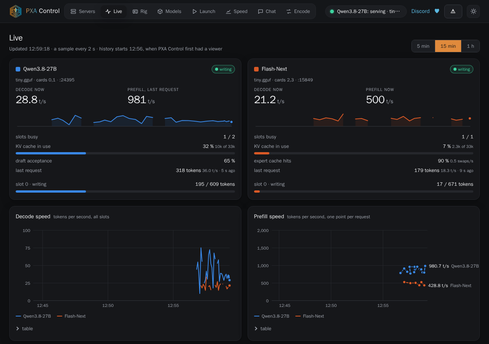
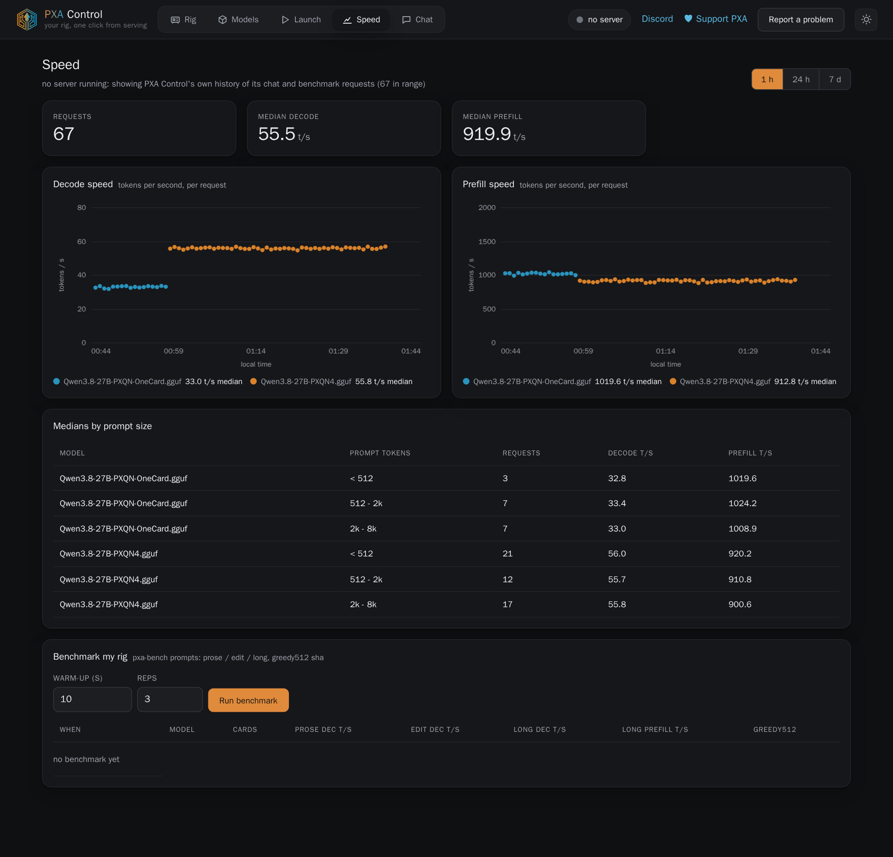

<p align="center"></p>

<h1 align="center">PXA v3.1</h1>

<p align="center"><b>Local language models, fast, on the Tesla P100, Tesla V100 and GTX 10-series cards that everyone else stopped tuning for.</b></p>

<p align="center">
<a href="https://github.com/poisonxa16/pxa/releases/latest"></a>
<a href="https://benchmarks.pxanetwork.com"></a>
<a href="https://discord.gg/EqazvV9tf"></a>
<a href="https://ko-fi.com/shatteredrealms1"></a>
</p>

```bash
tar xzf pxa-v3.1-linux-x86_64-cuda12.8-sm60_61_70.tar.gz && cd pxa-v3.1-linux-x86_64-cuda12.8-sm60_61_70    # 1. unpack the release tarball
./pxa                                                                  # 2. PXA Control opens in your browser
# 3. pick your cards, pick a model, press Start.  No browser? Run ./pxa --tui for the same steps in the terminal.
```

No build tools, no CUDA toolkit, no account. Prefer a container? See [Quick start](#quick-start).

The speed work targets [PXA quants](#use-pxa-quants) (PXQ and PXQN). A standard GGUF file loads and runs on the same server.

<table align="center"><tr>
<td align="center"><b>85.8 t/s</b><br><sub>27B code on ONE V100<br>(PXQN2, was 36.7)</sub></td>
<td align="center"><b>48.1 t/s</b><br><sub>27B code on ONE P100<br>(PXQN2, was 27.2)</sub></td>
<td align="center"><b>3x</b><br><sub>32 GB Flash-Next on one P100<br>plus RAM (6.5 to 20.4 t/s)</sub></td>
<td align="center"><b>+35%</b><br><sub>Gemma 4 prompt reading<br>on a V100</sub></td>
</tr></table>

<p align="center"><sub>PXA v3.0 against v2026.10.2 on the same machine, default settings. v3.1 keeps these. Details in <a href="#speed">Speed</a>.</sub></p>

**On this page:** [What PXA is](#what-pxa-is) · [Use PXA quants](#use-pxa-quants) · [Why it is fast](#why-it-is-fast-on-these-cards) · [Features](#features) · [Supported hardware](#supported-hardware) · [Quick start](#quick-start) · [Models](#models) · [Speed](#speed) · [FAQ](#faq) · [Docs](#docs) · [Community](#community-and-support) · [Credits](#credits) · [Licence](#licence)

---

## What PXA is

PXA is a language-model server for NVIDIA Pascal and Volta cards: Tesla P100, Tesla V100, GTX 1080 Ti and their relatives. You give it a model file and one or more cards. It starts a local server with an OpenAI-style API, so any chat app or script that talks to that API can use it. The model runs on your machine. You do not need an account to run a model.

PXA ships its own weight formats (PXQ and PXQN), its own GPU code for these chips, and a planner that chooses the settings for your cards. It reads ordinary GGUF files too. Its lineage and licence credits are in the [Licence](#licence) section.

## Use PXA quants

PXA is tuned for its own quants. Those are the PXQ and PXQN files. The GPU code, the planner and the speed tables are built around them.

A standard GGUF quant loads and runs on the same server. Q4_K_M, Q8_0, q4_0 and the other ordinary types open and answer. The speed work targets the PXA files, so a standard quant is an ordinary GGUF that this build has not been tuned around. When a model has a PXA version, use that one.

Get PXA quants from [Hugging Face](https://huggingface.co/poisonxa), or make one in PXA Control's Encode tab. The [Models](#models) list is the files the team and the community have posted.

## Why it is fast on these cards

- **Fewer bytes per token.** Generating text is limited by how fast a card can read the model from its memory. PXQN files land closer to the original model than other formats of the same size, so you can use a smaller file and keep the quality.
- **GPU code written for these chips.** The kernels target the P100 (`sm_60`), the 1080 Ti and P40 (`sm_61`) and the V100 (`sm_70`). They use the instructions these cards really have, not the ones newer cards have.
- **Fewer steps per word.** Speculation proposes several words at once and the full model checks them in one pass. The engine keeps the model's own choice. It picks the kind of speculation that pays for each model and card.
- **Better use of two or four cards.** Two identical cards share every layer's work (tensor split) with a fused all-reduce, instead of taking turns.
- **It measures, then decides.** The settings for each card and model come from measurements. At start-up the engine prints what it picked and why, so nothing is hidden.

## Features

- **Settings picked per card and model.** Split mode, batch sizes, context, flash attention, speculation and KV-cache type come from one table built from measurements. A plain `./run-server.sh -m model.gguf` and the launcher choose the same on the same cards. Every choice is printed at boot as a `PXA_REGISTRY:` line. A flag you type always wins. See [`docs/DEFAULTS.md`](docs/DEFAULTS.md).
- **Tensor split across cards.** Two identical P100s or V100s, and four identical P100s, split each layer across the cards on files with measured support. If the split cannot start, the engine falls back to the layer split instead of stopping.
- **MTP and n-gram speculation, chosen per model.** A file with an MTP head (the model's own guesser) uses it where it pays. Other models use n-gram speculation, which reuses text from the prompt. Gemma 4 loads its assistant drafter with `-md`. PXA Control offers that file on the Launch page when it sits next to the model, and `./pxa --draft-model` does the same. On one V100, the Gemma 4 26B-A4B file with that drafter measured 144.9 / 155.6 t/s (prose / code) in the [Speed](#speed) table.
- **Expert cache for models bigger than the card.** Mixture-of-experts models that do not fit in VRAM keep their busiest experts on the card and run the rest from system RAM through a fast CPU path made for PXQN weights. It profiles which experts are busy by itself. This is how the 32 GB Flash-Next file runs on one 16 GB card.
- **PXQN quants with quality-class labels.** Every tier name comes with a measured class, so "PXQN2" tells you it behaves like a classic 3-bit file. See [PXQN tiers](#pxqn-tiers-and-what-they-are-worth).
- **PXA Control, the browser GUI.** Servers, Live charts, Rig, Models, Launch, Speed, Chat and Encode tabs. See [PXA Control](#pxa-control).
- **Pro and Free encoders, from PXA Control.** Make your own PXQ or PXQN file from a Hugging Face model in a few clicks. Free makes the classic PXQ tiers and needs no key. Pro makes the PXQN tiers and is a supporter feature. Pro files can be locked: Only me (the default), Any PXA supporter, or Anyone.
- **Old CPUs work.** If your CPU has no AVX2, the launchers pick a compatibility library on their own. Card speed stays the same. Only the work done on the CPU is slower.
- **One tarball or a container.** The tarball carries its own CUDA runtime and a launcher. Container images are on ghcr.io, with a Compose file.
- **Long context.** A needle-in-a-haystack test at 125,000 tokens passes on one P100 and one V100 with the one-card 27B file.
- **Hot model swap.** Register several models with `--hot-model 'NAME=PATH [flags]'`. They wait in pinned host RAM, one is on the cards, and the request's `model` field picks which. Supported for Qwen-family models on Volta (V100) and newer cards that report CUDA virtual memory. Sliding-window models, including Gemma 4, are refused. PXA Control's Launch page registers the extras the same way (not on Pascal), and the Servers tab shows which model is on the cards. [Guide 11](docs/tutorials/11-switching-models-from-your-app.md) covers that, and the other way: a separate model switcher in front of the server.

### PXQN tiers and what they are worth

Quality is measured on Qwen3.8-27B: how far the quantized model's next-word probabilities drift from the original, scored on the tokens the assistant wrote in a chat test set (KL divergence, **lower is closer to the original**). The class label says which ordinary quant it matches.

| Tier | Size (27B) | Quality class | Drift (KL) | In plain words |
|---|---:|---|---:|---|
| PXQN1 | 6.5 GB | 1-bit class | 2.205 | Experimental. Very lossy. Used for the biggest expert files. |
| **PXQN2** | 9.6 GB | **3-bit class** | 0.161 | Performs like a classic 3-bit file at 2-bit size. |
| PXQN3 | 12.7 GB | 3.5-bit class | 0.035 | A good size and quality trade. |
| PXQN3bal | 13.5 GB | 4-bit class | 0.0238 | PXQN3 and PXQN4 mixed per tensor. |
| **PXQN4** | 15.7 GB | **6-bit class** | 0.0079 | As faithful as a classic 6-bit file (PXQ6, 0.0076, 18.8 GB) in 15.7 GB. |
| PXQN5 | 18.8 GB | Q6_K class | 0.0022 | The highest quality. Matches Q6_K (0.0023) in 84% of the space. |

The finer-scale variants PXQN3S8 and PXQN4S8 sit in the 3.5-bit and 6-bit classes. Drift for them is measured for PXQN4S8 only (0.0076). The Encode tab shows the same labels beside each tier. Old PXQ files keep loading.

<p align="center"></p>

### PXA Control

Your rig, one click from serving. PXA Control is the launcher as a local web app: run `./pxa` and it opens. It listens on this machine only unless you pass `--lan` (which adds an access token). It starts nothing until you press Start. Dark and light themes, and it works on a phone.

| Tab | What you get |
|---|---|
| **Servers** | Every server on the machine, one card each: state, port, cards, VRAM, speeds. Start, stop, restart, read the log, chat with it. |
| **Live** | Decode and prefill speed, speculation acceptance, expert-cache hits, a request timeline and per-card memory, load, temperature and power, as charts with history. |
| **Rig** | Every card with VRAM, temperature, power, PCIe link, the driver, and a doctor that tells you what would stop a launch. |
| **Models** | Point it at your folders. Each file is read from its header and shows what fits on one card, a pair, or neither. |
| **Launch** | Pick cards and a model, press Start. Show plan prints the exact command and the reason for each setting. |
| **Speed** | Speed history per model, a one-click benchmark of your rig, and an optional community high-score board. Nothing is sent unless you press the button and read the payload. |
| **Chat** | Talk to the running server, with the decode and prefill speed of every reply. |
| **Encode** | Turn a Hugging Face model into a PXQ or PXQN file. See [Make your own quant](#make-your-own-quant). |

<p align="center"><br><sub>The Live tab, with sample data.</sub></p>

<table>
<tr>
<td width="62%"><br><sub>The Speed tab, with sample data.</sub></td>
<td width="38%"><br><sub>Chat on a phone.</sub></td>
</tr>
</table>

Full reference: [`docs/LAUNCHER.md`](docs/LAUNCHER.md).

### Make your own quant

The Encode tab walks you through five steps: Source, Target, Checks, Run, Done. It shows which tiers fit your cards, with their quality class, estimated file size and, where we have a measurement, the decode speed. It resumes after a crash or a reboot.

- **Free.** Classic PXQ tiers. No key and no graphics card needed.
- **Pro.** The PXQN tiers. Supporters get a key from the PXA Network Discord with `/encoder` (see [Community and support](#community-and-support)). A Pro encode of a 27B model needs an NVIDIA card and about 260 GB of free disk while it runs.
- **Who can load the file.** In Pro, choose **Only me** (tied to your PXA account, the default), **Any PXA supporter**, or **Anyone**. A locked file loads in PXA v3 or newer. Older versions stop at load with an error.
- **Which models.** Qwen3 and Qwen2, Llama, Mistral, Gemma 3 and Phi convert, load and generate in our tests. Gemma 3 vision towers are skipped (text only).

The converter's Python packages are not in the tarball. Install them once:
`python3 -m venv ~/pxa-convert && ~/pxa-convert/bin/pip install -r tools/requirements-convert.txt`, then start PXA Control with `PXA_CONVERT_PYTHON=~/pxa-convert/bin/python`. The list itself (`tools/requirements-convert.txt`) is in the release tarball; from a source checkout use `requirements/requirements-convert_hf_to_gguf.txt` and `requirements/requirements-convert_legacy_llama.txt`. Guide: [`docs/tutorials/04-quantize-your-own-model.md`](docs/tutorials/04-quantize-your-own-model.md).

---

## Supported hardware

| Card | Compute capability | Memory | Status |
|---|---|---|---|
| Tesla P100 | `sm_60` | 16 GB | Tuned and measured. |
| Tesla V100 | `sm_70` | 16 or 32 GB | Tuned and measured. |
| GTX 1080 Ti | `sm_61` | 11 GB | Works. One card only. Smaller models. |
| Tesla P40 | `sm_61` | 24 GB | Recognised and allowed to use the 16 GB-class settings. **Not measured by us yet.** |
| Other GTX 10-series, Titan X, Titan Xp, Quadro P cards | `sm_61` | varies | Same chip family as the 1080 Ti. Expected to work. Not individually tested. |
| RTX 20-series and newer | `sm_75` and up | | **Not in this build.** It is compiled for `sm_60`, `sm_61` and `sm_70` only. |

**Software.** Linux x86-64. An NVIDIA driver 570 or newer (the package brings its own CUDA 12.8 runtime, so you do not install the toolkit). `python3` for the launcher. Any x86-64 CPU. About 5 GB of disk for the package, plus your models. The main tarball needs glibc 2.38 (Ubuntu 24.04 and newer). A second tarball covers Ubuntu 22.04 (glibc 2.35).

**What works on one, two and four cards**

| Cards | What the engine does |
|---|---|
| 1 card | Everything runs. One-card files for 27B-class models. Mixture-of-experts models larger than the card use the expert cache and system RAM. |
| 2 identical P100 or V100 | Tensor split by default for Qwen3.8 files in PXQ4, PXQN4, PXQN4S8 and PXQN5. Other files use the layer split. |
| 4 identical P100 | Tensor split by default, with the same file rules. The 64 GB Flash-Next file is the exception: the launcher gives it the measured layer split that fills four 16 GB cards evenly. |
| P100 and V100 together | Layer split. An even split would run every step at the slower card's pace. |
| 3 cards, 5 or more, or 4 V100 | Layer split. Not measured. |
| A PCIe link narrower than x4 | Layer split. |

---

## Quick start

**Tarball (recommended).** Download the tarball from the [release page](https://github.com/poisonxa16/pxa/releases/latest). Use `pxa-v3.1-linux-x86_64-cuda12.8-sm60_61_70.tar.gz`, or the `-ubuntu22.04` variant on Ubuntu 22.04. Then:

```bash
tar xzf pxa-v3.1-linux-x86_64-cuda12.8-sm60_61_70.tar.gz
cd pxa-v3.1-linux-x86_64-cuda12.8-sm60_61_70
./pxa --doctor                 # checks your cards, driver and CPU; starts nothing
./pxa                          # opens PXA Control in your browser
```

Use a PXA quant for the speed this build is tuned for. A standard GGUF quant (Q4_K_M, Q8_0 and the rest) loads and runs on the same command. [Use PXA quants](#use-pxa-quants). Files: [huggingface.co/poisonxa](https://huggingface.co/poisonxa).

**Run `pxa` and PXA Control opens** at http://127.0.0.1:7777 (the next free port if that one is taken). Pick your cards and a model, press Start, then chat with it and watch its speed on the same page. Starting a server from the command line instead (`./pxa --gpus 0 --model your-model.gguf --yes`, or `./run-server.sh -m your-model.gguf`) opens PXA Control next to it, with that server already on the page and a Stop button. It listens on your machine only. `./pxa --tui` asks the same questions in the terminal, and `--no-control` (or `PXA_CONTROL=0`) turns the page off. In Docker it is opt-in: `-e PXA_CONTROL=1 -p 7777:7777`.

Prefer no launcher? One line starts a server, and the engine picks the rest:

```bash
./run-server.sh -m /path/to/model.gguf          # serves on http://127.0.0.1:8080
curl -s http://127.0.0.1:8080/health            # {"status":"ok"}
```

Flash-Next with `run-server.sh` or `llama-server` by hand: add `-ot 'per_layer_token_embd\.weight=CPU'`. That table is about 51 GB and must stay in system RAM; `./pxa` adds it for you, together with the rest of the measured settings.

Add `--host 0.0.0.0` to reach it from another machine. `START-HERE.md` in the tarball goes through it step by step, and [`docs/tutorials/`](docs/tutorials/README.md) has twelve guides from a first chat answer to quantizing your own model.

**One command.** The installer checks your CPU, glibc and cards, downloads the right tarball, verifies its checksum and unpacks it:
`curl -fsSL https://raw.githubusercontent.com/poisonxa16/pxa/main/install.sh | bash`
Add `-s -- --docker` after `bash` to pull the container image instead.

**Container.** `ghcr.io/poisonxa16/pxa:v3.1` carries the same binaries. Models are not in the image. Mount a folder at `/models`.

```bash
docker run -d --name pxa --gpus '"device=0,1"' --shm-size=1g -p 8080:8080 \
    -v /path/to/models:/models:ro \
    -v pxa-cache:/work/.cache/pxa -e PXA_CACHE_DIR=/work/.cache/pxa \
    ghcr.io/poisonxa16/pxa:v3.1
```

The `pxa-cache` volume is where a session's learned expert counts are kept. Without that mount they are deleted when the container is removed. If the directory is missing or not writable, the server log says so.

If `--gpus` fails with `nvidia-container-cli: ldcache error` (some hosts, Unraid among them), use `--runtime=nvidia -e NVIDIA_VISIBLE_DEVICES=0,1` instead.

With no arguments the container's launcher picks the cards, the model (the only `.gguf` under `/models`, or `PXA_MODEL`) and the settings. Add `-p 7777:7777` and the word `gui` to run PXA Control instead. More than one card needs `--shm-size=1g`. Details: [`docker/COMPOSE.md`](docker/COMPOSE.md).

**From source.** [`BUILD-FROM-SOURCE.md`](BUILD-FROM-SOURCE.md). A source build runs classic PXQ files and standard quants. For PXQN files, add the compiled PXQN library from the release page (section 4b of that guide says how).

---

## Models

| Model | Where it runs | Notes |
|---|---|---|
| **Qwen3.8-27B** in PXQN2 to PXQN5, and the one-card mix | 1 card and up | The main target. The model has its own MTP head, and PXA uses it where it pays. |
| **Qwen3.8 Flash-Next** (a very large mixture-of-experts model) | 32 GB file: one P100 plus system RAM. 64 GB file: four P100. | Needs lots of RAM on one card (see the [FAQ](#faq)). |
| **Gemma 4 26B-A4B** | 1 V100 or 1 P100 | Optional MTP drafter file with `-md`, from `run-server.sh`, `./pxa --draft-model`, or the Launch page when the assistant file sits next to the model. |
| **Llama, Mistral, Qwen2 and Qwen3, Gemma 3, Phi** | 1 card and up | Convert them with the Encode tab. |
| **Ornith 1.5** (35B-A3B and 9B) | 1 card and up | Runs; see the community list below. |
| **Any other GGUF** the engine can read | any supported card | Standard quants load and run on the same kernels. The speed work targets PXA quants ([Use PXA quants](#use-pxa-quants)). The engine loads more than 80 architectures. |

Model files are published by the team and by community members on Hugging Face ([huggingface.co/poisonxa](https://huggingface.co/poisonxa)). **Who may download a file is set on its model card.** Some files are public. Some are for supporters only. Nothing here promises that a particular file is free or public. A locked file is refused with a plain message that tells you where to put your key.

<!-- models:start -->
## Models

Models quantized to PXA formats by the team. New posts in the #models channel on the [PXA Network Discord](https://discord.gg/EqazvV9tf) are added here automatically.

| Model | Notes | Published by | Added |
| --- | --- | --- | --- |
|[Swift-1.5-Qwen3.8-27B-PXQN-OneCard](https://huggingface.co/poisonxa/Swift-1.5-Qwen3.8-27B-PXQN-OneCard) |  | PXANetwork | 2026-10-01|
|[Qwen3.8-27B-PXQN-OneCard](https://huggingface.co/poisonxa/Qwen3.8-27B-PXQN-OneCard) |  | PXANetwork | 2026-09-30|
|[Ornith-1.5-35B-A3B-PXQ4-GGUF](https://huggingface.co/poisonxa/Ornith-1.5-35B-A3B-PXQ4-GGUF) | works with tensor split: -sm tensor | poisonxa | 2026-09-22|
|[PXA-Fusion4-35B-GGUF](https://huggingface.co/poisonxa/PXA-Fusion4-35B-GGUF) | Fusion4 35B | poisonxa | 2026-09-22|
|[Qwable-27B-GGUF](https://huggingface.co/poisonxa/Qwable-27B-GGUF) | 27B dense | poisonxa | 2026-09-22|
|[PXA-Coder-35B-PXQ4](https://huggingface.co/poisonxa/PXA-Coder-35B-PXQ4) | coder model in PXQ4 | poisonxa | 2026-09-22|
|[Qwen3.8-27B-PXQ-GGUF](https://huggingface.co/mistrjirka/Qwen3.8-27B-PXQ-GGUF) |  | mistrjirka | 2026-09-17|
|[Ornith-1.5-35B-A3B-PXQ-GGUF](https://huggingface.co/mistrjirka/Ornith-1.5-35B-A3B-PXQ-GGUF) |  | mistrjirka | 2026-09-11|
|[Gemma-4-12B-PXQ-GGUF](https://huggingface.co/mistrjirka/Gemma-4-12B-PXQ-GGUF) |  | mistrjirka | 2026-09-09|
|[Ornith-1.5-9B-PXQ-GGUF](https://huggingface.co/mistrjirka/Ornith-1.5-9B-PXQ-GGUF) |  | mistrjirka | 2026-09-08|
Full list with download counts: [MODELS.md](MODELS.md)
<!-- models:end -->

---

## Speed

PXA v3.0 against v2026.10.2, the previous release, on the same machine. These are v3.0 numbers on the v3.0 build, and v3.1 keeps every one of them; where v3.1 moves a number, the [v3.1 notes](RELEASE-NOTES-v3.1.md) say so. Both builds ran the same model files with the same flags, one after the other, in the same session. Decode is tokens per second (t/s) while the model writes. Prompt is tokens per second while it reads your prompt. Every number is a mean of three requests per prompt type, first run, greedy output, a different prompt every time, with the settings the engine picks for those cards and no flags typed on the command line; each table names the settings behind it. The test machine has Tesla P100 and V100 cards (16 GB each) on PCIe x4 links. Faster slots would lift the multi-card numbers.

<p align="center"></p>

<p align="center"></p>

**One card, decode with speculation as shipped (prose / code, t/s)**

| Setup | v2026.10.2 | PXA v3.0 |
|---|---:|---:|
| Qwen3.8-27B PXQN2, one V100 | 36.8 / 36.7 | **66.9 / 85.8** |
| Qwen3.8-27B PXQN2, one P100 | 27.3 / 27.2 | **40.3 / 48.1** |
| Qwen3.8-27B one-card mix, one V100 | 34.6 / 35.0 | **67.2 / 84.2** |
| Qwen3.8-27B PXQN4, one V100 | 33.7 / 33.8 | 39.9 / 39.8 |
| Qwen3.8-27B PXQN4, one P100 | 24.2 / 24.2 | 25.4 / 25.5 |
| Gemma 4 26B-A4B with its drafter, one V100 | 116.1 / 126.6 | **144.9 / 155.6** |
| Flash-Next 32 GB, one P100 and system RAM | 6.5 / 6.5 | **20.2 / 20.4** |

**Plain decode, no speculation (llama-bench `tg128`, t/s)**

| Qwen3.8-27B tier, one card | One V100, v2026.10.2 to v3 | One P100, v2026.10.2 to v3 |
|---|---:|---:|
| PXQN2 | 38.5 to 52.0 (+35%) | 27.4 to 33.3 (+22%) |
| PXQN3bal | 34.5 to 42.0 (+22%) | 23.9 to 28.1 (+17%) |
| One-card mix | 33.5 to 42.6 (+27%) | 23.8 to 27.8 (+17%) |
| PXQN4 | 33.3 to 40.0 (+20%) | 24.0 to 25.2 (+5%) |

**Reading the prompt**

| Setup | v2026.10.2 | PXA v3.0 |
|---|---:|---:|
| Gemma 4 26B-A4B, one V100, 4,096-token prompt | 1,994 | **2,683** (+35%) |
| Flash-Next 32 GB, one P100 and RAM, 4,096-token prompt | 310 | **396** (+28%) |
| Qwen3.8-27B PXQN2, one P100, 512-token prompt (llama-bench) | 156.1 | **252.3** (+62%) |

Prompt speed on the other V100 and P100 files (llama-bench `pp512` and `pp4096`) is within 2% of v2026.10.2.

**Two and four cards.** Plain decode on the PXQN4 27B file: two P100 go from 37.9 to 38.8, two V100 from 56.3 to 56.1, four P100 from 30.2 to 31.7 (llama-bench `tg128`). A second identical card gives 1.4x to 1.5x of one card's plain decode (P100 25.2 to 38.8, V100 40.0 to 56.1) and lets you run a bigger file. The second chart shows the two-card and four-card rows with speculation.

**Measured on the final build.** Every number above comes from the v3 release gate on the shipping build, with the settings the engine picks for those cards and no flags typed -- on the V100 cards, the four V100 settings listed in [`docs/DEFAULTS.md`](docs/DEFAULTS.md), plus NUMA binding under the container. One exception is worth knowing: the gate runs in containers, where only the thread half of NUMA binding applies. Run natively, Flash-Next 32 GB on one P100 measured 21.9 / 22.7 t/s in our lever test. Flash-Next 64 GB on four P100 decodes code 23% faster (29.4 to 36.3 t/s, speculation as shipped); its prose speed is unchanged.

**What these tables do not cover.** The P40 and the 1080 Ti were not re-measured for v3. Mixed P100 and V100 setups were not measured. Output text differs from v2026.10.2 on many files (see the [FAQ](#faq)).

---

## Updating PXA

PXA Control can install a newer release. From a terminal, the same tool is `pxa-update`.

```bash
pxa-update check
pxa-update apply
pxa-update rollback
```

`apply` downloads the build that matches this machine, checks the checksum, unpacks it next to the one you have, and points `current` at the new one. The previous version stays on disk. `rollback` points `current` back at it. Stop a server from this install before either one.

It does not touch your models, your settings, or a model's `.expert-counts.csv`. Those stay outside the version folder it switches.

There is no beta channel in v3.1. That comes later.

---

## FAQ

**One card or two?** One card is enough for a 27B model in a one-card file (the one-card mix is 13.6 GB; PXQN3bal is 13.5 GB). A second identical card gives about 1.4x to 1.5x of the plain decode speed, faster prompt reading, longer context, and room for a bigger and better file such as PXQN4 or PXQN5. Two identical cards get the tensor split. Two different cards use the layer split.

**How much RAM does the 32 GB Flash-Next file need on one card?** Plan for 64 GB of system RAM. Much of the model sits in RAM and the card holds the busiest experts. With less RAM the machine will swap and decode slows to a crawl. Do not start a second RAM-heavy job beside it. The 64 GB file runs on four P100s.

**Which quant should I pick?** Match the file to the card, then the quality you need:

| You have | Start with |
|---|---|
| One 16 GB card, 27B model | The one-card mix or PXQN3bal. They leave room for context. |
| One 16 GB card, you want the highest quality that fits | PXQN4 (15.7 GB). It fits with a small context. |
| Two 16 GB cards | PXQN4, or PXQN5 (18.8 GB) for the best quality. |
| One 11 GB card | PXQN2 (9.6 GB) or PXQN1 (6.5 GB). Context stays small. Not measured by us on v3. |
| A model you want in less space than a 4-bit file | PXQN2. It matches a classic 3-bit file's quality at 2-bit size. |

**Does my old CPU work?** Yes. If it has no AVX2, the launchers (`pxa-launch`, `run-server.sh` and the container entrypoint) read `/proc/cpuinfo` and use the compatibility library in `lib-compat/`, then print one line saying so. We proved the picker under emulation of several older CPU types. If `bin/` programs stop with `Illegal instruction`, start through `./run-server.sh`, or set `PXA_CPU_LIB=compat`.

**Why is my output different from the last version?** The v3 kernels add up numbers in a different order. That moves the last digits of the probabilities. When two words are almost tied, the winner can flip, and the text goes another way from there. This is not a quality drop. In our quality test (assistant tokens against Q8_0, the one behind the tier table) the PXQN4 file scored exactly the same on both versions, and a PXQN2 file scored slightly better. If you keep hashes of outputs, make new ones. Speculation can also change near-ties compared with plain decode. The engine keeps the model's own choice, but the arithmetic is not identical.

**What did the engine pick for my cards?** Run `./pxa --doctor`. It lists your cards, the driver, the model file and the settings the engine would pick, with the reason for each. Starts nothing. In a container: `docker run --rm --gpus all -v /path/to/models:/models:ro ghcr.io/poisonxa16/pxa:v3.1 doctor -m /models/your-model.gguf`.

**It says a model is locked.** The file was encoded with Pro and locked. Paste your key into the key field on the Encode tab in PXA Control, or set `PXA_LICENCE_KEY`. Supporters get their key from the PXA Network Discord with `/encoder`; a [ko-fi membership](https://ko-fi.com/shatteredrealms1) is what unlocks the Supporter role that comes with it.

**Do I need NVLink?** No. Cards on plain PCIe work. The engine tests peer-to-peer copies at start and falls back to a safe route on boards where they corrupt data.

**Can I use my RTX card?** Not with this build. It carries code for `sm_60`, `sm_61` and `sm_70` only.

**Something is wrong.** Use **Report a problem** in PXA Control. It builds a report with paths, host names and addresses removed, shows you every byte, and sends only when you press Send. Or ask in the Discord #support channel. Known problems are listed in [`docs/KNOWN-ISSUES.md`](docs/KNOWN-ISSUES.md).

---

## Docs

| Start here | |
|---|---|
| `START-HERE.md` (in the tarball) | The first fifteen minutes, with what a good start looks like. |
| [`docs/tutorials/`](docs/tutorials/README.md) | Twelve guides: first chat, settings for your cards, going faster, long chats, measuring your card, fixing problems. |
| [`docs/LAUNCHER.md`](docs/LAUNCHER.md) | The launcher and PXA Control reference. |
| [`docs/DEFAULTS.md`](docs/DEFAULTS.md) | What the engine picks for each card set, and why. |
| [`docs/COOKBOOK.md`](docs/COOKBOOK.md) | Per-card command lines for when you want to drive it by hand. |
| [`docs/HOME-ASSISTANT.md`](docs/HOME-ASSISTANT.md) | Your server's numbers in Home Assistant: the REST sensors, or MQTT with auto-discovery. |

| Reference | |
|---|---|
| [`docs/KNOWN-ISSUES.md`](docs/KNOWN-ISSUES.md) | Known problems and their workarounds. |
| [`docs/LEVERS.md`](docs/LEVERS.md) | The settings you can change. |
| [`docs/QUANTIZING.md`](docs/QUANTIZING.md) and [`docs/PXQU-CONVERT.md`](docs/PXQU-CONVERT.md) | Classic PXQ tiers and mixed-tier files. |
| [`docs/PXQ-EXPORT.md`](docs/PXQ-EXPORT.md) | Turning a PXQ file back into a plain GGUF. |
| [`docs/PXA-SM60-SERVING.md`](docs/PXA-SM60-SERVING.md), [`docs/PXA-SM70-SERVING.md`](docs/PXA-SM70-SERVING.md), [`docs/VLLM.md`](docs/VLLM.md) | The optional vLLM sidecar for Pascal and Volta. |
| [`docker/COMPOSE.md`](docker/COMPOSE.md) | Container images and Compose. |
| [`BUILD-FROM-SOURCE.md`](BUILD-FROM-SOURCE.md) | Building the engine yourself. |
| [`RELEASE-NOTES-v3.md`](RELEASE-NOTES-v3.md) | What changed in v3. |
| [`RELEASE-NOTES-v3.1.md`](RELEASE-NOTES-v3.1.md) | What changed in v3.1. |
| [`MODELS.md`](MODELS.md) | The full model list. |

---

## Community and support

<p align="center">
<a href="https://discord.gg/EqazvV9tf"></a>
<a href="https://ko-fi.com/shatteredrealms1"></a>
</p>

**Live leaderboard: https://benchmarks.pxanetwork.com** (every measured card setup, plus community scores sent from PXA Control → Benchmark).

**Discord: https://discord.gg/EqazvV9tf.** Help in #support, benchmark results and the community high-score board in #benchmarks, community rigs in #show-your-rig, development talk in #dev, new quants in #models, releases in #announcements.

**Support the work: https://ko-fi.com/shatteredrealms1.** Ko-fi memberships keep the quantization runs, the testing and the releases going.

| Tier | You get |
|---|---|
| **Supporter** | The #supporters channel, the Supporter role, and the quantizer key. |
| **Valued Supporter** | All of the above, plus #early-access, #valued-lounge (direct team chat), roadmap votes, one custom quant request a month (licence permitting), and your name in the release notes' thanks. |

Supporter models are available to supporters first. Bug reports are welcome on Discord or through **Report a problem** in PXA Control.

## Credits

Thanks to **mistrjirka**, a developer on the PXA Network Discord and part of the PXA team, for his help on this release. Thanks also to the community members whose testing on real hardware keeps this engine honest:

- **Last-Guitar-5924** found a long-context decode cliff on a Tesla P40.
- **bradrlaw** traced the dual-GPU decode collapse on boards without NVLink and caught a missing library in an earlier package.
- **thisistimow** reported the P40 case that led to the P40 card class.
- **quenthalion** tested and reported on earlier releases.

And thanks to everyone who posts results and bugs on the Discord.

## Licence

PXA is built on the ggml and llama.cpp code base (MIT). The engine in this repository is under the MIT licence: see [`LICENSE`](LICENSE) for the terms and the upstream copyright notices, [`LICENSING.md`](LICENSING.md) for which parts fall under which licence, and [`NOTICE`](NOTICE) for the lineage and every upstream credit. Contributors are listed in the `AUTHORS` file. New files carry a `Copyright (c) 2026 PXA Network` header.

The PXQN kernels ship compiled only, as a library in the release package and the container images. The PXQN encoder is not part of this repository or of the tarball. It comes from the licence server through PXA Control. Model weights are separate works with their own licences. Check the model card before you use or redistribute a file.
