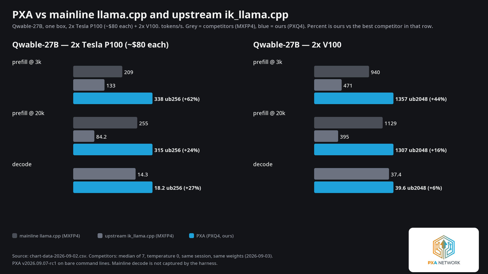
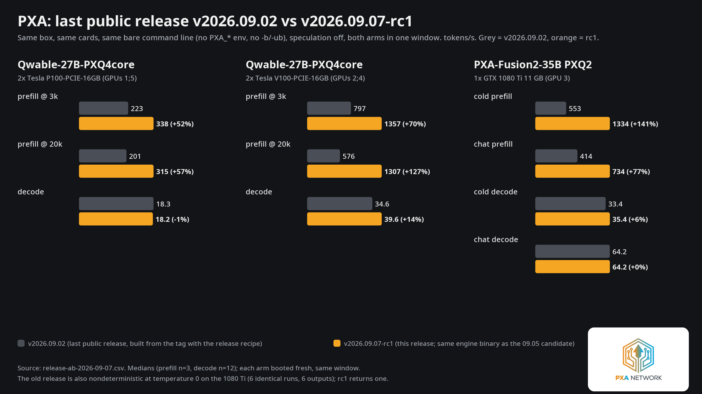
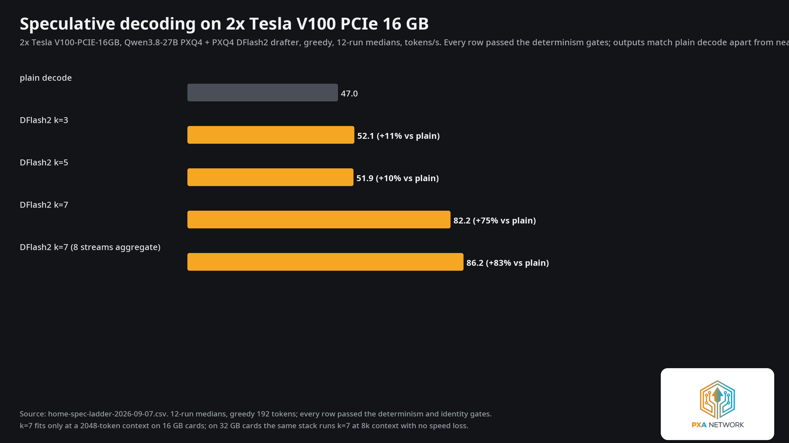
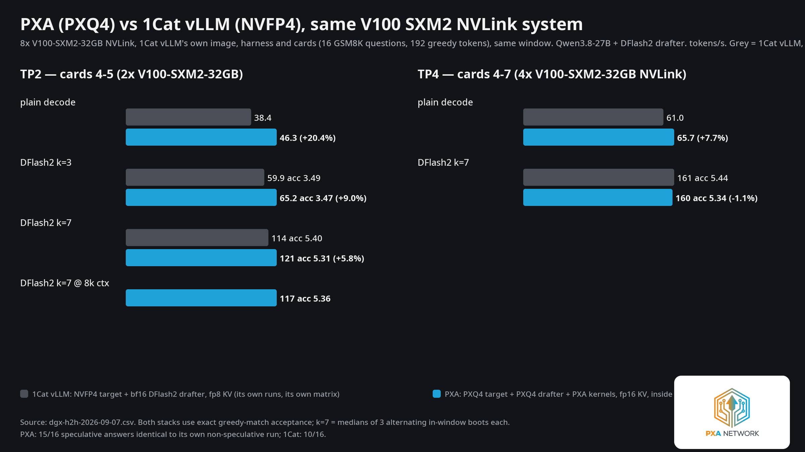
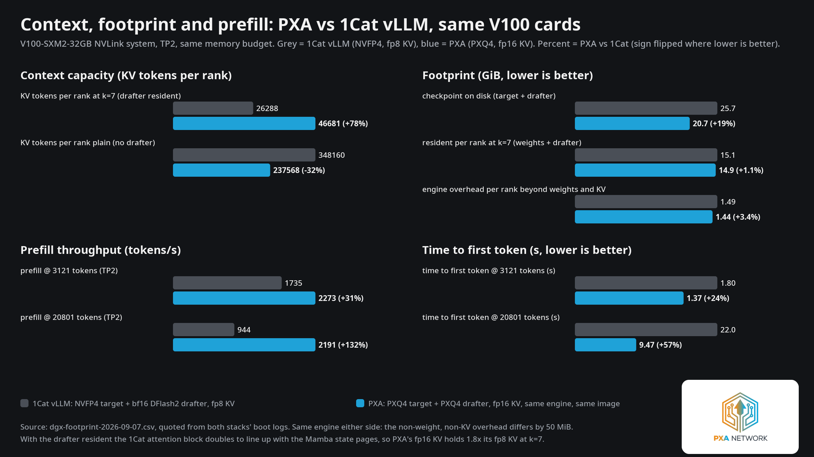

# PXA v2026.09.07-rc1 — major release candidate

A major release candidate: a rename, a root-caused correctness defect that was corrupting
output on every card since `v2026.09.02`, a vLLM sidecar rebased onto a new upstream, a
ported speculative-decode engine that is **present but default-off and experimental in this
build**, two new quant tiers in the vLLM plugin, and the first **measured** speculative
rows — which were taken on the vLLM sidecar, not on this engine binary. Every number below
traces to a named capture in the measurement ledger, and the harness, the sample count and
the reproduce command are given alongside each table. Where a window did not run at all, the section says so and says what it
would have measured. See [How much faster than the last public
release](#how-much-faster-than-the-last-public-release) and [Speculative decoding,
measured](#speculative-decoding-measured-on-the-vllm-sidecar).

## Since v2026.09.03

- **The engine picks its own batch geometry per card.** A four-card P100 host now gets
  `-b 2048 -ub 2048` from the engine with no flags at all, worth **+29% prefill @3k** and
  **+32% @20k** over the previous automatic choice, and matching what twelve hand-tuned
  environment levers used to buy. See [Config default: ENHANCE, and per-topology auto batch](#config-default-enhance-and-per-topology-auto-batch).
- **DFlash and DFlash2 hand-ported** into the llama-engine line from `ik_llama.cpp`,
  byte-identical acceptance to the reference; **off by default and experimental in this
  engine binary** — the code ships, no speculative speed row for *this binary* does.
- **Speculative decoding is measured, on the vLLM sidecar.** On our own 2x V100-PCIE-16GB
  pair, DFlash2 at `k=7` serves **82.18 tok/s against 47.02 plain — 1.75x** — losslessly
  (exact greedy match against the target's argmax), and on an 8x V100-SXM2-32GB NVLink box
  the same stack beats a specialist NVFP4 DFlash2 stack at TP2 (`k=7` +5.8%, plain +20.4%),
  matches it at TP4, and prefills a 20,801-token prompt **2.3x faster**. Those rows ship in the **sidecar images and the
  drafter asset**, not in this engine binary. See [Speculative decoding,
  measured](#speculative-decoding-measured-on-the-vllm-sidecar).
- **Measured against our own last public release**, `v2026.09.02`, on the same box in one
  window: V100 pair prefill **+70% / +127%**, decode **+14%**; P100 pair prefill
  **+52% / +57%**; 1080 Ti cold prefill **+141%**. And the old release is *nondeterministic*
  at temperature 0 on the 1080 Ti where this one is not. See [How much faster than the last
  public release](#how-much-faster-than-the-last-public-release).
- **Renamed.** The project is **PXA**; **PXQ** stays the name of the codec (the quantizer
  and its GGUF tensor types). All public references were scanned and updated.
- **Root-caused and fixed the DeltaNet out-gate fusion race** — the last source of
  greedy nondeterminism on the V100 pair, closing the two failures (`needle20801`
  1-in-4, `np=2` slot 1 1-in-12) that blocked the previous tag attempt.
- **Release gate raised to 11/11** on both the campaign hybrid model and a stock dense
  GGUF, including a logit-reproducibility arm at `np=1` and `np=2`.
- **Fixed multi-slot admission fairness** on the hybrid: a short chat during a 100k-token
  prefill on another slot went from ~463 s to first token to ~2.8 s.
- **vLLM sidecar rebased onto 1Cat-vLLM v1.5.0** (521 commits upstream): fixed MoE on
  Pascal under custom all-reduce, and fixed a live one-token completion defect on the
  Volta image that no prior gate had caught.
- **Two new vLLM quant tiers, PXQ2 and PXQ3**, alongside PXQ4 — one layout, three code
  widths, sharing kernels, books and the capture-ladder argument. CPU-exact and shipped;
  their on-GPU window did not run before the tag, so they are not a gated speed claim yet.
- **Launcher TUI, tarball, and container image** all rebuilt and gated from the tag
  commit.
- **The Volta prefill regression is closed:** the v1.5.0 rebase ships on Volta too, at
  parity on all four cells, once it is run the way the seat runs it — compiled, at
  `--block-size 256`. See [The Volta prefill regression, and what it actually
  was](#the-volta-prefill-regression-and-what-it-actually-was).

## What PXA is

PXA is the Pascal/Volta codec-plus-kernel-pack engine formerly published as a fork of
`ik_llama.cpp`: a llama.cpp-lineage inference engine carrying the PXQ quantization codec
(PXQ1 through PXQ6, PXQ_UNIVERSAL) and the kernel and scheduler work that makes cards
with no DP4A and no tensor cores — Tesla P100 — and Volta (V100, and the GTX 1080 Ti /
sm_61 by extension) competitive with current-generation hardware. As of this release the
project's public name is **PXA**; **PXQ** remains the name of the codec itself, not the
project. Nothing about the codec, its file format, or its tensor types changed with the
rename — only the repository, binary banners, image tags and documentation say `PXA`
where they used to say the old fork name.

## Headline numbers

Bare command lines: `PXA_ENHANCE` default level (no environment exported), `-b`/`-ub`
left unset so the server's per-topology auto-batch picks them. This is what an operator
who reads no documentation gets.

| card set | model | prefill @3,121 | prefill @20,801 | decode | comparison |
|---|---|---|---|---|---|
| 2x Tesla V100-PCIE-16GB | `Qwable-27B-PXQ4core` | **1,369** t/s | **1,300** t/s | **39.5** t/s | vs mainline llama.cpp 940 / 1,129; vs upstream ik decode 37.4 |
| 2x Tesla P100-PCIE-16GB | `Qwable-27B-PXQ4core` | **337.6** t/s | **315.3** t/s | **18.1** t/s | vs mainline llama.cpp 209 / 255 (decode not captured); vs upstream ik 134.5 / 84.0 / 14.3 |
| 1x GTX 1080 Ti 11 GB | `PXA-Fusion2-35B` PXQ2 | **1,363.5** t/s (cold, `-fa off`) | — | **65.3** t/s (chat decode) / 36.73 (cold decode) | vs upstream ik IQ2_KS 1,132 (cold) / 740 (chat prefill) / 53.3 (chat decode) |



Reproduce with no `PXA_*` environment and no `-b`/`-ub`:

```bash
# 2x V100 (and 2x P100: identical command line; the engine picks -b/-ub per card)
./build/bin/llama-server -m Qwable-27B-PXQ4core.gguf -ngl 99 -c 32768 -t 16 -fa on -sm layer

# 1x GTX 1080 Ti
./build/bin/llama-server -m PXA-Fusion2-35B-PXQ2.gguf -ngl 99 -c 8192 -t 16 --ctx-checkpoints 0
```

The server prints which `-b`/`-ub` it chose and why (`PXA_AUTO: batch defaults for 2x
V100 (sm_70) -> -b 8192 -ub 2048`), so the choice is auditable rather than assumed. The
V100 cells are +2.2% / +1.4% prefill and -0.45% decode against the n=7 quiet-box
reference from the previous tag — inside that reference's own spread — and the auto
picker reproduces the hand-tuned control's flags exactly.

## How much faster than the last public release

The table above is against other projects. This one is against **us**: our own last public
release, `v2026.09.02`, versus this candidate, on our own cards.

Both arms were compiled by the same compiler in the same image (`gcc 11.4.0`, Ubuntu 22.04)
for the same architectures (`60;61;70`) with the same flags, and both were **run** from the
same container with the same mounts — only the binary tree differs. Both arms ran
back-to-back on the same cards inside a single lock hold, alternating BEFORE then AFTER so
any box drift hits both. **No `PXA_*` environment was exported, no `-b`/`-ub` was passed,
and no speculation flag was passed to either arm**: everything here is what the two engines
choose for themselves.

| binary | banner | commit |
|---|---|---|
| BEFORE | `version: 5076 (ac932d9e)` | tag `v2026.09.02` |
| AFTER | `version: 5201 (cd681b35)` | this candidate's engine tree |

| card set | model | cell | BEFORE `v2026.09.02` | AFTER | delta |
|---|---|---|---|---|---|
| 2x Tesla V100-PCIE-16GB | `Qwable-27B-PXQ4core` | prefill @3,121 | 797.24 t/s | **1,356.78** t/s | **+70.2%** |
| | | prefill @20,801 | 575.58 t/s | **1,306.54** t/s | **+127.0%** |
| | | decode (low fill, n=12) | 34.61 t/s | **39.58** t/s | **+14.4%** |
| 2x Tesla P100-PCIE-16GB | `Qwable-27B-PXQ4core` | prefill @3,121 | 222.87 t/s | **337.75** t/s | **+51.5%** |
| | | prefill @20,801 | 200.77 t/s | **315.35** t/s | **+57.1%** |
| | | decode (low fill, n=12) | 18.34 t/s | 18.17 t/s | **−0.9%** |
| 1x GTX 1080 Ti 11 GB | `PXA-Fusion2-35B` PXQ2 | cold prefill (`-fa off`) | 552.6 t/s | **1,333.5** t/s | **+141.3%** |
| | | cold decode (`-fa off`) | 33.39 t/s | **35.37** t/s | **+5.9%** |
| | | chat prefill (`-fa on`) | 414.5 t/s | **734.1** t/s | **+77.1%** |
| | | chat decode (`-fa on`) | 64.18 t/s | 64.23 t/s | +0.1% |



**The P100 decode cell is the one place this release is not faster.** −0.9% is small but it
is *outside* the measured noise (both arms' half-spreads are ≤0.05%), so it is a real, tiny
regression and it is stated as one. Prefill on the same card set is up by half.

Most of the story is that the two builds choose differently. On a bare command line the old
release boots at `PXA level=DEFAULT`; this one boots at `PXA level=ENHANCE` and arms the
levers it has measured — `-b 8192` on both Tesla pairs (from `-b 2048`), `ROUTER_FUSE` and
`CUBLAS64` on the V100s, `INT8_PREFILL` on the 1080 Ti. Neither build was asked to
speculate and neither did; this release prints its reasoning (`PXA_AUTO: spec DECLINED …`
on single-card sm_61) where the old one simply had nothing to arm.

### And the old release is nondeterministic where this one is not

On the 1080 Ti, **every `v2026.09.02` arm returned three different sha256 across its three
identical greedy runs** — `-fa off` and `-fa on` both — while this candidate returned *one*
sha in both arms, the same sha in both:

| arm | rep shas |
|---|---|
| BEFORE cold (`-fa off`) | `10556d99…`, `a966d188…`, `6559bd18…` (3 distinct) |
| BEFORE chat (`-fa on`) | `c063afb3…`, `53758f1f…`, `8284c0b3…` (3 distinct) |
| AFTER cold | `7caed6a0…` ×3 |
| AFTER chat | `7caed6a0…` ×3 |

That is the DeltaNet out-gate fusion race this release root-caused and closed
([below](#correctness-the-deltanet-out-gate-fusion-race-root-caused-and-closed)),
reproducing live on the last public release, on a card the fix was never demonstrated on.
Six different answers to the same question, from the release people are running today.

## Engine

### Correctness: the DeltaNet out-gate fusion race, root-caused and closed

This is the defect behind every remaining garbage-output and greedy-nondeterminism
report since `v2026.09.02`, and it is now understood down to the instruction.

`PXA_FUSE_DELTANET` is a bitmask of kernel-fusion clusters in the delta-net (Gated
DeltaNet) block. Bit 1, `pxa_try_deltanet_outgate`, folds a fused RMS-norm and a fused
SiLU-gate multiply (`FUSED_RMS_NORM` + `FUSED_MUL_UNARY`) into one kernel,
`pxa_dn_rms_silu_gate_f32`. One thread block handles one row and reads that row twice —
once for the sum-of-squares reduction, once to compute and store the final value.
Unfused, the launch boundary between the two original kernels orders every read of the
input before any write of the output, across the whole grid. Fused, only `__syncthreads`
orders reads and writes *within* one block; there is no grid-wide barrier. So when the
fused kernel's output storage overlaps an input at a **shifted** (non-identical) base —
which happens on the shipping multi-slot state carry, though not on the single-sequence
in-place path the fusion was originally written against — one thread block's store can
land in another block's still-unread input. That is a write-after-read race, ordered by
whatever order the GPU happens to schedule blocks in, which is why the symptom was
run-to-run nondeterminism rather than a hard failure: corrupting the delta-net gate
corrupts the recurrent state, so the visible effect ranges from a one-token logit wobble
to full garbage output.

The `v2026.09.03` release had already added a guard to this fusion, but that guard
checked contiguity, shape and "is this norm's only consumer the gate multiply" — it
never checked for a *shifted* overlap, so it passed the exact case that was unsafe. The
fix, once isolated, was three lines reusing the shifted-overlap predicate the sibling
`ADD+FUSED_RMS_NORM` fusion already carried from the previous release. Bisecting on raw
token-0 top-1 probability (rather than on output hashes — hashes only catch a flip when
sampling actually changes, which was hiding most of the wobble) found the bit cleanly:
mask 53 (bit 1 off) and mask 48 both reproduce the unfused reference's probability to the
bit; every mask containing bit 1 wobbles.

**Shipped state.** The shifted-overlap guard is in the tree and armed by
`PXA_FUSE_DELTANET_WAR` (default on). The default `PXA_FUSE_DELTANET` mask stays at
**53** — bit 1 off by default — because the measured cost of leaving it off is nil (two
V100 boots under load: prefill 1,316/1,316 vs 1,320/1,300, decode 32.6 vs 32.8, i.e.
inside noise) and the fusion's own win (1.6–3.7 t/s of V100/P100 decode) is not worth
re-litigating per release. It can be turned on (`PXA_FUSE_DELTANET=55`) once the guard is
armed, and doing so is now safe; it ships off anyway. See
[Documented negatives](#documented-negatives).

**The logit-reproducibility gate.** The 12-run byte-identity gate that shipped
`v2026.09.03` could not see this defect reliably — hashes only diverge when the
race flips a close sampling decision, and most of the time it does not. The release
gate (`bench/gate/run-gate.sh`) now runs a **logit-reproducibility arm**: six identical
greedy requests, comparing raw per-token top-k probabilities rather than just the
sampled output, at both `np=1` and `np=2` (same-KV-placement). This is what let the fix
be verified rather than merely hoped for.

### Release gates: 11/11 on hybrid and dense

The full gate (`bench/gate/run-gate.sh`) is now **11 checks**: `np=1` greedy
determinism (12/12), coherence, `needle3121` and `needle20801` recall and sha-stability
(4/4 each), logit reproducibility at `np=1` and `np=2` (6/6 each), `np=2` slot 1 greedy
determinism (12/12) and its same-KV-placement match against the `np=1` reference, and
three unit tests (`test-pxq-cpu-dot`, `test-kv-seq-shadow`, `test-narrow-kernel-parity`).

- **`Qwable-27B-PXQ4core`** (the campaign hybrid model), V100 pair: **PASS=11 FAIL=0
  SKIP=0**, including the logit-reproducibility arm at both `np` levels.
  
- **`Qwen3.8-27B-UD-Q4_K_S`** (a stock dense GGUF, no PXQ conversion), same binary:
  first attempt was `PASS=9 FAIL=8`, and every failure was the identical truncated
  needle-recall output — the gate's 32-token answer budget was too small for a
  thinking model that spends its first ~100 tokens inside a `<think>` block. The logit
  shas were identical between the failing and passing configurations, which is the
  proof it was budget, not the engine. Re-run with `N_PREDICT=256`, nothing else
  changed: **PASS=11 FAIL=0**. The gate's default answer budget is raised 32 → 256
  accordingly.
  
- **Re-gate on the renamed, final release binary**: **PASS=11 FAIL=0 SKIP=0** on the
  V100 pair with no environment set.
  

The 12/12-at-`np=1`-AND-`np=2` rule from the previous release stands: a lever that
touches the recurrent path does not ship default-on until it clears both.

### Config default: ENHANCE, and per-topology auto batch

Carried over from `v2026.09.03` and re-verified bare-metal for this release: the
default configuration level is **ENHANCE** (`PXA_ENHANCE=0` rolls back to the previous
DEFAULT level; `PXA_REFERENCE=1` is the bit-exact all-levers-off baseline), and on a
card topology the campaign has measured, the server fills `-b`/`-ub` when the operator
leaves them unset: 2x V100 → `-b 8192 -ub 2048`; 1x GTX 1080 Ti → `-b 2048 -ub 768`; 2x
P100 → `-b 8192 -ub 256`; **new this release, 4x P100 → `-b 2048 -ub 2048`**. The startup
log names the choice
(`PXA_AUTO: batch defaults for 1x 1080 Ti (sm_61) -> -b 2048 -ub 768`), an explicit
`-b`/`-ub` on the command line always wins, and every other card set keeps the
adaptive-VRAM ladder. Verified this release with genuinely no environment and no batch
flags on both the V100 pair and the 1080 Ti: output is bit-identical to the hand-tuned
control in every case checked, and the auto-picked flags are the ones the headline table
above reproduces.

**The four-card row is the one that mattered.** Until this release there was no 4x `sm_60`
entry, so a four-card P100 host fell through to the adaptive-VRAM ladder — and that ladder
estimated free memory by splitting the model file evenly across devices, which is wrong the
moment `-ts` or `-ot` is uneven, as it is on any real four-card seat. The estimate floored
`-ub` at 512 and cost about a fifth of prefill. Two fixes ship: the `4x sm_60` row itself,
and a headroom estimate that honours the actual per-device split and declines to floor on a
provably wrong number. Measured on the 177B MoE seat with **no batch flags and no `PXA_*`
environment at all**, against the same binary driven by hand-tuned flags:

| | prefill @3.1k | prefill @20.8k | decode |
|---|---|---|---|
| previous automatic choice | 377.9 t/s | 284.9 t/s | 23.62 t/s |
| hand-tuned flags (12 levers + explicit `-b`/`-ub`) | 485.7 t/s | 344.1 t/s | 23.74 t/s |
| **this release, automatic** | **487.62 t/s** | **376.71 t/s** | **24.57 t/s** |

That is +29% prefill @3k and +32% @20k over the old automatic choice, and it lands on top
of what twelve hand-set environment levers used to buy — so the levers, and the hand
`-b`/`-ub`, can be retired from the seat recipe. This is the whole "engine for dummies"
claim, tested on the hardest model in the fleet: name your cards and your model, and the
engine picks the rest.

### Prompt fairness and the multi-slot decode window

On the hybrid Flash-Next-class configuration, the batcher used to admit one prompt per
batch and walk slots in id order, so a short chat arriving on one slot while another
slot was 100,000 tokens into a prefill waited for that prefill to finish end to end:
**463.2 seconds** to first token. Two scheduler changes fix this without costing the
deep prefill anything measurable: prefer, among pending prompts, the one whose
remaining prompt fits in a single batch; and after each prompt chunk, run decode ticks
for the other slots for up to a second, ending early once nobody needs decode.

- 23-token chat on slot 1 during a 100k-token prefill on slot 0: time to first token
  **2.70 s** under CPU load 63 (compared to the 463.2 s unfixed), **2.24–2.82 s** on a
  quiet box; full answer **3.26 s** at 22.96 tok/s, content correct.
- The deep prefill it interrupts loses nothing measurable: 99,999 tokens at 218.95 t/s
  with the fix, needle recalled (216.5 t/s unfixed).
- At a deeper 145,024-token prefill, probed every 60 s: 13/13 probes correct, 11/13
  under 15 s, worst-case total 19.13 s — against a **298.29 s** worst probe on the
  unfixed build (15.6x). The two probes over 15 s land in the prefill's final minute; see
  [Known limits](#known-limits) for why.

### The launcher TUI

`tools/pxa-launch.py` — lists the cards in the box and the model files it can find,
picks the engine (llama.cpp-based `pxa` vs the vLLM sidecar), the batch sizes, tensor
split and flash-attention regime from a measured decision table, prints the evidence
before running anything, and boots. Sanity-boot verified within 3% of the reference
numbers on V100, P100 and the 1080 Ti this release.

### Packaging: the tarball for dummies, and the container image

The release tarball is built in a CUDA 12.8 / Ubuntu 22.04 image rather than the
development container's Ubuntu 24.04, so its **glibc floor is 2.35**, not 2.39 —
binaries built for the dev container did not start on 22.04 at all. Bundles `libgomp`
and `libstdc++` alongside the binaries and a `START-HERE` script, proven booting on
both 22.04 and 24.04.

The container image's runtime stage carries `libgomp1` (missing in an earlier smoke
test, now fixed), a driver stub, the `LLAMA_ARG_*` environment surface, and OCI labels;
smoke-tested twice. Both the tarball and the image are rebuilt from the tag commit by
`artifacts-from-tag.sh` before publish, not carried over from a development build.

## vLLM sidecar

### v1.5.0 base

The vLLM plugin's image now rebases onto **1Cat-vLLM v1.5.0** (521 commits ahead of the
previous base), carrying our 22-commit delta (the Pascal port, the short-prefill guard,
branding, the vendored PXQ4/PXQ2/PXQ3 sidecar) on top rather than merged in, so a future
rebase stays a rebase. See `docs/VLLM.md` §"The engine base" for the full commit-range
summary (rewritten paged decode kernel, rewritten Marlin/TurboMind GEMMs, two
silent-wrong-answer fixes on stock AWQ/Triton-MLA paths, a custom-all-reduce dtype
fallback, and DFlash/DFlash2 arriving wired through `FLASH_ATTN_V100`).

### MoE on Pascal, finally correct

Since 2026-08, a P100 MoE seat with custom all-reduce (CAR) on produced deterministic
token soup from the first character; the documented mitigation was `CAR` off, at roughly
1.8x the decode cost. On the v1.5.0 base:

- **Gate:** 20/20 byte-identical completions, CAR on vs CAR off, same first token in all
  20; both arms pass the short-prefill probe.
  
- **Speed**, 35B MoE (`coder35-moe-pxq4-m1`), P100 pair, TP=2, median of 3: CAR on beats
  CAR off by **+28.8%** single-stream decode (29.80 vs 23.13 t/s) and **+6.6%** aggregate
  @8 (97.81 vs 91.73 t/s); both arms 20/20 byte-identical. The two mandatory mitigations
  this project carried for a year — CAR off, PP=2 — are retired; the fastest correct
  aggregate on record for this cell.
  

The exact upstream change that fixed it has not been bisected — the whole v1.5.0 range
landed at once — but the leading candidate is the dtype guard that keeps a non-float
tensor from reaching the fp16 all-reduce kernel.

### The one-token completion defect, fixed

A live production defect on the shipped Volta (sm_70) vLLM image: a raw
`/v1/completions` prompt of exactly one token (e.g. `"Hello"`) returns a degenerate
`"!!!!…"` completion; 5- and 12-token prompts are clean. Same class as the P100 MoE
short-prompt corruption — a prompt whose length matches the captured decode CUDA
graph's query length passes the shape check and replays the graph over stale input
state. Invisible to chat-templated and 70-prompt gates, which pad every prompt past the
envelope; present since at least 2026-08.

The v1.5.0-based candidate image (carrying our short-prefill guard) is clean:

- **Gate C** (one-token probe): coherent, where the shipped image on the same cards
  returned `!!!!` nine minutes earlier.
- **Gate D** (70-prompt same-top-token vs the shipped image): **70/70** first-token
  agreement (bar was 98.6%), 65/70 exact 32-token match, mean common prefix 20.5 of
  ~24 words (late fp16 near-tie drift on the rest).
- **Gate F**: 12/12 greedy determinism at 20k tokens.

This release **fixes a live production defect** on the Volta serving seat, independent
of anything else it ships.

### The Volta prefill regression, and what it actually was

For most of the release window the v1.5.0-based Volta image looked like a straight loss.
Measured **eager**, against the previously-shipped image on the same cards, same day,
same harness, reproduced twice:

| | prefill @3k | prefill @20k | decode | agg @8 |
|---|---|---|---|---|
| shipped `sm70` image | 1,010.0 t/s | 987.3 t/s | 52.41 | 189.2 |
| candidate `sm70-v15`, eager | 905.0 t/s (**-10.4%**) | 857.2 t/s (**-13.2%**) | 52.66 (+0.5%) | 189.1 (flat) |

An eager arm is a measurement, not a serving configuration: the seat runs compiled. Every
attempt to boot the candidate compiled failed with `Constraints violated
(inputs_embeds.size()[0], positions.size()[1])`, which read like a defect in the rebase.
It was not. **The harness was setting `PXQ4_TRACE_M=1` on the compiled arms**, and the
sidecar's `_trace_route` hashes the batch dimension — `int(M)` on a `SymInt`, into a dict
key — which specialises the dynamic dimension and makes Dynamo reject the graph. With the
trace off, the candidate boots compiled, and so does the previously-shipped image.

Compiled, at the seat's own `--block-size 256`, the rebase is at parity:

| | prefill @3k | prefill @20k | decode | agg @8 |
|---|---|---|---|---|
| shipped `sm70` image | 1,010.0 t/s | 987.3 t/s | 49.71 | 178.33 |
| `sm70-v15c`, compiled, `--block-size 256` | 1,002.85 t/s (-0.7%) | **993.84 t/s (+0.7%)** | 49.73 | 178.23 |

Parity on rate is the weaker half of the claim. On the determinism gate the two images
produce the **byte-identical** 256-token greedy continuation at `-np 1` (`sha
c220beafa2d5`, twelve times each), the same two-sha pair in the same proportions at `-np
2`, and identical logit spreads of 0.0 at both — the same answer, not merely the same
rate. The `-np 2` split is a property of batched vLLM on `cc 7.0` (batch invariance is
offered only on `cc >= 9.0`), unchanged by the rebase, and the previously-shipped image
fails that arm identically.

**What ships:** `pxa-vllm:sm70-v15c` on the Volta seat with `--block-size 256`, and the
launcher now defaults to that block size for GDN hybrids on `cc == 7.0`. The two host-side
fixes in the rebase branch (a compile-safe `is_compiling()` guard around the route trace,
and its companion) are **hardening, not the cure** — the previously-shipped image also
boots compiled at `--block-size 256` once the trace is off. The lesson is cheaper than the
window it cost: **never measure a serving seat in a mode the seat does not run in, and
never leave a diagnostic env var armed on the arm you are judging.**

### PXQ2 / PXQ3 tiers in the vLLM sidecar

New this release: the vLLM plugin now implements **PXQ2 and PXQ3**, not just PXQ4. All
three tiers are one layout with three code widths — 64-row panels, a 128 B fp16
row-anchor header, 32-column slabs, the same `SUB16` lookup table and the same
parity-locked reconstruction — differing only in code width (8/12/16 bytes per row per
slab → 576/832/1088 slab bytes) and book size (4/8/16 entries). The slab stride is
asserted at weight creation, at every op, and against the checkpoint's own tensors at
load, so a PXQ2 tensor can never be silently read at the PXQ4 stride. A checkpoint
declares tiers per module (`quant_method: "pxq"`, a `pxq_tiers` map, and the
checkpoint's own `tier_books`/`tier_sub` tables — decoding a v3-book file with the wrong
compiled-in table is a silent, uniform weight error with no load-time symptom, which is
why the runtime refuses to serve a tier whose book the checkpoint did not record). New
kernel libraries `libpxq_sm70_v13.so` / `libpxq_sm60_v13.so` are required; existing
PXQ4-only libraries (`v12b` and earlier) refuse a PXQ2/PXQ3 checkpoint at layer
construction with a message naming the library it needs, not silently.

**Why this exists — the 16 GiB arithmetic.** The 35B `qwen35moe` Fusion family's routed
experts are natively PXQ2 (`ffn_gate/up_exps`) and PXQ3 (`ffn_down_exps`); everything
else is a small MXFP4/q8_0/q6_K/f32 backbone. Converter policy `m2` keeps the routed
experts at their on-disk tier as a byte move and re-encodes the backbone to PXQ4; `m2f`
is its fp16-backbone control arm. Resident-weight totals, from the converter's own plan:

| source tier | policy | total |
|---|---|---|
| PXQ2 | m2 (PXQ4 backbone) | **12.23 GiB** |
| PXQ2 | m2f (fp16 backbone) | 13.89 GiB |
| PXQ3 | m2 | **15.98 GiB** |
| PXQ3 | m2f | 17.64 GiB |

A 16 GiB P100 or V100 has roughly 0.8 GiB spoken for by the CUDA context before a weight
loads. **PXQ2 runs at TP=1 on one card** with `m2` (about 3 GiB left for KV). **PXQ3 does
not fit one card in either policy — it runs at TP=2.** This is arithmetic, not a
limitation of the port; see [Known limits](#known-limits).

**Status this release: the code ships, the GPU claim does not.** Correctness is built and
gated on CPU (`gpu_selftest.py` bit-exact against a host oracle; the converter and
TP-shard-placement gates are green), and the tiers are in the sidecar for anyone who wants
to run them. The on-GPU window — same-top-token 70/70 against the llama engine, needle
recall, and speed on one P100 and one V100 — **did not run before the tag**: the tier arms
were being served at `--max-model-len 8192` while the benchmark sends a ~20k-token prompt,
so every cell came back HTTP 400, and the re-run lost its window to the release chain. Per
the release checklist, that means **PXQ2/PXQ3 are not a gated claim in `v2026.09.05`**;
the window is the first item of the next tier release. Treat the "yes" cells above as "the
code path exists and is CPU-exact", not as a GPU-verified result.

### DFlash on the vLLM sidecar

Distinct from the llama-engine DFlash port below: the V100 vLLM window's same-top-token
gate against the currently-shipped image is **done**, and prefill/decode/aggregate are
**done** (see the prefill-regression section above for how those cells were finally taken).
The DFlash arm on this seat
completed its **acceptance and byte-identity gates only**, at `--max-model-len 4096` —
the drafter plus the 27B target together leave only about 5.8k tokens of context on a
16 GB card, so no throughput (tok/s) cell was taken at a realistic context length. This
is a **known limit** of running DFlash alongside a dense 27B target on 16 GB Volta
cards, not a defect: see [Known limits](#known-limits).

### Single-stream MoE decode on the P100 pair: the floor, stated

vLLM's MoE decode on the P100 pair is slower than the llama engine's, and this release
states the floor rather than claiming a fix. Plain against plain — speculation off on both
sides, same cards, same 35B MoE PXQ4 checkpoint:

| | prefill @3k | decode (single stream) | agg @8 |
|---|---|---|---|
| llama engine | 901.87 t/s | 52.52 t/s | 99.88 t/s |
| vLLM sidecar, TP=2 | 342.13 t/s | 32.86 t/s | 93.64 t/s |

An earlier internal figure of **105.9 t/s** for the llama arm circulated during this
cycle. It was measured with the engine's automatic n-gram speculation on, against a
maximally repetitive prompt, while the vLLM arm had no speculation at all. It is not a
head-to-head number and it is not used here; the honest plain-vs-plain gap is **+60% on
single-stream decode**, not 3.2x.

The profile says where vLLM's 32.86 goes. One decode token costs **26.19 ms = 20.74 ms on
the GPU (2,433 kernel launches) + 5.45 ms of host time (20.8%)**, and the largest single
line item is not a matmul: **elementwise and normalization glue is 9.196 ms, 44.3% of GPU
time across 1,766 launches**, against `f16_gemv` 3.341, `pxq4_linear` 2.327, `moe_routed`
2.165, collectives 1.575, attention 1.257 and top-k 0.595. On `sm_60` these ops run as
eager decompositions — there is no Inductor path for this architecture — so the fix is
fused providers, not a scheduler change. `PP=2` moves the tradeoff rather than the floor:
prefill +22.4%, decode -7.9%, aggregate -16.0%.

## Speculative decoding, measured, on the vLLM sidecar

Previous candidates carried this section as a promise. This one carries numbers. Read the
first three lines before the tables, because *where* the numbers come from matters:

- **The measured speculative rows are the vLLM sidecar's, not this engine binary's.** They
  ship in `pxa-vllm:sm70-v2026.09.07-rc1` (with the `libpxq_sm70` verify kernel) plus the
  PXQ4 drafter checkpoint published as a release asset. Point `--spec-model` at the drafter
  and you get them; the tarball's `llama-server` does not.
- **DFlash / DFlash2 on the llama engine is present in this build and default-off, and this
  candidate still makes no speculative speed claim for it.** The port's acceptance is
  byte-identical to the `ik_llama.cpp` reference, which is a correctness result. On Pascal
  it is not viable yet and we measured why: see [the P100 verify
  floor](#the-p100-verify-floor-why-the-llama-engine-does-not-speculate-here-yet).
- **Nothing else in this release depends on either.** Every headline number, every gate and
  every comparison row elsewhere in this file was measured with speculation off on both
  sides, on the bare command lines an operator gets with no environment set.

### On our own cards: 2x Tesla V100-PCIE-16GB, PCIe x4

Qwen3.8-27B in PXQ4, the sidecar's `k_pxq4_mma884` small-M tensor-core verify kernel, a
DFlash2 drafter quantised to PXQ4, TP2, `--max-model-len 2048`, fp16 KV, single stream,
12-run median of a 192-token greedy completion.

| arm | decode | vs plain |
|---|---:|---:|
| plain (speculation off) | **47.02** t/s | — |
| DFlash2 `k=3`, bf16 drafter | 50.77 t/s | 1.08x |
| DFlash2 `k=3`, PXQ4 drafter | **52.14** t/s | 1.11x |
| DFlash2 `k=5`, bf16 drafter | 51.87 t/s | 1.10x |
| **DFlash2 `k=7`, PXQ4 drafter (incl. `fc`)** | **82.18** t/s | **1.75x** |
| DFlash2 `k=7`, aggregate at 8 concurrent | 86.23 t/s | — |



**It is lossless, and that is gated, not asserted.** At `k=7`: token-0 logit spread **0 at
`np=1` and at `np=2`**; **12/12 byte-identical** completions against the previous `k=7`
capture; 11/12 against the plain SIMT capture, the one difference being a documented
near-tie flip (the `m884` route is `M`-dependent by design — SIMT keeps `M==1`). The
acceptance rule itself is exact greedy match against the target's argmax; it cannot trade
quality for speed. Acceptance length at `k=7` is 3.48-3.55 drafted tokens per step.

**The honest limit: `k=7` on a 16 GB card is a 2,048-token context.** The drafter and the
27B target together leave very little room, and five boots established that no fp8-KV
pinning recovers it on this model family — every pin that satisfies the engine leaves graph
capture short, because the GDN state pages are fixed-size fp16. `k=7` at a real context
length needs 32 GB cards. `k=3` at 1.11x is the arm that fits a normal context here.

**What made `k=7` fit at all** was quantising the *drafter* to PXQ4 — including its `fc`
projection and, in the final checkpoint, its `qkv` — which frees ~1.06 GB per rank. That
checkpoint ships as a release asset.

### On an 8x V100-SXM2-32GB NVLink box: against a specialist DFlash2 stack

The interesting question is not whether speculation is faster than no speculation. It is
whether *our* quantisation and *our* verify kernel hold up against a stack purpose-built for
this drafter. So we ran on someone else's rig, in **his** container image, through **his**
benchmark script, on **his** cards, under **his** contract (16 GSM8K questions x 192 greedy
tokens, sequential, `--max-num-seqs 1`, `--max-num-batched-tokens 512`,
`--gpu-memory-utilization 0.8`, `--max-model-len 4096`). His arm is an NVFP4 target with a
bf16 drafter and his native ops; our arm is a PXQ4 target with a PXQ4 drafter and our
`libpxq_sm70` kernels, rebuilt inside his image. Nothing of his was modified.

| arm | his | ours | ours vs his | how it was taken |
|---|---:|---:|---:|---|
| TP2, plain decode | 38.44 t/s | **46.28** t/s | **+20.4%** | single boot each |
| TP2, DFlash2 `k=3` | 59.88 (acc 3.49) | **65.24** (acc 3.47) | **+9.0%** | single boot each, in one window |
| TP2, DFlash2 `k=7` | 114.50 | **121.17** | **+5.8%** | ours median of 3 (114.64 / 121.78 / 121.17); his median of his 6 boots earlier the same day — **not alternated against this arm** |
| TP4, plain decode | 61.03 t/s | **65.72** t/s | **+7.7%** | single boot each |
| TP4, DFlash2 `k=7` | 161.37 (154.39-161.57) | 159.58 (152.15-160.30) | **−1.1%, inside his own spread** | **six boots alternating in one window**, `h,o,h,o,h,o` |
| TP2, prefill @3,121 tokens | 1,735 t/s, TTFT 1.80 s | **2,273** t/s, TTFT **1.37 s** | **+31%** | 3 runs each, both as servers in one window |
| TP2, prefill @20,801 tokens | 944 t/s, TTFT 22.0 s | **2,191** t/s, TTFT **9.5 s** | **+132% (2.3x)** | 3 runs each, both flat to <0.4% |



**Read the right-hand column before the left-hand ones.** Both stacks have 5-6% run-to-run
spread on this rig, so only the TP4 `k=7` row — six boots alternating in a single window, so
clock drift hits both arms equally — is strong enough to carry a small margin. The TP2 `k=7`
row compares our three-boot median against his median over six boots taken earlier the same
day; it is a real +5.8% but it is not an alternated comparison and is not claimed as one. The
plain-decode and `k=3` rows are single boots each.

The TP4 `k=7` row was **−10.1%** earlier the same day (147.52 against 164.06) and closed to
−1.1% by three kernel/checkpoint fixes: a split-K budget that adapts to the per-rank panel
count, a fused epilogue that skips the split-K reduce when there is nothing to reduce (proved
bit-identical on 40/40 output tensors), and the drafter's `qkv` in PXQ4. On round 2 of the six
we beat him outright, 160.30 against 154.39; his own round-3 low sits below our median. **This
is not a claim of parity — it is a claim that the gap is no longer resolvable above his own
noise.** Those fixes are in the shipped `sm70` image; the prefill, fidelity, memory and
context rows below were taken on the earlier kernel arm and are unaffected by them.

**Both stacks accept a drafted token by the same rule, and we checked the source rather than
assuming it.** The drafter's config routes both stacks to the same DFlash2 selector
speculator; at `--temperature 0` the fork's own contract check
(`sparse_rejection.py:170`, `if np.any(temperatures <= 0.0): return False`) sends both down
the shared greedy path, whose entire decision is `rejected = draft_token_id !=
target_argmax_id`. **Both stacks are lossless by construction, under the identical rule**,
so his 5.40 and our 5.34-5.44 acceptance lengths are comparable numbers.

**Fidelity: ours reproduces its own plain output more often than his does.** Lossless
speculation must reproduce target-only text exactly; where it does not, the cause is the
*target's* batch variance between a 1-token decode step and an 8-token verify step.

| comparison, TP2 | identical answers |
|---|---:|
| ours, target-only vs `k=7` | **15/16** |
| ours, target-only vs `k=3` | **15/16** |
| his, target-only vs `k=7` | 10/16 |
| his, target-only vs `k=3` | 12/16 |

(GSM8K accuracy is **not** a quality verdict on this sample and is not quoted as one: 14 of
16 answers hit `finish_reason: "length"` at 192 tokens.)

**Context and footprint, from both stacks' boot logs, same cards, same budget:**

| | ours | his |
|---|---:|---:|
| KV tokens per rank at `k=7` | **46,681** | 26,288 |
| checkpoint on disk (target + drafter) | **20.72** GiB | 25.70 GiB |
| resident per rank at `k=7` (weights + drafter) | **14.88** GiB | 15.05 GiB |
| engine overhead per rank beyond weights and KV | 1.44 GiB | 1.49 GiB |



**The caveat that has to be stated, because it favours us.** His checkpoint turns on its own
fp8 KV cache — `quantization_config.kv_cache_scheme` in its `config.json`, with no fp8 flag
passed by the harness — so every "his" row above is fp8 KV and every "ours" is fp16. That is
why his plain-decode KV holds more tokens than ours, and it is the most likely reason his
20k prefill is 2.3x slower: the fp8 write/expansion path is paid on every prefill chunk.
This is **his stack as shipped against ours as shipped**, on his cards, which is the
comparison an operator actually faces — but it is not a controlled study of NVFP4 against
PXQ4, and it must not be quoted as one. (For what it is worth, fp8 KV goes backwards in our
stack too at `k=7`: 111.82 t/s instead of 117.56, at 0.58x the context.)

**Where our remaining TP4 deficit is.** A four-rank torch profile of our own stack:
`k_pxq4_mma884` is 50.4% of the 20.1 ms target step, at 39.6 us across 256 launches — 0.77x
the TP2 time for 0.5x the work, i.e. roughly 35% of that kernel's cost is fixed per launch.
Collectives are 8.0% on this NVLink box. **The residue is one kernel running out of
parallelism at small per-rank panel counts, not an architecture and not the fabric**; a
persistent-CTA or multi-layer-batched variant is the next lever, and it is not in this
release.

### The P100 verify floor: why the llama engine does not speculate here yet

Measured rather than assumed, on the 2x P100 pair with the shipped binary
(`llama-batched-bench -npp M -ntg 1 -npl 1`, stock Qwen3.8-27B PXQ4): decode at `M=1` is
61 ms, and **verify at `M=8` is 7.0x that** on every route the engine has — 410 ms on the
default path, 425 ms with a gate/up reroute arm (which also regresses `M=4` and `M=16` and
is therefore not a default), and a flat 307-319 ms on the forced dequant+cuBLAS route, whose
floor is the ~250 ms fp32 weight materialisation. Break-even for DFlash on this card set
would need an acceptance length above 1.75 at `k=1` and above 5.2 at `k=7`.

**So Pascal speculation waits on an `sm_60` token-folded verify kernel, and that kernel is
not in this build.** The measurement table and the kernel plan are written up internally; the
llama-engine DFlash port stays default-off here for exactly this reason.

### Flash-Next under vLLM on Pascal: it works, and it is still not the fast path

As of 2026-09-07 the 4x P100 configuration boots with CUDA graphs and serves coherent output
under the sidecar. The earlier all-zero MoE output was a loader-dispatch defect — the fork's
`FusedMoE.load_weights` dispatched expert tensors through a `weight_loader` that only handles
names containing `weight`, so every PXQ4 expert tensor was silently skipped — and the fix
ships in the `sm60` sidecar image. It passes coherence and a 3k needle. But at 14.1 / 138 /
131 tok/s (decode / prefill@3k / prefill@20k) it is **slower than the llama-engine Flash-Next
seat on the same four cards** (24.6 / 488 / 377), so it is a works-on-Pascal milestone and
**not a release speed row**. There is no number for it in the tables above.

### What is NOT in this release

Stated as plainly as the rest, so nobody is surprised:

- **No `sm_60` token-folded verify kernel.** The P100 fold kernel that would make llama-engine
  speculation viable on Pascal is designed and measured against, and it is not in this binary.
- **No llama-engine DFlash speed.** The port ships, default-off, with a correctness gate only.
- **No Pascal vLLM Flash-Next seat**, for the reason above.
- **The speculative rows above are the sidecar's.** They need the `sm70` image and the drafter
  asset. They are not a property of the tarball.

## DFlash

DFlash and DFlash2 speculative decoding are hand-ported into the llama-engine line from
**`ik_llama.cpp @3c58ae37`** (three commits on a dedicated port branch: the port itself,
a fix for two dropped-branch acceptance bugs, and two converter fixes). Two port bugs
were making acceptance look like chance before the fix: `llm_build_context::init()`
unconditionally cleared the token/position graph inputs, orphaning the draft graph's own
inputs mid-draft (the drafter decoded token 0 at position 0 for every block row); and
the accepted-rows commit had no DFlash branch, so rejected drafts were appended into the
drafter's target-feature window and `last_target_pos` pointed at an uncommitted token.

**Correctness:** acceptance on stock `Qwen3.8-27B` is **44.30%**, byte-identical to the
`ik_llama.cpp` reference binary run on the same drafts (same 12 drafts, same 10
accepted). This is the port's own acceptance-parity gate, not a speed claim.

**The lineage-not-codec finding.** A drafter distilled against the stock model collapses
when pointed at our fine-tune, and the reason is lineage, not quantization:

| target | drafter | acceptance |
|---|---|---|
| stock `Qwen3.8-27B-UD-Q4_K_S` | z-lab (stock-matched) | 44.30% (35/79) |
| `Qwable-27B-PXQ4core` (our fine-tune) | z-lab (stock-matched) | 4.68% (11/235) |
| `Qwable MXFP4-lite` (our fine-tune) | z-lab (stock-matched), ik reference | 5.31% (12/226) |
| `Qwable-27B-PXQ4core` | Heretic (lineage-matched) | **13.06%** (2.8x the z-lab drafter) |

The 0.6-point gap between the PXQ4 and MXFP4 rows is inside noise — the collapse is
lineage, not the quantizer — and a drafter distilled against the model actually served
recovers 2.8x of it before any further tuning. Several optimizations (target-feature
window capped to the drafter's sliding window, capture copying only the newest window,
type-aware selector placement) are in the tree, env-gated and inert without a drafter
attached.

**Ships default off, and experimental.** No GPU speed or crossover number for DFlash is
claimed in this candidate. The six-arm window has since run on stock checkpoints and did
not beat plain decode on any pair measured — the verify batch at `M=8` costs about one full
plain decode per row, so the batch bought nothing — and three engine defects found in that
window (a drafter that must be given `-ngld`, a segfault under the device-pin env knob, and
a `n_max != block_size-1` assert that locks the verify shape at `M=8`) are open. That is why
this section carries no tok/s cell: the numbers exist, they are not good yet, and publishing
them as a feature claim would be dishonest. The reason has since been measured precisely —
on the P100 pair verify at `M=8` costs 7.0x a plain decode on every route the engine has, so
the batch cannot pay for itself until an `sm_60` token-folded verify kernel exists. See [The
P100 verify floor](#the-p100-verify-floor-why-the-llama-engine-does-not-speculate-here-yet).
The measured speculative rows this release *does* publish are the vLLM sidecar's, not this
port's: [Speculative decoding,
measured](#speculative-decoding-measured-on-the-vllm-sidecar).

## Documented negatives

Ten levers measured this cycle and shipped **off**, so nobody spends a session
rediscovering them. All are correct (each is bit-exact or logit-parity gated against the
incumbent path) and all are slower or a net loss on the shapes measured.

| lever | env | result |
|---|---|---|
| Native Volta register-direct PXQ4 GEMM (V70) | `PXA_PXQ_GEMM_V70` | Correct (bit-identical decode, 0.0011 ppl delta), but **40–52% slower** than dequant+cuBLAS. 12.5–18.75% occupancy on Volta by construction (no `cp.async` on sm_70).  |
| PXQ4 dp4a MMQ prefill tile | `PXA_PXQ4_MMQ` | Correct (176 checks, 0 failures), **-49%** on the one shape it claims (fused gate+up). A V100's dp4a rate is half its HMMA rate, so a dp4a GEMM starts at half the tensor-core ceiling.  |
| Wide-store dequant kernel (K8) | `PXA_PXQ_DQ_WIDE` | Bit-exact, but **~2x slower** (294–322 vs 604–644 GB/s) — the incumbent kernel already runs at ~70% of HBM peak, so there was no gap to close.  |
| Side-stream dequant prefetch arena (K8-C) | `PXA_DQC_MB` | Correct (499/512 rounds served, bit-identical), but **does not pay for itself** on this cell — a kernel already near peak bandwidth has little slack for overlap to exploit. Stays at its default of 0.  |
| Cross-ubatch device pipelining | `PXA_SCHED_PIPELINE` | Correctness clean; **-6.3%/-4.3%** at `-ub 2048` (wash at `-ub 512`). The delta-net recurrent carry serializes each layer's output before the next layer's input, so a second copy slot has no independent work to overlap.  |
| Async input staging | `PXA_SCHED_ASYNC_INPUTS` | A second, independent source of the same fusion-race corruption signature (a submitted graph outliving its call) **and** an **18% performance loss** on its own at `n_copies=1` (trips the scheduler's own full-drain defence). Ships off on both counts.  |
| Deeper scheduler copy depth (n_copies=4) | `PXA_PIPELINE_PP_COPIES=4` | Correct — exactly as correct as `n_copies=2` — but **not the lever**: mainline's remaining prefill margin does not come from copy depth.  |
| Explicit `-ts` layer-count rebalance | `PXA_LAYER_SPLIT` / `-ts 45,55` | Byte-identical output, but a **monotone loss** at 20,801 tokens (-4.4%, -7.1%, -12.7% as the rebalance deepens) even though summed device-busy rises — the rebalance adds device work at the tighter card faster than it recovers from better balance.  |
| Pascal fused norm + SwiGLU pack (vLLM sidecar) | `PXA_OPS_FUSED=gemma,silu` | Correct and **+13.4% decode / +3.3% agg8** where it runs (fusion2-35b-pxq2-m2: decode1 36.49 -> 41.38, 20/20 byte-identical vs control at np1 and np2, decisive top-token 7/7), but it **crashes the worker on long prompts**: on the shipping coder35 m3 checkpoint a ~6.5k-token request returns HTTP 500 and drops the connection, while the same request on the same boot with `PXA_OPS_FUSED=0` answers correctly. Ships **off**, available opt-in, default pending a long-context fix. 
| DeltaNet out-gate fusion bit (bit 1) | `PXA_FUSE_DELTANET=55` (bit 1 on) | The race described under [Correctness](#correctness-the-deltanet-out-gate-fusion-race-root-caused-and-closed), now guarded and safe to enable, but left off by default (mask 53) because the decode win it buys (1.6–3.7 t/s) is not worth re-litigating every release, and dropping it costs nothing measured.  |

## Known limits

- **Flash-Next is not servable by the vLLM sidecar, and the reason is the checkpoint,
  not the engine.** The fork registers `Qwen4ExpForCausalLM`/`ForConditionalGeneration`/
  `MTP`, routes their DeltaNet layers through the same GDN module the Pascal port
  covers, and its fused top-k router is tuned for exactly this model's shape (512
  experts, top-10). Three checkpoint facts block it. First, no vLLM-form (safetensors)
  Flash-Next checkpoint exists — every artifact on hand is GGUF. Second, in those GGUF
  files every routed expert is PXQ2 or PXQ3, tiers the vLLM sidecar did not implement
  until this release, and even now the converter refuses a mixed-tier module by design
  when a module truly mixes tiers internally. Third, the smallest artifact is 91.9 GiB
  against 64 GB of P100 VRAM; llama.cpp serves it because it pages weights from disk,
  and vLLM requires them resident (`--cpu-offload-gb` would stream weights over the bus
  every layer and be far slower than the seat it is meant to beat). Flash-Next stays on
  the llama.cpp seat, which is also where it is fastest.
  
- **PXQ3 needs two cards.** By the arithmetic under [PXQ2/PXQ3 tiers](#pxq2--pxq3-tiers-in-the-vllm-sidecar),
  a PXQ3-tier 35B MoE does not fit one 16 GiB card in either converter policy; it serves
  at `TP=2`. PXQ2 fits one card.
- **A deep-fill chat probe can still take one chunk time to answer.** At 145k tokens of
  fill, a single 2,048-token prefill chunk costs about 19 s; a probe arriving just after
  a chunk starts must wait it out before the decode window opens. That is the residual
  behind the two >15 s probes in [Prompt fairness](#prompt-fairness-and-the-multi-slot-decode-window)
  above — it is a structural floor of the current chunk size, not the old defect
  returning, and getting below it needs a smaller `-ub` at deep fill or chunk
  pre-emption, not a scheduler fix.
  
- **DFlash on the vLLM sidecar leaves little room for context on a 16 GB card.** A
  drafter plus a 27B dense target together leave about 5.8k tokens of usable context at
  `--max-model-len 4096` on a 16 GB V100. This release's DFlash-on-vLLM window is
  therefore acceptance- and byte-identity-gated only, with no throughput cell at a
  realistic context length; the llama-engine DFlash port (above) does not have this
  constraint, because it does not require the drafter and target to be resident under
  vLLM's KV/activation budget at once.
  
- **Batched output on Volta is not byte-invariant.** At `-np 2` the vLLM seat produces
  one of two greedy continuations depending on how requests batch. This is a property of
  vLLM on `cc 7.0` — batch invariance is offered only on `cc >= 9.0` — not of the rebase:
  the previously-shipped image splits into the same two shas in the same proportions.
  Single-stream output is deterministic (12/12, one sha). Anything that needs
  reproducible bytes should be served at `-np 1`.
  

## Community and support

- **PXA Network Discord:** https://discord.gg/EqazvV9tf — support, the benchmark wall, and
  dev talk. Release notes post there automatically. If a number in this file does not
  reproduce from the same command on the same file, that is a bug report and this is where
  to file it.
- **Ko-fi:** https://ko-fi.com/shatteredrealms1 — entirely optional. Everything here is
  free, the weights are public, and nothing in the engine is gated behind a donation; this
  is a way to help with the electricity the benchmarks burn, nothing more.
