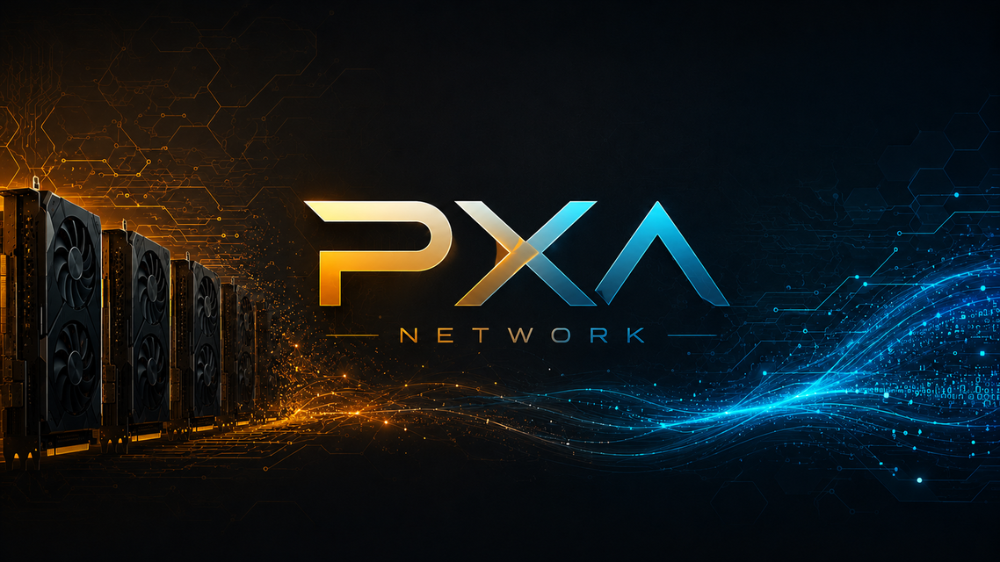
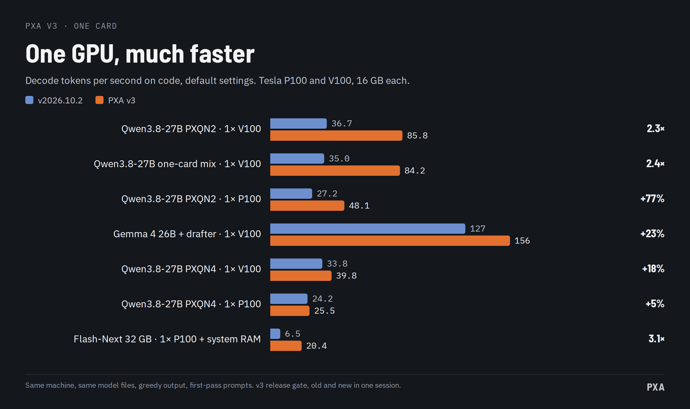
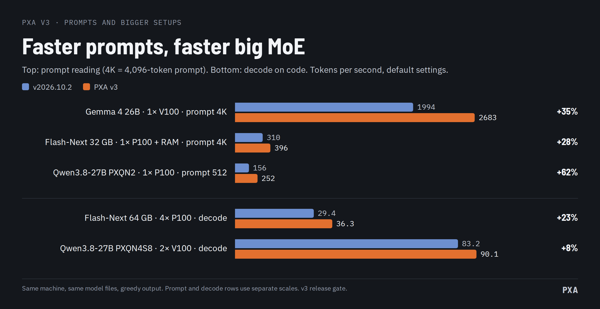

# PXA v3

**Install in one line:** `curl -fsSL https://raw.githubusercontent.com/poisonxa16/pxa/main/install.sh | bash` · Docker: `docker pull ghcr.io/poisonxa16/pxa:v3`

One name now, one number. v3 replaces the date-based versions (v2026.10.x).

The big change is one card. On the 27B model the PXQN2 file decodes 2.3 times faster on a V100 for code (85.8 against 36.7 t/s) and the other tiers gain 5% to 27% without speculation. A 32 GB Flash-Next file runs three times faster on one P100 with system RAM, and Gemma 4 reads prompts about a third faster on a V100. Same model files, no re-quantizing. Upgrade recommended.

## The numbers

Every measured card setup, live: **https://benchmarks.pxanetwork.com** (our verified numbers plus community scores from PXA Control).

PXA v3 against v2026.10.2 on the same machine, one after the other, same files, same flags. Default settings, no flags. Greedy output, a new prompt for every request, mean of three requests per prompt class. Tokens per second.

**One card, decode as shipped (prose / code)**

| Setup | v2026.10.2 | PXA v3 |
|---|---:|---:|
| Qwen3.8-27B PXQN2, one V100 | 36.8 / 36.7 | **66.9 / 85.8** |
| Qwen3.8-27B PXQN2, one P100 | 27.3 / 27.2 | **40.3 / 48.1** |
| Qwen3.8-27B one-card mix, one V100 | 34.6 / 35.0 | **67.2 / 84.2** |
| Qwen3.8-27B PXQN4, one V100 | 33.7 / 33.8 | 39.9 / 39.8 |
| Qwen3.8-27B PXQN4, one P100 | 24.2 / 24.2 | 25.4 / 25.5 |
| Gemma 4 26B-A4B with its drafter, one V100 | 116.1 / 126.6 | **144.9 / 155.6** |
| Flash-Next 32 GB, one P100 and system RAM | 6.5 / 6.5 | **20.2 / 20.4** |

**Reading the prompt (4,096 tokens)**

| Setup | v2026.10.2 | PXA v3 |
|---|---:|---:|
| Gemma 4 26B-A4B, one V100 | 1,994 | **2,683** (+35%) |
| Flash-Next 32 GB, one P100 and RAM | 310 | **396** (+28%) |
| Qwen3.8-27B PXQN2, one P100, 512 tokens (llama-bench) | 156.1 | **252.3** (+62%) |

**Plain decode without speculation** (llama-bench `tg128`): Qwen3.8-27B PXQN2 +35% on a V100 (38.5 to 52.0) and +22% on a P100 (27.4 to 33.3). PXQN3bal +22% and +17%. The one-card mix +27% and +17%. PXQN4 +20% and +5%. PXQN4S8 and PXQN5 on two P100 +14%. The two-card and four-card PXQN4 rows without speculation change by -1% to +5% (two P100 37.9 to 38.8, two V100 56.3 to 56.1, four P100 30.2 to 31.7). Flash-Next 64 GB on four P100 decodes code 23% faster with speculation as shipped (29.4 to 36.3 t/s); its prose speed is unchanged.

**Switched on after the charts were made.** Our lever test found four V100 settings and one host setting (NUMA binding) that win, with output that is identical or not worse in our quality test. They are on by default in v3. One V100 with the one-card 27B file goes from 59.3 / 77.5 to **66.1 / 85.6** t/s (prose / code) and keeps its 4,096-token prompt speed at 1,043 t/s. Flash-Next 32 GB on one P100 goes from 20.5 / 20.8 to 21.9 / 22.7 t/s when the expert-cache threads are bound to the right CPU socket.

Test machine: Tesla P100 and V100 cards, 16 GB each, on PCIe x4 links. The P40 and the 1080 Ti were not re-measured for v3, and mixed P100 and V100 setups were not measured.

## What is new

**Speed**
- **MTP speculation on every model that has an MTP head.** The guess list is shorter, rejection is cheaper, and the engine has a measured table of defaults per model and card. Gemma 4 gets a faster verify step for its mixture of experts as well.
- **Faster PXQN decode on V100 and P100.** PXQN2, PXQN3, PXQN3bal, PXQN4, PXQN4S8 and PXQN5 all have new kernels (numbers above).
- **PXQN2 prompt reading on one P100 is about 60% faster** (512-token prompt, 156 to 252 t/s).
- **Gemma 4 prompts are 28% to 35% faster on a V100** (a better launch plan for the expert matrix multiply).
- **Hybrid models (the Qwen3.8 family) waste less time per token.** The engine no longer rescans the model graph for every layer.
- **One P100 plus system RAM runs the big expert models much better.** PXQN weights kept in RAM now have a fast CPU path, the engine profiles which experts are busy when no profile exists, and threads and memory pages can be bound to the right CPU socket (on by default; containers need `--cap-add SYS_NICE` for the memory half).
- **Stock Q6_K decode on a P100 is 3.5% faster.**

**Old CPUs**
- **A compatibility library is picked automatically** on CPUs without AVX2 (`lib-compat/` in the package). Same GPU code, same card speed, only the CPU work is slower. Proven under emulation of Core 2, Nehalem and Sandy Bridge type CPUs.

**Low RAM**
- Context checkpoints and the RAM prompt cache size themselves to the free memory, so a small machine no longer swaps at long context.

**PXQN and the encoders**
- **PXA Control's Encode tab** turns a Hugging Face model into a PXQ or PXQN file. It handles Llama, Mistral, Qwen2 and Qwen3, Gemma 3 (text only) and Phi. Pro makes the PXQN tiers. Free makes the classic PXQ tiers and needs no key.
- **Locked Pro files.** A Pro file can be tied to you (the default), to any PXA supporter, or left open. A locked file loads in PXA v3 or newer.
- **Pro encoder keys work on your own machines** (2 by default), not anywhere the key is copied; a third machine is refused with a clear message. Moving to a new computer: **/encoder reset** in the PXA Network Discord (once per 30 days; an admin can do it sooner). Nothing about your computer is sent to PXA, only a salted hash the server cannot reverse.
- **Rotated PXQN files load for more models**, not only the Qwen3.5 and 3.8 family.
- **Better calibration.** The encoder's calibration text was rebuilt from sources we can name. On a small test model the quality drift fell by about 10%.
- **Tier labels.** PXA Control and the docs show each tier with its measured quality class (PXQN2 is the 3-bit class, PXQN4 the 6-bit class).

**PXA Control**
- **Live tab**: decode and prefill speed, speculation acceptance, expert-cache hits, a request timeline and per-card memory, load, temperature and power, with history.
- **Several servers in one GUI**, a fleet view of every server on the machine, benchmark telemetry, and a card list that works without `nvidia-smi`.
- **Community board**: it remembers your name, keeps the settings behind each score, shows them on click, and explains why a score was not accepted. Credentials and paths are refused.
- **Fixes**: the port reuse bug is gone, and Report a problem works while a start is stuck.

**Sampling**
- **Repeat, frequency and presence penalties now work.** The history they looked at was one token long, so they never changed anything. They now see the last `repeat_last_n` tokens.
- **DRY now applies at temperature 0**, and speculation checks against the same penalised distribution.
- **The repetition guard also arms on the 1.25-bit Flash-Next 32 GB file.** `PXA_REP_GUARD=0` turns it off.

**Opt-in, off by default**
- `PXA_SPEC_SELECT=1`: the engine measures its own speed and picks no draft, n-gram or MTP depth for each round. Gemma 4 long prompts gained 10% in our test.
- `PXA_XCACHE_ADAPT=1`: the expert cache re-ranks its resident experts to follow the prompt. It changes output with request history, so it stays off.

## Fixes

- Gemma 4 26B-A4B on one 16 GB P100 now starts with a batch size that fits. Before, the default batch ran the card out of memory and weights streamed at 1 to 2 t/s.
- A 4,096-token prompt on one V100 with a PXQN2 file reads at least as fast as on v2026.10.2 again (1,048 t/s against 1,037) while decode stays about 2x faster.

## Known issues

- **Texts differ from v2026.10.2.** New kernels add up numbers in a different order, so near-ties can flip and a greedy answer can go another way. The quality test is unchanged or better: PXQN4 scored the same on both versions and a PXQN2 file slightly better. If you keep output hashes, make new ones.
- **Locked Pro files need v3.** v2026.10.2 and older stop at load with an error. v3 without a key refuses a locked file with a plain message that says where to put the key.
- **The 32 GB Flash-Next file is about 42% 1.25-bit by size.** It trades quality for size. On long prose and non-English answers it can repeat itself. The repetition guard is on, and repeat penalties now work.
- **Flash-Next 32 GB on one card needs about 64 GB of system RAM.** With less, the machine swaps.
- **Gemma 4 on a 16 GB card at a 16k-token prompt.** The default batch is smaller than 2048 (`-ub 1024` on a 16 GB V100). If you set `-ub 2048` yourself, it can run out of memory; that needs a 32 GB card.
- **Gemma 4 MTP helps less on non-English text.** The engine stops drafting when the guesses stop paying, and decode then stays near plain speed.
- **The P40 is recognised but not measured by us.**
- **Speculative output is not byte-identical to plain output.** The engine keeps the model's own choice, but the arithmetic differs, so a near-tie can flip.
- **On a V100, the last digits of a request's numbers can depend on where it sits in the shared context cache** while other requests are resident. The chosen tokens stayed the same in our tests. v2026.10.2 does the same; a fix is planned.
- **Flash-Next 64 GB on four P100 with speculation: the greedy text can differ from one server start to the next.** Within one run it repeats exactly. For byte-reproducible output across restarts, start it with `--spec-type none`.
- More in [docs/KNOWN-ISSUES.md](docs/KNOWN-ISSUES.md).

## Upgrade

Unpack into a new folder (`install.sh` does this for you). Same model files. No re-quantizing.

- Unpacking over a v2026.10.x folder instead? Delete that folder's old `pxa/` directory first (it only holds a kernel note). v3 puts the `./pxa` launcher where it was, and `tar` cannot replace a directory with the launcher.

- If an old post told you to export a `PXA_*` variable to get speed, unset it. The engine now picks it, and a value you set always wins over the default, including a slower one.
- Containers: add `--cap-add SYS_NICE` if you run Flash-Next with the expert cache on a machine with more than one CPU socket.
- Pro files you encode and lock need v3 or newer to load.
- The container image is `ghcr.io/poisonxa16/pxa:v3`. The vLLM sidecar images are unchanged.

## Downloads

Each file has a `.sha256` next to it. The one-line installer checks it for you.

| File | For |
|---|---|
| `pxa-v3-linux-x86_64-cuda12.8-sm60_61_70.tar.gz` | Ubuntu 24.04 and newer (glibc 2.38) |
| `pxa-v3-linux-x86_64-cuda12.8-sm60_61_70-ubuntu22.04.tar.gz` | Ubuntu 22.04 and newer (glibc 2.35) |

Both need an NVIDIA driver 570 or newer. They bring their own CUDA 12.8 runtime. Cards: Tesla P100, V100, GTX 1080 Ti and other Pascal cards. Newer cards are not covered by this build.

## Credits

mistrjirka (a developer on the PXA Network Discord and part of the PXA team), quenthalion and thisistimow. Thanks to everyone who tests and reports on the Discord.

## Community

- Live leaderboard: https://benchmarks.pxanetwork.com
- Discord: https://discord.gg/EqazvV9tf
- Support on Ko-fi: https://ko-fi.com/shatteredrealms1
