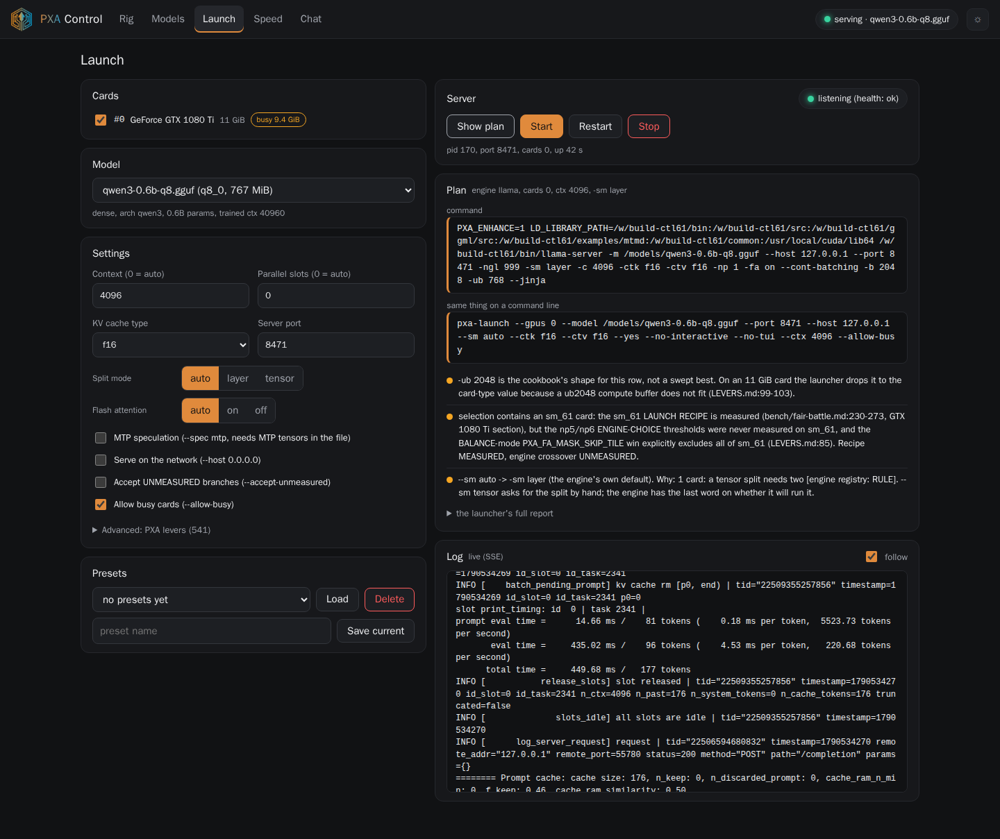

# `pxa` — start here

**Run `pxa` and PXA Control opens in your browser.** That is the whole start: pick your cards
and a model on the page, press Start, watch it load, chat with it, see its speed. In the release
folder it is `./pxa`; in a source checkout it is `python3 tools/pxa-launch.py` (same program;
`pxa-launch` is its longer name and still works).

```bash
./pxa                      # PXA Control at http://127.0.0.1:7777 (the next free port if that one is taken)
./pxa --tui                # the text menu in this terminal instead
./pxa --gpus 0 --model your-model.gguf --yes    # start a server straight away: Control opens next to it
```

PXA Control listens on this machine only (`127.0.0.1`). No desktop on this machine, for example over
SSH? `pxa` prints the address and the tunnel line to open it from your own computer; or use
`pxa --tui`. Starting a server from the command line, with `pxa` or `run-server.sh`, also starts
Control in the background and prints `PXA Control: http://127.0.0.1:7777`, with that server
already on its Servers and Live tabs and a Stop button. `--no-control` or `PXA_CONTROL=0` turns all
of this off; services, scripts and containers never get it unless you ask. The rules are in
[PXA Control opens by itself](#pxa-control-opens-by-itself).

`tools/pxa-launch.py` is the front door to this engine. **You pick the cards and the
model. It picks everything else** — which runtime, the batch and micro-batch sizes,
the tensor split, the flash-attention regime, the chat template, the environment —
and it shows you the measurement behind every choice before anything starts.

## Three steps (the text menu: `pxa --tui`)

1. **Pick your cards.** It lists every NVIDIA GPU in the box with its VRAM and
   whether another process is already sitting on it. Tick the ones you want.
2. **Pick your model.** It lists the `.gguf` files it can find, with size, family
   (dense / MoE / hybrid-MoE) and PXQ tier read out of each file's own header, and
   whether it fits the cards you ticked.
3. **Say what it is for** — chat, serving several people at once, or long
   documents. That is the only performance question you are asked, and it is asked
   because on these cards it genuinely changes the answer.

Then it shows you the plan, the evidence and the exact command, and asks before
starting. Nothing is chosen silently and nothing is started without your say-so.

If your models are not where it looked, tell it once:

```bash
python3 tools/pxa-launch.py --models-dir /path/to/models
# or, permanently:
export PXA_MODELS_DIR=/path/to/models:/another/path
```

PXA Control (what a bare `pxa` opens, and `--gui`) is the same launcher as a local web app with rig
telemetry, a model library, start/stop, live speed charts and a chat box. See
[PXA Control (GUI)](#pxa-control-gui).

## The full-screen version, and the plain one

With a terminal at least 80x24 you get a full-screen UI: arrow keys (or `j`/`k`)
to move, space to tick a card, enter to go on, `q` to quit. Screens: **CARDS →
MODEL → CHAT → ENGINE → REVIEW → RUNNING**. From CARDS you can press `m` to pick
the model first and come back — the order is yours.

Anywhere the UI cannot run — no terminal, a terminal under 80x24, `curses`
missing, `--no-tui`, or `PXA_NO_TUI=1` — the same questions are asked as plain
line prompts. Nothing is only available in one of the two. A real session, taken
from this box:

```text
==============================================================================
pxa-launch - pick your cards and your model. The launcher does the rest.
            Everything it chooses is printed with the measurement behind it
            before anything starts. Ctrl-C is always safe here.
==============================================================================
STEP 1 of 4 - which card(s) do you want to use?

   #   gpu  name                            VRAM        in use by another process?
   1     0  Tesla P100-PCIE-16GB             16.0 GiB  sm_60   YES - pid 27968 llama-server (8398 MiB)
   2     1  Tesla P100-PCIE-16GB             16.0 GiB  sm_60   free
   3     2  Tesla V100-PCIE-16GB             16.0 GiB  sm_70   free
   4     3  GeForce GTX 1080 Ti              11.0 GiB  sm_61   YES - pid 2751094 llama-server (478 MiB)
   5     4  Tesla V100-PCIE-16GB             16.0 GiB  sm_70   free
   6     5  Tesla P100-PCIE-16GB             16.0 GiB  sm_60   free
   7     6  Tesla P100-PCIE-16GB             16.0 GiB  sm_60   free

  Type the numbers from the # column, separated by commas.
  Two cards of the SAME type is the best-measured shape; four P100s is the
  Flash-Next seat. Press Enter for every card on the box.
  cards> 3,5

STEP 2 of 4 - which model?

   #  file                                          size      family        PXQ tier
   1  Qwable-27B-PXQ4HQ.gguf                         15.3 GiB  hybrid (SSM)  PXQ4-HQ
   2  Qwable-27B-PXQ4core.gguf                       14.6 GiB  hybrid (SSM)  PXQ4
   3  Qwable-27B-MXFP4-lite.gguf                     14.6 GiB  hybrid (SSM)  -

  Searched: /models

  Type a number from the # column, or paste a full path to a file this list missed.
  model> 2

STEP 3 of 4 - what will you use it for?

   1  chat / agent - you type, it answers              -fa on: full decode speed
   2  serve - several people or agents at once         -fa on, --np above 1
   3  long documents - ingest, summarize, embed in bulk -fa off: much faster cold prefill, much slower decode

  This picks the flash-attention regime, and it is a real fork on these cards:
  FA is a decode win and a cold-prefill loss (docs/COOKBOOK.md 'Two FA regimes').
  use [1]> 1

STEP 4 of 4 - chat template, jinja, reasoning, sampling

  chat template in the file: 8057 chars, looks like 'chatml'
    | 
    | 
    | 
    |     
    |         {{- content }}
    |     
    | ... 152 more lines (8057 chars total)

  setting              value                                        source
  chat template        embedded in the GGUF (8057 chars, looks l... from the file
  --jinja              ON                                           MEASURED
  --reasoning-format   not passed -> engine default 'deepseek'      MEASURED
  --reasoning-budget   not passed (unlimited)                       [INFERRED]
  --temp               1                                            from the file
  --top-p              0.95                                         from the file
  --top-k              20                                           from the file
  --api-key            none - the port is OPEN                      UNMEASURED
  --slot-save-path     not set                                      [INFERRED]
  --host / --port      0.0.0.0:8080                                 default

  These are the settings people forget. Press Enter to take them as they are,
  or type the letter of one to change it:
    t  chat template      j  jinja on/off        r  reasoning format
    b  reasoning budget   s  sampling            k  API key / host / port
  edit [Enter = accept]>
```

...and then the same plan, evidence and command the full-screen REVIEW screen
shows, printed to the terminal.

For scripts, answer everything on the command line and no question is asked at
all:

```bash
python3 tools/pxa-launch.py --gpus 2,4 --model /models/Qwable-27B-PXQ4core.gguf --yes
python3 tools/pxa-launch.py --gpus 2,4 --model /models/Qwable-27B-PXQ4core.gguf --explain   # decide, print, run nothing
```

## Design rule: never magic

The launcher is built around four commitments, and they explain most of its
behaviour:

1. **It prints the decision, the evidence, and the command** before executing.
2. **It refuses rather than silently dropping** a parameter that does not
   translate between engines.
3. **It says `UNMEASURED` out loud** instead of guessing quietly.
4. **It makes no claim it cannot back**, including no health claim about the instance
   it starts — it `exec`s the server, so it cannot observe anything afterwards.

A launcher that quietly picks differently turns every performance question into a
debugging exercise about the launcher.

Two runtimes serve one quant family. pxa runs on every card the PXQ family
supports. vllm-pxq4 runs wherever its image has PXQ4 kernels for the card, and
brings real data parallelism that llama.cpp's `-sm layer` does not have. Choosing
by hand means remembering which card is which, whether the model is dense or MoE,
which PXQ tier is actually inside the file, and which engine wins at the
concurrency you actually serve at. That is what this script is for.

---

## What it picks, per topology

This is the whole table. Every row was booted and timed; the source column is the
document and line the numbers were copied from. A card shape that is not in this
table gets `[INFERRED]` flags from the nearest row (its `-b`/`-ub` only, never its
model-specific flags) or the word `UNMEASURED` and a request to confirm — it never
gets a number that was not measured for it.

`--selftest` prints this same table from the code, so it cannot drift from what
the launcher actually does.

| cards | model | flags the launcher passes | measured result | source |
|---|---|---|---|---|
| 2× V100 (sm_70) | dense 27B, PXQ4 | `-b 8192 -ub 2048 -fa on -c 32768 -sm layer` | prefill **1,369** t/s @3,121 · **1,300** @20,801 · decode **39.5** @fill 8 (release binary, quiet box, no env) | `RELEASE-NOTES-2026-09-07.md:77` (measured 2026-09-05) |
| 2× P100 (sm_60) | dense 27B, PXQ4 | `-b 8192 -ub 256 -fa on -c 32768 -sm layer` | prefill **337.6** t/s @3,121 · **315.3** @20,801 · decode **18.1** @fill 8 (release binary, quiet box, no env; fold n=7 reference 340.16 / 316.84 / 17.83) | `RELEASE-NOTES-2026-09-07.md:78`; `bench/fair-battle.md:303` (measured 2026-09-05) |
| 1× GTX 1080 Ti (sm_61, 11 GB) | 35B MoE, PXQ2 | `-b 2048 -ub 768 -c 8192`, `-fa on` for chat / `-fa off` for long documents, `PXA_AUTO_SPEC=0` | **unmeasured with this recipe**, which keeps context checkpoints since 2026-09-25; the published cells were taken with `--ctx-checkpoints 0`: cold prefill 1,363.5 t/s (fa off) · chat prefill 746.6 (fa on) · decode 36.73 cold / 65.3 chat (release binary, no env). Add `--ctx-checkpoints 0` to run that configuration | `RELEASE-NOTES-2026-09-07.md:79` (measured 2026-09-04) |
| 4× P100 (sm_60) | Qwen3.8 Flash-Next 64 GB (PXQN) | `-ngl 99 -np 1 -fa on -c 32768 -t 16 -b 2048 -ub 2048 -wgt 64 -sm layer -ts 0.95,1.01,1.01,1.03 -ot per_layer_token_embd\.weight=CPU -ot blk\.24\.ffn_down_exps=CUDA0 -ot blk\.23\.ffn_down_exps=CUDA3 --no-context-shift --cache-ram 0` (the v3 gate line, recipe `4xp100-flashnext`) | decode **27.8** prose / **36.3** code t/s with automatic speculation, 29.4 / 29.5 without · prefill **379** t/s @4,096 (v3 release gate) | v3 release gate report |
| 1× P100 (sm_60) | 35B MoE, PXQU-16 + q8_0 head | `-b 2048 -ub 2048 -c 8192 -fa on` | decode 62.4 t/s · prefill 827-843 t/s | `docs/COOKBOOK.md:65-73` |
| 1× V100 (sm_70) | 35B MoE, PXQU-16 + q8_0 head | `-b 2048 -ub 2048 -c 8192 -fa on` | decode ~101-102 t/s · prefill ~1,800-1,900 t/s | `docs/COOKBOOK.md:75-78` |
| 2× P100 (sm_60) | 35B MoE flagship PXQ4/PXQ6 | `-b 8192 -ub 2048 -c 8192 -ts 1,1 -fa on` | decode 55.7 t/s · prefill ~843 t/s | `docs/COOKBOOK.md:80-89` |
| 2× V100 (sm_70) | 35B MoE flagship PXQ4/PXQ6 | same command | `[INFERRED]` — the published pair row is the P100 one; the V100 pair's own number was never taken | `docs/COOKBOOK.md:80-89` |
| any single card | a stock (non-PXQ) GGUF | `-b 2048 -ub 2048 -c 8192 -fa on`, `-ub` lowered on an 11 GB card | `[INFERRED]` — engine-only same-quant decode control: V100 +3.2% (bit-identical), P100 +2.7%, 1080 Ti +3.3% | `docs/COOKBOOK.md:149-169` |

Every `-sm layer` in that table is the split those cells were **measured** under, and
they are still emitted as measured. What `--sm auto` changes is the split mode on top of
them: on the 2× V100 and 2× P100 dense-27B PXQ4 rows the launcher now asks for `-sm tensor`
instead, because neither row names a `-ts` of its own and the decode win is large. The
`-b`/`-ub`/`-c` cells come across unchanged, and `--explain` says so out loud rather than
letting you think they were re-measured under the split. See
[Which split mode, and who chooses](#5b-which-split-mode-and-who-chooses).

`PXA_ENHANCE=1` is exported on every row, explicitly, even though the engine is
making it the default level. A launcher that leans on an engine default cannot be
read: the same printed command would mean two different things on two builds, and
someone who copies it onto an older binary would get a different seat with no
warning.

### Two things the cookbook recipe does not say, and the 1080 Ti needs

Both were found by booting the published recipe as written, on the card it was
written for, and both stop the seat rather than slow it down:

- **`PXA_AUTO_SPEC=0`.** `PXA_ENHANCE=1` makes the server auto-arm
  `--spec-type ngram-mod:n_max=4,n_min=2` for the `qwen35moe` family (the
  PXA AUTO-SPEC block in `examples/server/server.cpp`). That drafter's context
  asks for a 254 MiB per-step checkpoint buffer and falls back to a 62.8 MiB
  shadow. On 11 GiB, with 9,907 MiB of weights, 160 MiB of KV and a 733 MiB
  compute buffer, there is no room: the seat loads, answers short prompts, and
  then dies mid-prefill on a 5.8k-token prompt with `out of memory`. Reproduced
  twice, 2026-09-04. `PXA_ENHANCE=1` still has to be exported — it is what arms
  the sm_61 int8 prefill tile the published numbers depend on — so the launcher
  keeps `ENHANCE` and turns off only the auto-drafter.
- **`--ctx-checkpoints 0`.** Every published 1080 Ti arm passes it (4 of 4 arm
  files, both FA regimes). The cookbook recipe omits it.

### The two FA regimes

On P100, V100 and 1080 Ti, flash-attention is a **decode win and a cold-prefill
loss** — for this engine and for the parent engine alike. One server carries one
setting, so the launcher asks which one you want:

| workload | `-fa` | what you get |
|---|---|---|
| chat, serve | `on` | full decode speed and a solid prefill in the same server |
| longdoc | `off` | 26-56% more cold prefill, 16-48% less decode |

Measured per card in `docs/COOKBOOK.md:41-63` and `bench/fair-battle.md:35-50`.
On the 1080 Ti both cells were measured on the card itself, so that row's regime
switch is `MEASURED` rather than inferred.

---

## Things people forget

The launcher asks about these because the server starts happily without them and
only misbehaves later. Each row shows a value **and where the value came from**;
none of them is a launcher preference invented on your behalf.

| setting | default | why it matters |
|---|---|---|
| **chat template** | the one embedded in the GGUF (`tokenizer.chat_template`), shown to you with its detected family and first lines | it is what the model was trained to see. Overriding it is how a model starts answering the wrong question in a slightly wrong format. If the file has none, the launcher says so loudly — published PXA files have shipped in that state before. |
| **tool-call block** | checked, warned about | a template with no `tool_calls` block serves chat fine and never returns a tool call. If the seat is for an agent, that is the whole job missing. |
| **`--jinja`** | ON, and the launcher says whether this template *requires* it | without it, a request carrying `tools` returns HTTP 500 while plain chat keeps working. A production seat on this box ran that way for weeks and looked healthy. |
| **`--reasoning-format`** | unset → the engine's own `deepseek` (`common/common.h:510`), which is what the live seat inherits | decides whether thinking-tag contents come back as `message.reasoning_content` or inline. |
| **`--reasoning-budget`** | unset (unlimited) | `0` switches thinking off for a latency-sensitive seat; a token count caps it (`common/reasoning-budget.cpp`). |
| **context size `-c`** | the recipe row's value | the launcher prints the KV arithmetic and warns when the fit is tight. It blocks only on facts that need no formula. |
| **slots `-np`** | the recipe row's value (2 on the Flash-Next seat, 1 elsewhere) | more slots means more KV, and on the hybrid it also means `--kv-unified`. |
| **`-fa` regime** | from `--workload` | see above; the one performance question you answer yourself. |
| **sampling** (`--temp`, `--top-p`, `--top-k`) | the model's own `general.sampling.*` keys when the GGUF carries them, otherwise not passed at all | these are written into the file by the quantizer. They are the model author's defaults, not ours. |
| **`--api-key` / `--host` / `--port`** | no key, `0.0.0.0:8080` | with no key on `0.0.0.0`, anyone who can reach the port can use the model. The launcher says so every time. A key is never echoed and never written into a saved script. |
| **`--mmproj`** | auto-detected beside the model; refuses to guess between several | a vision model without a projector serves text only and never says why. |
| **`--slot-save-path`** | off | needed for `/slots` save+restore, which the release gate uses to replay a fill without re-prefilling. |

---

## Saving a seat you can bring back

```bash
python3 tools/pxa-launch.py --gpus 2,4 --model /models/Qwable-27B-PXQ4core.gguf \
    --serve-name v100-chat --yes
```

writes `~/.cache/pxa-launch/serve/v100-chat.sh` (override with `--serve-dir` or
`PXA_SERVE_DIR`): an executable shell script holding the exact command, the exact
environment, and the same busy-card check the launcher does. No systemd, no
daemon, no hidden state.

It deliberately does **not** call the launcher again — a launcher is free to decide
differently tomorrow, and a restart script that quietly changes the seat is worse
than no script. Run `pxa-launch` again when you want a fresh decision. An API key
is never written into it; the script reads `PXA_API_KEY` from the environment
instead.

## Several models behind one proxy (llama-swap)

```bash
PXA_ENGINE_DIR=/path/to/engine python3 tools/pxa-launch.py --emit-swap-config \
    --swap /models/qwen38-27b-pxq4.gguf:0,1 \
    --swap /models/gemma-4-26B-A4B-PXQ3.gguf:3 \
    --swap-ttl 300 > llama-swap.yaml
```

runs the same decision as `--explain` once per `--swap MODEL:GPUS[:PORT]` and prints
a [llama-swap](https://github.com/mostlygeek/llama-swap) config. Nothing is started, so
the busy-card check is skipped: the proxy starts each model later, when it owns the
cards. Ports count up from 8081 (or from `--port`) and skip any port an entry names.
Backends bind 127.0.0.1 so only the proxy reaches them.

llama-swap runs `cmd` without a shell, so the environment the launcher would have set
(`CUDA_DEVICE_ORDER=PCI_BUS_ID` next to `CUDA_VISIBLE_DEVICES`, the engine's library
path, the ENHANCE and tensor-split levers) goes in each model's `env:` list, not in
front of the command. An `--api-key` is written as `${env.PXA_API_KEY}`, which
llama-swap fills at load time and refuses to load without. Exit 0 = every entry is
clean; 5 = some entries carry blockers or were refused (see `--explain` for each);
3 = no entry could be written; 2 = bad arguments or two entries on one port.

## PXA Control (GUI)

The same launcher in a browser: pick cards and a model, see the plan, start and stop the server,
watch its log, chart its speed and talk to it, from a desk or a phone.

```bash
./pxa                                                 # the same as --gui, from a terminal
python3 tools/pxa-launch.py --gui                     # http://127.0.0.1:7777/ on this machine
python3 tools/pxa-launch.py --gui --port 8800         # another port
python3 tools/pxa-launch.py --gui --lan               # on your network, behind a token
docker run --runtime=nvidia -p 7777:7777 -v /models:/models -v pxa-cache:/work/.cache/pxa -e PXA_CACHE_DIR=/work/.cache/pxa IMAGE gui   # in the container
```

### Updating

The install can move to a newer release without copying your models.

```bash
pxa-update check      # is there a newer release
pxa-update apply      # download, check the checksum, switch to it
pxa-update rollback   # switch back to the previous version
```

`apply` unpacks into a new folder and then switches the `current` link. The previous folder stays. `rollback` only moves that link. Stop any server started from this install first.

Models, Control settings, and `*.expert-counts.csv` are not inside the folder that gets switched, and the updater refuses a download that contains them. There is no beta channel in v3.1. That comes later.

### PXA Control opens by itself

| You run | What happens |
|---|---|
| `pxa` (no arguments, in a terminal) | PXA Control starts on `127.0.0.1:7777` (the next free port when 7777 is taken) and stays in the foreground; a browser opens when there is a desktop. Ctrl-C stops it and the servers it started. If you already have one running, `pxa` prints its address (and opens it) instead of starting a second one. |
| `pxa --tui` | The text menu in the terminal, as before. |
| `pxa --gpus 0 --model x.gguf ...`, `./run-server.sh -m x.gguf ...` (in a terminal) | The server starts as before, and PXA Control comes up next to it in the background (or the one you already have is reused). The startup lines carry `PXA Control: http://127.0.0.1:7777`. The server is on the Servers and Live tabs at once, marked *command line* and *adopted*, with **Stop** (you type `stop` to confirm; it is the same as Ctrl-C in that terminal). |
| `--no-control`, or `PXA_CONTROL=0` | No Control: a bare `pxa` shows the text menu, a server starts alone. `run-server.sh` takes `--no-control` out before the engine sees it. |
| no terminal (a systemd unit, a script, a pipe, `nohup`) | No Control, so a service never opens a web port on its own. `PXA_CONTROL=1` turns it on. |
| inside a container | No Control unless `PXA_CONTROL=1`; then it listens on every interface behind the access token, because 127.0.0.1 inside a container cannot be reached from the host. Publish the port (`-p 7777:7777`). See [In a container](#in-a-container). |

**When the background Control closes.** A Control that started on its own next to a server closes
itself once no server is running (neither one it started nor one the launcher started) and no page
has asked it anything for 10 minutes (`PXA_CONTROL_IDLE_S` changes that, in seconds). A tab that is
open and visible keeps it up; stopping the last server from the page starts the 10 minutes. One you
opened yourself with `pxa` or `--gui` runs until you stop it.

**Where it listens.** Always `127.0.0.1` unless you pass `--lan`, which needs the access token, as
it always has. `--control-port N` picks the port. It keeps three small things in
`~/.config/pxa/` (mode 0700): `run/` (the Control that is up, so a second `pxa` finds it),
`launched/` (the servers the launcher started for you, each named by its process id and start time,
so a reused process id is never mistaken for one), and `control.log` (what the background Control
printed). A Control never starts another Control, and `pxa --bench` boots its test server without one.



It needs Python 3 and nothing else: a standard-library HTTP server
(`tools/pxa_control.py`) and one self-contained page (`tools/pxa_control_ui/`), with no
CDN, no pip packages and no build step. With `--gui`, `--port` is the GUI's own port
(default 7777). The server's port is chosen on the Launch tab (default 8080). A browser opens
when the machine has a display; `--no-browser` stops that.

**It decides nothing itself.** Each tab collects the answers a command line would carry and
passes them to the launcher's own parser and `plan_and_build()`, the same code `--explain`
and the terminal UI use. The Launch tab therefore shows the same evidence, refusals and command,
and prints the `pxa-launch ...` line that would do the same thing from a shell.

| Tab | What it shows |
|---|---|
| **Servers** | The opening page: every llama-server on the machine, one card each. The servers this GUI manages (as many as you like, each with its own name, cards, model, port, levers and extra args, kept in `control.json`), plus the docker containers and bare processes started some other way (found from `docker ps`, the process table and `nvidia-smi`'s compute apps). Each card shows the state (loading, serving, stopped, exit code, "no output for N s" while loading), port, cards, VRAM per card, decode/prefill medians and requests from `/pxa/stats`, and its actions: Start, Stop, Restart, Log (live, with search and problems-only), Edit, Chat, Speed. A strip of the cards shows which server holds how much of each. Discovered servers are read-only. **Adopt** gives one a name; with *allow control* on, Stop/Start/Restart become available for that container, and each asks you to type the container's name. |
| **Live** | What the servers and the cards are doing right now, with a history (5 min, 15 min or 1 h). One tile per server: state (idle, reading the prompt, writing), decode speed now (or of the last request when idle), prefill speed, busy slots with a progress bar for each, KV-cache fill, speculative draft acceptance and expert-cache hit rate when the server uses them. Charts, one line per server in the server's own colour (the same colour as on the Servers tab): decode speed, prefill speed per request, draft acceptance, expert-cache hit rate. A request timeline: one bar per request in a lane per server slot, the pale part is the prompt being read and the solid part the answer being written; hover a bar for prompt tokens (and how many were reused), prefill and decode speed and draft acceptance. A strip per card with memory, load, temperature (a line marks 80 °C) and power, and a chip for a power or thermal cap. Hover any chart for the exact values at that time; each chart has a table view. Axes start at zero or a fixed range, never auto-zoomed, one y axis per chart. Numbers come from `nvidia-smi` (one call per sample) and from each server's own `/slots`, `/props` and `/pxa/stats`; with `--metrics` on the server the speeds are exact engine counters, without it they are counted from slot progress. The sampler runs every 2 s with this tab open and every 10 s otherwise. Since v3.1 PXA Control also keeps the numbers on disk, page open or not (see *History on disk* below), and the 6 h, 24 h, 7 d, 30 d and 90 d buttons draw from that store, with CSV links for the shown range; without it (history off) the sampler runs only while PXA Control has a viewer, stops after 10 idle minutes and keeps 3 h in memory. A request's prompt text, which `/slots` carries, is dropped before it reaches the page and is never stored. |
| **Rig** | Every card: name, VRAM used/total, temperature, power, utilisation, PCIe link generation and width (a narrow link is flagged), and the processes resident on it. Also the driver and CUDA version, `/dev/shm` and the container kind, the engine build it found, and the `--doctor` findings in colour (red stops a launch, amber is a warning). Refreshed every 3 s. |
| **Models** | The folders you add, remembered in `~/.config/pxa/control.json` (or `$XDG_CONFIG_HOME/pxa/`; `--models-dir` and `PXA_MODELS_DIR` add to it). One row per `.gguf` with the codec (PXQ / PXQN / other), the type (the PXQ tier from the tensor directory, else the dominant ggml type), parameters, size, family and arch, all read from the file's header the way the launcher reads it. **Fits on** badges come from the launcher's own VRAM check (`vram_check`: weights plus the KV estimate at one 4096-token slot, on idle cards) for your current pick, one card of each kind, and all cards of each kind. Click a row to use it. |
| **Launch** | Cards, model, context, parallel slots, KV cache type, MTP on/off (`--spec mtp`), split mode auto/layer/tensor, flash attention auto/on/off (on = the chat/serve regime, off = long documents, which is how the launcher expresses it), port, serve on the network, `--accept-unmeasured`, `--allow-busy`. **Show plan** runs the decision and starts nothing. **Start / Restart / Stop** run the planned command the way the CLI does (the same environment, `CUDA_DEVICE_ORDER` pinned next to the card list); Stop sends SIGTERM to that PID, then kills it. The log streams live (server-sent events, falling back to polling), and the header shows the health (`/health`: loading, ok, down). **Presets** save the whole form by name into `control.json`. A **server** selector at the top picks which managed server the form edits (New, Save, Rename, Delete). The plan shows a fit verdict for the cards as they are now, any clash with another server's port or cards (refused before anything is spawned), lever warnings, and copy buttons for the exact shell line and the `pxa-launch` line. **Extra args** appends llama-server flags from an allow-list (`--alias`, `-t`, `-ot`, `--temp`, `--metrics` ...); flags that read or write files or change who can reach the server (`--path`, `--log-file`, `--host`, `--api-key`, `-m` ...) are refused. **Engine build** picks one of the llama-server builds found (`PXA_ENGINE_DIR`, `./build*/bin`, the checkout's `build*/bin`, the image's). |
| **Advanced** | Every lever in the catalog (`common/pxa-lever-catalog.inc`, generated from `docs/LEVERS.md`) with its default, status and rule. Diagnostics are hidden until you tick "show diagnostics"; a status filter and a "set only" view narrow the list, and each row says whether the engine default is ON or OFF. A value typed here goes into the server's environment; an empty box means the engine's default. A value that does not look like the lever's kind (0/1, a number) or that equals the default gets a warning, never a refusal. |
| **Speed** | Decode and prefill t/s over the last hour, day or week, one colour per model, with medians by prompt size. It reads the server's `/pxa/stats` when the build has it. On an older build it says so, and charts PXA Control's own record of the chat and benchmark requests it has proxied (`~/.config/pxa/history.jsonl`). **Benchmark my rig** runs `tools/pxa-bench.py`'s three fixed prompts (prose, edit, long) REPS 3 after a short warm-up, plus the greedy-512 identity hash, through the running server. While it runs, the cards' temperature, SM clock, power and throttle reasons are sampled every 2 s; the result shows the peak temperature, lowest clock, every throttle reason seen and a power limit below the card's stock limit, with a warning for each. Results are kept in `bench.jsonl`. There is also a link to the server's own `/pxa/speed` page. |

**Community high-score board.** After a benchmark, **Check the community high-score board** asks the PXA board (`bugs.pxanetwork.com`, through Cloudflare) for the record on your setup (card model, card count, model file, mode). Nothing is sent until you press it, and a score is only submitted on a second click, showing you the exact JSON first. Your **name** for the board is asked once; after the first submit it is kept in `~/.config/pxa/control.json` (`user_name`) and in the page's localStorage and pre-filled next time. Type another name to change it, clear the box to forget it. Each submitted score carries the numbers **and the settings that produced them**: card names and VRAM, card count, driver, engine version and commit, model file name, size, codec and tier, context, KV types, split mode, MTP on/off and `n_max`, batch and ubatch, flash attention, prompt class, reps, the greedy-512 hash and a timestamp. Never a file path, host name, address, API key or token: the board refuses a submission that contains anything shaped like one. Click a score in the "Community scores for this setup" table to see its settings. Scores are self-reported and not verified; implausible ones are rejected or held for review.
| **Chat** | A prompt box that streams from the server's `/v1/chat/completions`: system prompt, temperature, max tokens, and a thinking toggle (`chat_template_kwargs.enable_thinking`). Replies are rendered as Markdown by a small built-in renderer (code, lists, bold, links). Each reply shows decode and prefill t/s from the server's own timings. A *Talk to* selector picks any server on the Servers page (it defaults to the first one that is serving). **Attach** points Chat and Speed at a server you started some other way, on a local port. |
| **Encode** | A wizard that turns a Hugging Face model (or a local folder, or a BF16 / F16 / Q8_0 GGUF) into a PXQ or PXQN file: **Source** (size, architecture, whether PXA supports it, the model's licence), **Target** (which cards will run it; the tiers that fit with their measured quality class, file size, context and, where PXA has a measurement, decode speed), **Checks** (disk, RAM, graphics card, tools, licence key, a time estimate; a refusal is one plain sentence), **Run** (download, convert, quantize, then for PXQN: reference copy, skeleton, activation dump, Hessians, encode; a bar per stage, ETA, log, pause, cancel, resume after a crash or reboot) and **Done** (path, sha256, **Test it** in this GUI's server + benchmark, **Share your score**). See *The Encode tab* below. |

Dark theme by default, light on the sun button (remembered per browser). The layout works at
phone width, with the tabs moving to a bottom bar.


### The Encode tab

The tab drives the **PXA Quantizer** command line (`pxqe`) as a subprocess and never touches its internals. Everything that
depends on that command line lives in one file, `tools/pxa_encode_adapter.py` (where to look for an encoder, `pxqe info --json`,
the argv for `quantize` / `run`, the progress lines, the plain-language reading of a failure), so a change in the quantizer
is a change in that file. The other pieces: `tools/pxa_encode.py` (the wizard backend and the resumable job runner),
`tools/pxa_encode_plan.py` (fit math, tier recommendation, estimates), `tools/pxa_encode_pkg.py` ("Get the encoder": the
licence-server client, signature check and installer) and `tools/pxa_encode_cells.json` (measured decode speeds; no row = the
tab says there is no measured speed yet).

- **Two editions, one command.** Free makes the classic PXQ tiers and needs no key. Pro (a supporter feature) adds the PXQN tiers.
  The tab looks for `pxqe` in the Control config, `PXA_ENCODER`, `~/.local/share/pxa/encoder/<edition>/<build_id>/` (where it
  installs what it downloads), the engine folders and `PATH`, runs `info --json` on each, shows a Free / Pro badge and, for Pro,
  the licence state and encodes left. If both are installed, Pro is used and you can switch. With Free installed every PXQN tier is
  shown locked ("Supporter feature") with its quality class and the size it would be. The tier list always comes from `info --json`,
  never from a table in the page.
- **Get the encoder.** *Download Free* asks the licence server for the signed Free package; *I have a key* takes the key the
  Discord bot gave you (`/encoder` in the PXA Network Discord) and downloads your Pro package. Both are checked before anything
  runs: the statement's Ed25519 signature (public key built into Control), that it names the edition, platform and CUDA version
  asked for, the file's size and sha256, and the package's own file list. A package that fails is deleted and refused with a
  sentence. *Use a Pro encoder I already downloaded* takes a path and validates it with `info --json`. An update is offered
  (at most one check a day) with a one-click install next to the old build.
- **The GPU runtime (Pro).** The Pro encoder library links NVIDIA's cuBLAS and cuSOLVER, and a computer with only the NVIDIA driver does not have them.
  `info --json` then says exactly which libraries are missing (`runtime.missing`) and the Encode tab shows **Download the GPU runtime (one time, 722 MiB)**
  (also in the checks, which stop until it is done). The licence server publishes the pack once for everyone (`/v1/runtime/latest`, signed like a package, no
  key, resumable download); Control verifies the signature, the sha256 and the pack's file list, unpacks it to `~/.local/share/pxa/encoder/runtime/<id>/`
  (next to the encoders, shared by every Pro build; NVIDIA's licence text is inside) and hands the folder to the encoder (`PXQE_RUNTIME_DIR`).
  Most users skip it: the encoder first looks for a complete cuBLAS + cuSOLVER set in `PXQE_CUDA_LIBS`, the pack, the system, the PXA engine install,
  a CUDA toolkit, pip's `nvidia-*` packages (torch) and conda, and the Encode tab says where the GPU libraries came from. No NVIDIA driver is a different,
  plain message (install the driver, 525 or newer); the Free encoder needs none of this. `GET /api/encode/runtime`, `POST /api/encode/runtime/get`.
- **Who can load this file (Pro, PXQN tiers).** The Target step asks who may load the finished file: *Only me (recommended)* (tied to your PXA account), *Any PXA supporter* or *Anyone (no lock)*; the last two appear only when your plan allows them. Control passes the choice to `pxqe make --lock`, and only to an encoder that lists `make.lock_modes` in `info --json`; what your plan allows comes from the licence server through the encoder (`pxqe status`). While locking is switched off, or with an encoder from before locks, the choice is shown disabled ("File locking turns on with the next encoder update") and the file is written without a lock. The Done screen reads the finished file's own header and says whether it is locked and who can load it; a locked file loads in PXA v3 or newer. Every lock refusal from the encoder is shown as one plain sentence.
- **The key.** Stored in `control.json` (mode 0600), shown only masked, sent only to the licence server (`https://lic.pxanetwork.com`,
  overridable with `PXA_LICENCE_URL`) in the body of the package requests, and given to `pxqe` through `PXQE_KEY` in its
  environment, never on a command line. It is not in any log line, bug report, score or telemetry record (a redaction rule for
  `pxk1.` keys is in `redact_text`), and the Hugging Face token never follows a redirect to another host.
- **One command.** An encoder that reports `"cli": "2"` in `info --json` runs the whole job as ONE call, `pxqe make SOURCE --tier T
  --out FILE --work DIR`: download, convert, Q8_0, skeleton, calibration run, statistics, encode, verify (the classic tiers: download,
  convert, quantize, verify). Control reads its `@pxqe ` JSON lines (plan / stage / done / error) for the stage bars, the percentage
  and the ETA, shows its own human lines in the log, and turns its exit code (0 done, 1 a step failed, 2 cannot run here, 3 refused by
  the licence server, 130 stopped) into one plain sentence with the next step. The checks use `stages[]` of `info --json` (each stage
  says whether it can run on this computer and why not), so no engine install is needed for the converter, the skeleton writer or the
  calibration tool: they are in the package. If an engine folder with a `llama-imatrix` is known it is offered to `make` (`--engine`),
  which uses it for the calibration run when it carries the hook and otherwise runs the bundled CPU tool. An encoder below CLI version 2
  keeps the older multi-command path (`quantize`, `run`, with the engine's own tools), unchanged.
- **Resume.** `make` keeps its state in the job's work folder (`state.json`); **Resume is the same command again** and it skips what
  is finished (the download continues the partial file, the calibration run starts over, the statistics and the encode skip finished
  layers and tensors). `job.json` (in `~/.local/share/pxa/encode/jobs/<id>/`) is written after every change. A job that was running
  when Control (or the computer) went away comes back as *interrupted*; Resume stops any process the old Control left behind and
  re-uses the same licence job (no second encode is charged). Pause stops the whole process tree (`make` starts each worker in its
  own session); Cancel stops `make` cleanly and keeps its state.
- **Free disk as it goes.** `make` removes the downloaded files after the convert, the BF16 copy after the Q8_0 copy and the activation
  dump after the statistics; the disk check uses that peak (about 260 GB for a 27B PXQN encode: the dump alone is about 4.4 GB per
  billion parameters). *Keep the intermediate files* in Advanced passes `--keep-work`.
- **Classic tiers** (PXQ1 to PXQ6) need no graphics card, no licence and no key (Control does not hand the key over for them), and
  no encode is charged. From a Q8_0 GGUF it is a second lossy pass (Control passes the quantizer's two requantize flags, and the checks
  warn first); on a small model the quantizer refuses a file where under 50% would be in the chosen tier, and the checks warn about that
  too. The page shows the quantizer's own progress.
- **Engine-side tools (older encoders only).** Below CLI version 2 the converter (`convert_hf_to_gguf.py`), `llama-quantize`,
  `llama-imatrix` and a calibration text are the engine's, not the quantizer's; the checks step names whichever is missing, and the
  PXQN skeleton writer needs a quantize tool that lists `PXQN4` in its `--help`.
- **Release package tools.** In the release package the open ones are already where the checks look: `bin/llama-imatrix` (the
  activation dump, with its `PXQN_DUMP_*` hook), `bin/llama-quantize`, and `tools/convert_hf_to_gguf.py` with the `tools/gguf-py/` of
  the same commit (the converter uses it before any `gguf` from pip). The converter's own Python packages are not in the package:
  `python3 -m venv ~/pxa-convert && ~/pxa-convert/bin/pip install -r tools/requirements-convert.txt`, then start Control with
  `PXA_CONVERT_PYTHON=~/pxa-convert/bin/python`; the checks name the package that is missing. The encoder itself is never in the
  package: it comes from **Get the encoder**.

Tests: `tests/test-pxa-encode.py` (CTest `test-pxa-encode`: adapter, fit math, checks, job runner, resume, package verification)
and the route tests in `tests/test-pxa-control.py`; `tests/encode-gui-check.py` clicks the whole wizard in Chromium at 1280 px and
390 px against fakes (needs docker and the playwright image). The fake encoder reports CLI version 2 and speaks the `make` protocol;
`cli="1"` makes it an older encoder, and the job tests run against both. `tests/encode-e2e-live.py` is the LIVE check (real licence
server, real Hugging Face, one encode; not in CTest).

### What it will and will not do

- **Binds 127.0.0.1** unless `--lan`. With `--lan` it listens on every interface and requires
  a token, printed at start with the addresses to open. The token is kept in the config dir
  (`token`, mode 0600) so bookmarks survive a restart; `PXA_CONTROL_TOKEN` sets it. The first visit with
  `?token=...` swaps it for an `HttpOnly; SameSite=Strict` cookie, and scripts can send
  `X-PXA-Token`. On a local bind, the Host header must name localhost, which stops DNS-rebinding
  pages. A POST from another origin is refused either way.
- **No shell anywhere.** The only process it starts is the launcher's planned command, as an
  argv list. The engine proxy forwards a fixed set of paths (`/health`, `/props`,
  `/v1/models`, `/pxa/stats`, `/pxa/speed`, `/pxa/explain`, `/slots` GET,
  `/v1/chat/completions` and `/completion` POST), and only to a port on 127.0.0.1 that belongs
  to a server it knows (one of its own, a discovered one, or the attach port).
- **Checks every input.** Card numbers must exist. The model must be a `.gguf` inside one of
  your folders (symlinks are resolved first). Numbers are range-checked, and the KV type, split
  mode and flash attention come from fixed lists. A lever override must be a catalog name
  (`PXA_*`/`PXQ_*`) with a value of at most 200 characters from `A-Z a-z 0-9 _ . , : = + - /`,
  so `LD_PRELOAD`, `PATH` or `1; rm -rf` are refused with the reason.
- **Several servers, one owner each.** The servers it starts belong to the GUI: closing PXA
  Control (Ctrl-C or SIGTERM) stops them. Servers started elsewhere (a `docker run` seat,
  `--serve-name`) are listed and charted but never touched unless adopted with control on, and
  then only through `docker stop/start/restart` of that one container after a typed
  confirmation. `PXA_CONTROL_DISCOVER=0` turns the discovery off.
- **The bug report works while the rig is stuck.** Every slow source (nvidia-smi, the engine
  probe, telemetry) has a time budget; what did not answer is listed in the report instead of
  hanging it, and the page builds a report itself if PXA Control does not answer at all.
- **No nvidia-smi** (a container with the compute driver only): the card list comes from NVML,
  else the CUDA driver API, in a child process.
- The launcher's refusals are shown as they are. A busy card is refused (R-20) unless you tick
  *Allow busy cards*, and an UNMEASURED branch unless you tick *Accept UNMEASURED*.

### Thinking on/off

Each model that can think gets a Thinking switch (auto / on / off), a thinking budget and, where
the model has them, effort levels: on the Launch tab (the server's default, sent as
`--reasoning`, `--chat-template-kwargs`, `--reasoning-budget`), on the Chat tab (per request) and
as a column on the Models tab. PXA Control recognises the family from the GGUF's chat template,
then its architecture and name, then by inspecting the template; unknown models get no switch.
A per-model setting is saved in `control.json` and used when the server profile says auto.
Off is done by the template kwarg where the model has one, then a soft tag (`/no_think`, a system
line), then an empty thought pre-filled at the start of the answer (models that always think);
`--reasoning-budget 0` is the server-wide fallback. Budgets are suggestions. The families, what on and off do for each, and the suggested budgets
are in [THINKING.md](THINKING.md).

### In a container

`docker run ... IMAGE gui` runs `pxa-launch --gui --lan --no-browser --models-dir /models`. A
127.0.0.1 bind inside a container cannot be reached from the host, so it listens on all
interfaces and prints the token. Publish the port with `-p 7777:7777`, or use
`--network host`. Model folders you add in the GUI are paths inside the container.

Next to a server, Control is opt-in in a container and the default does not change: without
`PXA_CONTROL=1` no web port opens. `docker run -e PXA_CONTROL=1 -p 8080:8080 -p 7777:7777 ... IMAGE`
(with or without engine arguments) starts the server as usual plus Control on every interface
behind the token, printed once in the log (`docker logs <name>`). `-e PXA_CONTROL_TOKEN=<16 or more
letters, digits, _ or ->` keeps the token the same across a recreated container.

### Tests

`tests/test-pxa-control.py` (CTest `test-pxa-control`) covers the HTTP handlers, the Host and
Origin guards, token auth (header, query-to-cookie, cookie, wrong token), lever validation
against the catalog, launch validation and the argv it builds (checked against the
launcher's own parser), preset and folder persistence (`control.json` at mode 0600), and the
engine proxy (a stub server that streams SSE, including the timings being recorded). It also
checks that the server process starts, streams its log, stops and refuses a second copy. It
uses fake cards (`PXA_LAUNCH_FAKE_GPUS`), and needs no GPU and no model. The multi-server
part covers server profiles (create, rename, persist, delete), port and card conflicts between
servers and with discovered containers, the proxy's port allow-list, adopt/control refusals,
the extra-args allow-list, lever hints, the bench telemetry summary, the token surviving a
restart, the report returning while every probe hangs, the no-nvidia-smi fallback, and the
engine-build search.

The Live tab has its own unit tests in the same file (rates from slot progress and from engine counters,
draft acceptance, expert-cache hit rate, a stalled or restarted server, the prompt text never reaching
the page, retention and bucketing) and `tests/live-gui-check.py`, which starts `tests/live_env.py` (a fake
`nvidia-smi` and two fake servers running a scripted workload, no GPU) and checks the tab in Chromium in
both themes at 1280 px and 390 px: structure, series colours, 2 px solid lines, legends, hover tooltips,
theme change, no horizontal scroll, no page error.

`tests/test-pxa-thinking.py` (CTest `test-pxa-thinking`) covers the thinking switch: family
detection from every template in `models/templates/` and `tests/fixtures/thinking/` (copied from
PXANET's GGUFs), from architecture + name alone, and for unknown models; each family's template
rendered with thinking on and off (needs jinja2, skipped without it), including the soft tags and
the empty-think prefill; the launch flags; the request rewrite (budget, `max_tokens` guard); the plan
text showing the flags PXA Control adds; and the Control wiring (validation, per-model settings, the
proxy rewrite against a stub server). `SymlinkedModels` in `test-pxa-control.py` covers models
linked into a model folder from another disk (allowed when the target is a regular GGUF).

### History on disk (v3.1)

PXA Control records what the Live tab shows into one SQLite file, `telemetry.db` in its config
directory (mode 0600, WAL, about 100 MB for 8 cards and 3 servers at the defaults), whether a page is
open or not. Per card: memory, load, temperature, power and its limit, SM clock. Per server: decode and
prefill tokens per second, busy and total slots, KV-cache fill, expert-cache hits, draft acceptance,
finished requests with their prompt and generated tokens, and one row per finished request (token
counts and speeds only; no prompt text, no file paths). This machine: RAM, CPU, swap.

- **Sampling.** The Live sampler keeps running in the background, every 10 s (`sample_s`), and one
  writer thread writes the averages in one transaction per sample. Only one PXA Control writes a given
  file (a lock next to it); a second one on the same config directory reads it and says so.
- **Retention.** Every sample for 7 days (`raw_days`), minute averages for 90 days (`rollup_days`),
  checked every 5 minutes; past `max_mb` (512) the oldest day goes first. A server not seen for
  `rollup_days` is forgotten.
- **Settings.** The `telemetry` object in `control.json` (`enabled`, `sample_s`, `raw_days`,
  `rollup_days`, `max_mb`, `prometheus`), `POST /api/telemetry/settings` with any of those keys, or the
  `PXA_CONTROL_TELEMETRY*` variables (a variable wins). `PXA_CONTROL_TELEMETRY=0` gives the
  pre-v3.1 behaviour.
- **Reading it.** `GET /api/telemetry` (state, size, the series it knows),
  `GET /api/telemetry/series?kind=card|server|host&key=...&since=...&until=...&step=...&points=...`
  (bucketed averages; every sample when the range is inside `raw_days` and the step under 5 minutes,
  else the minute averages), `GET /api/telemetry/history?since=...` (what the Live tab draws),
  `GET /api/telemetry/requests` and `GET /api/telemetry/csv?kind=card|server|host|requests&since=...`.
  Times are Unix seconds. Server keys are `m:<profile>` for PXA Control's own servers, `d:<name>` for
  containers and `p@<port>` for a server started from a terminal.
- **Prometheus.** With `prometheus` on (`PXA_CONTROL_METRICS=1`), `GET /metrics` serves
  `pxa_card_*`, `pxa_server_*` and `pxa_host_*` gauges, `pxa_server_requests_total` and token counters,
  and every running server's own `/metrics` with a `server="<key>"` label added. On `--lan` it needs
  the token (`Authorization: Bearer <token>`).

`tests/test-pxa-telemetry.py` covers the store (averaging, rollups, rows written behind a rollup,
retention, the size cap, bucketing, CSV, one writer, the Prometheus text);
`tests/test-pxa-control.py` covers the routes, the background sampler with no page open, the read-only
second PXA Control and `/metrics`. `python3 tests/live_env.py --backfill-days 3` starts the fake
environment with three made-up days of history to look at the long ranges.

---

### Profiles: power, clocks and auto-starts per card (v3.1)

The **Profiles** tab makes the cards quieter, cooler or faster and chooses which saved servers start on them. A
profile names its cards **by UUID**, so it still finds them after a re-cabled bus changes the order. It holds:

| | Simple mode | Advanced mode |
|---|---|---|
| Power limit | one slider, 60–100 % of the card's stock limit, with a **Reset to default** button | watts, % of stock, % of max or stock; the card's full hardware range (going outside the recommended band shows a warning) |
| Presets | Quiet (60 %), Balanced (80 %), Max Speed | also Benchmark (factory settings) and Overnight (55 %), plus your own: clone, edit, import/export JSON |
| Cards | tick the cards | also "all P100" style groups and a UUID list (cards not plugged in now are kept and skipped) |
| Temperature guard | one checkbox: slow down by itself when hot | warn / act temperatures and the action (alert, lower the power, pause auto-starts) |
| Clocks, persistence | hidden | application clocks (snapped to a supported pair), locked clocks (Volta and newer), persistence mode; a card that cannot do one says so and is skipped |
| Auto-start | hidden | saved servers with order, delay, health wait, restart (never / on-failure with exponential backoff and a retry cap), on-boot, extra engine args and PXA_/PXQ_ settings |
| Schedules, history | hidden | time-of-day switches; the change history (every step, who, before/after); **Copy as curl** on every action; the raw dry-run diff |

The Simple / Advanced choice is remembered per browser and in `control.json` (`"ui_mode"`).

Each card tile shows live power against its limit (with lowest / stock / highest marked), temperature against the
card's own slowdown point, memory, how busy it is, the servers on it, the active profile, **tok/s** and **tok/s per
watt** (for A/B comparisons), and the last hour as a sparkline. **Power limit…** on a tile sets one card's limit
directly: it is clamped to the card's range, asks in plain words ("Card 2 power: 250 W → 180 W. You can undo this
anytime."), and lands in the same history and Undo.

Every change: **preview** (a dry run that changes nothing) → confirm → apply in a fixed order (persistence, clocks,
power last) → **read every value back** → if any step fails or reads back wrong, **every card already changed is put
back**, newest first. Applying the same profile twice is a no-op. After a change the page offers **Undo**, and for 30 s
a safety watch undoes the change by itself if a changed card stops answering the driver or reaches its slowdown
temperature.

Server cards and the Launch view also show the context the engine actually runs with, read from the engine itself
(its `/props`, else its load log), never guessed: *Context: Auto (picked 65,536 tokens to fit your card)*, with a
tooltip saying how it was chosen. With a hand-set context, Advanced users get **What would auto pick?** (the
launcher's own plan with context 0; nothing starts).

**Everything that changes a card is off until you switch it on.** The switches live in `control.json` (or the
environment) only; the page can never turn them on:

| `control.json` | environment | default | what it allows |
|---|---|---|---|
| `"allow_gpu_control": true` | `PXA_CONTROL_ALLOW_GPU=1` | off | power limit, clocks and persistence changes (the page is look-and-preview only without it) |
| `"gpu_autostart": true` | `PXA_CONTROL_AUTOSTART=1` | off | a profile's servers start (and restart on failure) |
| `"gpu_schedules": true` | `PXA_CONTROL_SCHEDULES=1` | off | schedules fire |
| `"gpu_boot_apply": true` | `PXA_CONTROL_BOOT_APPLY=1` | off | at Control start, re-apply the profiles that were active (the driver forgets limits at reboot) |
| `"gpu_lock_files": [paths]` | `PXA_CONTROL_LOCK_FILES=a:b` | none | while a file exists, its cards are kept free (content `{"gpus":[0,"GPU-…"],"why":"…"}` or `gpus=0,1`; no scope = every card) |
| `"gpu_lock_if_missing": [paths]` | `PXA_CONTROL_LOCK_IF_MISSING=a:b` | none | while a file is MISSING, every card is kept free (e.g. a benchmark's done-marker) |

A card that is **kept free** (a lock file, a missing wait-for file, maintenance mode, a card reserved from the page,
**Benchmark mode**) is refused for every change *and* for every server start PXA Control makes onto it, including
Start on the Servers tab (HTTP 423 with the reasons). **Benchmark mode** keeps the test cards free, pauses auto-starts
and (only with `allow_gpu_control`) lowers the other cards to a share of their stock limit; ending it puts everything
back.

Driver access: NVML when `pynvml` is installed, else `nvidia-smi` (argv only, by UUID, with timeouts), else read-only.
`PXA_CONTROL_GPU_ADAPTER=auto|nvml|smi|mock|none` picks one; `mock` (with `PXA_CONTROL_GPU_MOCK=p100,v100,1080ti`, or
automatically with `PXA_LAUNCH_FAKE_GPUS`) is an in-memory rig for tests and demos. Without any driver the tab says so
and the rest of PXA Control works as before. Files, next to `control.json`: `gpu_profiles.json` (versioned, validated,
0600, atomic, previous copy as `.bak`) and `gpu_audit.jsonl` (the history, rotated at 2 MiB).

Routes (same token / Host / Origin rules as the rest; errors are `{"error", "code", "status"}`):
`GET /api/health`, `GET /api/gpu/state`, `GET|POST|DELETE /api/gpu/profiles`, `POST /api/gpu/plan` (dry run),
`POST /api/gpu/apply` (`confirm` = the profile id), `POST /api/gpu/power` (`{uuid, watts|"default", confirm}`),
`POST /api/gpu/undo`, `POST /api/gpu/reset` (`confirm: "reset"`), `POST /api/gpu/reserve`, `POST /api/gpu/maintenance`,
`POST /api/gpu/quiet` (Benchmark mode, `confirm: "quiet"`), `POST /api/gpu/schedules`, `POST /api/gpu/supervisor`
(pause / resume / run / forget), `GET /api/gpu/clocks?uuid=`, `GET /api/gpu/audit`, `GET /api/gpu/export`,
`POST /api/gpu/import`, `POST /api/gpu/ui`.

First real use, safest order: set `"allow_gpu_control": true`, restart Control, make a profile for ONE card,
**Preview**, apply, watch the tile and the history, press **Undo**.

### Assistant chat (v3.1)

**Chat → Assistant** is an in-house assistant (`tools/pxa_chat`, stdlib Python + vanilla JS) that talks to a
running server's OpenAI endpoint and can use tools. **Classic chat** (the plain streaming chat) is unchanged
behind the switch in the page header.

- **Layout.** A chat list on the left (New chat, auto-titled, grouped *Today* / *Earlier*, rename and delete
  inline, collapsible), a wide centred conversation, and a composer at the bottom. User messages are right
  bubbles; replies are full-width Markdown (headings, lists, tables, code blocks with a language label and a
  Copy button), rendered by a small escaping renderer: HTML in a reply is shown as text, links are http(s) only.
- **Replies are the model's own words.** PXA never wraps an answer in a fixed prefix or suffix. Only when the
  model sends an *empty* final turn after using a tool does PXA write one short line from the last result
  (e.g. `**441** (2450×18/100 = 441)` or "Skipped saving notes.md because you said no.").
- **Tool steps** are compact rows (*Calculated 2450×18/100*, *Read notes.txt*, *Fetched example.com*) that
  expand to show the input and output. Thinking is one collapsed *Thought for 3s* row.
- **Approvals** (saving files, opening an address on your own network, running a command) are inline cards in
  the conversation: *Allow once*, *Always for this chat* (not offered for commands), *Deny*. Unanswered cards
  are skipped after `PXA_CHAT_APPROVAL_TIMEOUT` seconds (default 300).
- **Composer.** Enter sends, Shift+Enter is a new line, Send turns into Stop while streaming. The *Mode* chip
  picks Chat / Assistant / Researcher / Coder; the server chip picks the model (it auto-selects the last used
  server if it is up, otherwise the healthiest). Ctrl+K starts a new chat, Esc stops the reply.
- **Per message.** Hover a reply for Copy and Regenerate (latest reply) plus tokens and tok/s; hover your own
  message for Copy and Edit-and-resend (the chat branches from there).
- **Simple / Advanced.** Advanced opens a settings drawer on the right: system prompt, temperature, top P/K,
  min P, max tokens, step limit, thinking on/off, tool-call mode (native / text protocol), tool switches, and
  Copy as curl. Chat and Assistant modes send `enable_thinking: false` by default (quick answers from reasoning
  models); Researcher and Coder leave thinking to the server.
- **Saved chats** live in Control's config folder (`chat/sessions/<id>.json`, mode 0600; each chat's files in
  `chat/sandbox/<id>/`, mode 0700) and export as Markdown or JSON from the download button in the conversation
  header. Deleting a chat deletes its sandbox folder too.
- Routes: `GET /api/chat/servers|presets|sessions|session|events|export`, `POST /api/chat/run` (`rewind: N`
  replaces turn N and everything after it: regenerate / edit), `POST /api/chat/cancel|approve|select|rename`,
  `DELETE /api/chat/session`.
- UI check (by hand): `node tests/agent-ui-check.js http://127.0.0.1:<port>/ /tmp/shots [--real]` against a
  Control attached to `tests/pxa_chat_mock.py` or a real server.

#### Memory across chats

The assistant can remember short facts about you ("The user is vegetarian.") and use them in every later chat,
on any server. It belongs to you, not to a chat or a model.

- **How it saves:** the model calls `remember(fact)` when you tell it something lasting (name, place, diet, units,
  tools, projects) and `forget(fact_or_id)` when you ask. Each save shows a **Memory updated** row in the chat;
  expand it to see the fact, press **Undo** to take it back.
- **How it recalls:** before every message, PXA Control picks the facts that share words with what you wrote
  (rare words count more), plus every **pinned** fact, then the newest ones while room is left, and puts them in a
  clearly marked `<memory>` block in the system prompt, within a token budget (default 8 facts / 400 tokens).
- **Never saved:** passwords, API keys, tokens, card numbers, private keys (a pattern screen refuses them), and
  rules about how to reply ("keep answers short"): those make every later answer worse, so they are refused too.
- **Memory panel** (sidebar, **Memory**): the switch **Remember things across chats** (on by default), add, edit,
  pin, delete (with Undo) and **Clear all**. Advanced mode adds facts-per-message, token budget, Export/Import
  (JSON) and the raw facts, and the settings drawer gets **Use memory in this chat** (off = the chat neither sees
  nor saves memories).
- **Where:** `<config>/chat/memory.json`, owner-only (0600), written atomically; up to 200 facts, the oldest unpinned
  fact makes room. Saving the same fact again updates it instead of adding a twin.
- **API:** `GET /api/chat/memory`, `POST /api/chat/memory` with `op` = add, update, pin, delete, restore, clear
  (`confirm: true`), settings (`enabled`, `k`, `budget`), import (`facts`, `replace`); `GET /api/chat/memory/export`.
  A run takes `use_memory: false` to switch memory off for that chat; its answer lists the recalled fact ids.

## The screens

A real session, captured from a terminal, on this box. Two P100s, a 27B PXQ4
model, chat workload.

**1. CARDS.** Space ticks a card. The busy column is read from `nvidia-smi --query-compute-apps`, so a card another process is sitting on says so by name. The line at the bottom tells you, as you tick, whether the shape you are building has a measured row.

```text
 PXA launcher   1/5  CARDS - tick the cards this model should use

    #  gpu  name                          VRAM used/total    in use by another process?
   [x] 0    Tesla P100-PCIE-16GB              5/16384  MiB sm_60  free
   [x] 1    Tesla P100-PCIE-16GB              5/16384  MiB sm_60  free

  MEASURED combinations on this class of box:
    2x sm_70    2x Tesla V100 (sm_70), dense 27B, PXQ4
    2x sm_60    2x Tesla P100 (sm_60), dense 27B, PXQ4
    1x sm_61    1x GTX 1080 Ti 11 GB (sm_61), 35B MoE, PXQ2
    4x sm_60    4x Tesla P100 (sm_60), Qwen3.8 Flash-Next hybrid MoE, 150k ctx
    1x sm_60    1x Tesla P100 16 GB (sm_60), 35B MoE, PXQU-16 + q8_0 head
    1x sm_70    1x Tesla V100 16 GB (sm_70), 35B MoE, PXQU-16 + q8_0 head
    2x sm_60    2x P100 or 2x V100, 35B MoE flagship PXQ4/PXQ6 (18.7 GB)


  selection: 0, 1   -> MEASURED for this shape: dense|hybrid PXQ4; hybrid-moe|moe PXQ4|PXQ4-HQ|PXQ6


 up/down (or j/k) move   space tick   a all   n none   m model first   enter next   q quit
```

**2. MODEL.** Everything in this list was read from the file's own GGUF header: family, PXQ tier, trained context, whether it carries a per-layer-embedding table or vision tensors. `fits` is the weights-only check against the cards you ticked. `d` points the search somewhere else.

```text
 PXA launcher   2/5  MODEL - pick the file to serve

    file                                     size       family        tier      fits
    Qwable-27B-PXQ4HQ.gguf                    15.3 GiB  hybrid (SSM)  PXQ4-HQ   yes
    Qwable-27B-PXQ4core.gguf                  14.6 GiB  hybrid (SSM)  PXQ4      yes
    Qwable-27B-MXFP4-lite.gguf                14.6 GiB  hybrid (SSM)  -         yes


  /models/Qwable-27B-PXQ4HQ.gguf
  arch qwen35   trained ctx 262144


 up/down (or j/k) move   enter pick   d change directory   c back to cards   q quit
```

**3. CHAT.** The template that is actually inside the file, its detected family, and its first lines - then every setting people forget, each with where the value came from. `from the file` means the model author put it there. `MEASURED` means production runs it. Nothing here was invented by the launcher.

```text
 PXA launcher   3/5  CHAT - template, jinja, reasoning, sampling

  template inside this file: 8057 chars, looks like 'chatml'
    | 
    | 
    | 
    |     
    |         {{- content }}
    | ... 153 more lines (8057 chars total)
  setting              value                                    source
  chat template        embedded in the GGUF (8057 chars, looks  from the file
  --jinja              ON                                       MEASURED
  --reasoning-format   not passed -> engine default 'deepseek'  MEASURED
  --reasoning-budget   not passed (unlimited)                   [INFERRED]
  --temp               1                                        from the file
  --top-p              0.95                                     from the file
  --top-k              20                                       from the file
  --api-key            none - the port is OPEN                  UNMEASURED
  --slot-save-path     not set                                  [INFERRED]
  --host / --port      127.0.0.1:8405                           YOURS


 t template   j jinja   r reasoning   b budget   s sampling   k key/host/port   enter next   c back   q quit
```

**4. ENGINE.** The recommended runtime carries the reason from the decision table; the other one is greyed with the blocker that rules it out. You can still pick the other one when nothing blocks it.

```text
 PXA launcher   4/5  ENGINE - which runtime serves this seat

   > pxa - the llama.cpp engine in this tree  (recommended)
        model is a raw GGUF (Qwable-27B-PXQ4core.gguf); vLLM needs a converted artifact
        (tools/vllm-pxq4/tools/gguf_to_vllm.py). Cards: 0:Tesla P100-PCIE-16GB sm_60, 1:Tesla P100-PCIE-16GB sm_60


     vllm-pxq4 - the sm_70 serving sidecar
        cannot be used here: model is a raw GGUF (Qwable-27B-PXQ4core.gguf); vLLM needs a converted artifact
        (tools/vllm-pxq4/tools/gguf_to_vllm.py). Cards: 0:Tesla P100-PCIE-16GB sm_60, 1:Tesla P100-PCIE-16GB sm_60


  evidence
    MEASURED topology row '2xp100-dense-pxq4' (2x Tesla P100 (sm_60), dense 27B, PXQ4): prefill 340.16 t/s @3,121
    tok | 316.84 @20,801 | decode 17.83 @fill 8 (n=7, two passes, GPUs 1;5, fold 24ebec4096)
    MEASURED FA regime: -fa on for workload 'chat' - the interactive/serving setting, and what every recipe row
    above was measured at. Switch with --workload longdoc if you are ingesting rather than chatting.
    MEASURED envelope: exactly 2 cards, both sm_60 - the table applies as measured (the measurement record,
    the MoE crossover analysis)


 up/down (or j/k) move   enter accept   c back   q quit
```

**5. REVIEW.** This is the output of the same `plan_and_build()` the command line runs - the UI cannot drift from `--explain`, because it is not a second copy of the logic. Scroll it, edit ctx and slots in place with `e`, save a restart script with `s`, or press enter to start.

```text
 PXA launcher   5/5  REVIEW - the decision, the evidence and the command

  ==============================================================================
  pxa-launch: ENGINE = llama
  model: /models/Qwable-27B-PXQ4core.gguf [gguf, 14.60 GiB]
  class: dense, arch=qwen35 [read from GGUF header + tensor directory]
  tier: PXQ4 (provenance KV says PXQ4) [tensor-type histogram over 866 tensors (the signal the loader dispatches on,
  llama-model-loader.cpp:527)]
  compose:f32x360 PXQ4x325 MXFP4x145 q8_0x35 q6_Kx1
  trained ctx: 262144
  mtp: 4 nextn/mtp tensors; KV nextn_predict_layers=1 [tensor walk for nextn/mtp names]
  deltanet: True [336 ssm_* tensors - the GGUF spelling of the same linear-attention layers. Whether a PURE-SSM
  (non-hybrid) model needs the -sm graph guard is UNMEASURED; guarding is the safe direction]
  serve: np=1, workload=chat, ctx=32768 (=32768/slot), threads=72
  cards: 0:Tesla P100-PCIE-16GB sm_60 16GiB, 1:Tesla P100-PCIE-16GB sm_60 16GiB
  recipe: 2xp100-dense-pxq4 (2x Tesla P100 (sm_60), dense 27B, PXQ4) [MEASURED]
  from the row (you did not set these): -c 32768
  reason: model is a raw GGUF (Qwable-27B-PXQ4core.gguf); vLLM needs a converted artifact
  (tools/vllm-pxq4/tools/gguf_to_vllm.py). Cards: 0:Tesla P100-PCIE-16GB sm_60, 1:Tesla P100-PCIE-16GB sm_60
  ev: MEASURED topology row '2xp100-dense-pxq4' (2x Tesla P100 (sm_60), dense 27B, PXQ4): prefill 340.16 t/s @3,121
  tok | 316.84 @20,801 | decode 17.83 @fill 8 (n=7, two passes, GPUs 1;5, fold 24ebec4096)
  [RELEASE-NOTES-2026-09-07.md:78 (P100 headline row, carries this fold reference);
  bench/fair-battle.md:217 (full fold n=7 table); RESULTS-2026-09-01-session2.md 2026-09-03 21:11
  FINAL TABLE]
  ev: MEASURED FA regime: -fa on for workload 'chat' - the interactive/serving setting, and what every recipe row
  above was measured at. Switch with --workload longdoc if you are ingesting rather than chatting.
  [docs/COOKBOOK.md:41-63 (Two FA regimes); bench/fair-battle.md:35-50]
  ev: MEASURED envelope: exactly 2 cards, both sm_60 - the table applies as measured (the measurement record,
  the MoE crossover analysis)
  ** -ub does NOT transfer between pairs: 2,048 is best on the V100 pair and 256 on this one (-ub 256 gives 218.4
  t/s @3,121 against 231 at -ub 2048 on the DEFAULT chunk; at -b 8192 the 256 cell is the 340.16 above).
  RESULTS-2026-09-01-session2.md 2026-09-02 23:00 (HONEST numbers, UNIFIED build #2/#3:
  P100 ub256 218.4 vs ub2048 231); docs/COOKBOOK.md:103-106.
  ** -ub 512 at the same -b 8192 measured 323.26 / 310.38 / 17.76 (n=7) - about 5% behind
  (RESULTS-2026-09-01-session2.md 2026-09-03 22:27).
  ** PXA_PIPELINE_PP is ON by ENGINE default for arch 'qwen35' (qwen35/qwen35moe only). This launcher does not set
  or unset it; the seat inherits the engine's default. PXA_PIPELINE_PP is an ENGINE default for the qwen35/qwen35moe
  ctx (from the recipe)   np 1   scroll 1/101

 up/down (or j/k) scroll   e edit ctx/np   s save script   enter LAUNCH   c back   q quit
```

**6. RUNNING.** The server's own log streams in the lower pane. The state line at the top is the post-boot contract this launcher has always printed, performed instead of described: it waits for the listening line, then sends one small raw `/completion` and reports what came back.

```text
 PXA launcher   RUNNING - the server log is below

  state: serving
  first token OK - 4 chars back, prefill 18.5 t/s, decode 23.0 t/s
  cards 0,1   pid 85   running
  ------------------------------------------------------------------------------------------------------------------
  PXA_FA_GQA_PACK: NH=0 (OFF — stock one-block-per-head vec kernel)
  PXA_FA_GQA_QSMEM: OFF (Q staged in shared for NH=4/8)
  PXA_FA_VEC_ILP: ON (D=256 decode V-pass 4-way ILP; PXA_FA_VEC_ILP=0 reverts)
  PXA_PXQ4_2D_SPLIT dev1: FIRING (S=4 panels=160 ny=1 R=10240 K=5120, target 448 blocks)
  PXA_PXQ_MMVQ_FUGSPLIT dev1: OFF (dense PXQ up/gate decode = fused twin) [auto: sm_70+]
  PXA_PXQ_DENSE_GATEUP dev1: FIRING (S=2 panels=272 ny=1 R=17408 K=5120)
  =============================== NCCL main communicator initialized
  INFO [                    init] initializing slots | tid="22502421118976" timestamp=1788493431 n_slots=1 kv_unified
  srv          init: Exclude reasoning tokens when selecting slot based on similarity: start: <think>, end: </think>
  use `--reasoning-tokens none` to disable.
  INFO [                    init] new slot | tid="22502421118976" timestamp=1788493431 id_slot=0 n_ctx_slot=32768
  pxa_reserve_real_graph: reserved the real-path graph at n_tokens = 256, n_kv = 32768 (nodes = 3080)
  prompt cache is off by default for a model with recurrent state (bug seat-ram-prompt-cache-degrades-hybrid) - pass `--cache-ram N` to enable it
  prompt cache is disabled - use `--cache-ram N` to enable it
  init: chat template, example_format: '<|im_start|>system
  You are a helpful assistant<|im_end|>
  <|im_start|>user
  Hello<|im_end|>
  <|im_start|>assistant
  Hi there<|im_end|>
  <|im_start|>user
  How are you?<|im_end|>
  <|im_start|>assistant
  slot print_timing: id  0 | task 0 |
  prompt eval time =     270.83 ms /     5 tokens (   54.17 ms per token,    18.46 tokens per second)
  INFO [ieval time =     174.02 ms /     4 tokens (   43.51 ms per token,    22.99 tokens per second)
  INFO [total time =     444.85 ms /     9 tokens: codec=PXQ4 bpw=4.59 backbone_rev=2 tier=core source=n/a | tid="225
  INFO [== Prolog_server_request] request | tid="22499730591744" timestamp=1788493432 remote_addr="127.0.0.1" remote_
  INFO [   launch_srelease_slots] slot released | tid="22502421118976" timestamp=1788493432 id_slot=0 id_task=0 n_ctx
  INFO [    batch_pendslots_idle] all slots are idle | tid="22502421118976" timestamp=1788493432431 id_slot=0 id_task

 q stop the server and come back   up/down scroll
```

The same screen a few minutes later, serving.

```text
 PXA launcher   RUNNING - the server log is below

  state: serving
  first token OK - 4 chars back, prefill 18.5 t/s, decode 23.0 t/s
  cards 0,1   pid 85   running
  ------------------------------------------------------------------------------------------------------------------
  PXA_FA_GQA_PACK: NH=0 (OFF — stock one-block-per-head vec kernel)
  PXA_FA_GQA_QSMEM: OFF (Q staged in shared for NH=4/8)
  PXA_FA_VEC_ILP: ON (D=256 decode V-pass 4-way ILP; PXA_FA_VEC_ILP=0 reverts)
  PXA_PXQ4_2D_SPLIT dev1: FIRING (S=4 panels=160 ny=1 R=10240 K=5120, target 448 blocks)
  PXA_PXQ_MMVQ_FUGSPLIT dev1: OFF (dense PXQ up/gate decode = fused twin) [auto: sm_70+]
  PXA_PXQ_DENSE_GATEUP dev1: FIRING (S=2 panels=272 ny=1 R=17408 K=5120)
  =============================== NCCL main communicator initialized
  INFO [                    init] initializing slots | tid="22502421118976" timestamp=1788493431 n_slots=1 kv_unified
  srv          init: Exclude reasoning tokens when selecting slot based on similarity: start: <think>, end: </think>
  use `--reasoning-tokens none` to disable.
  INFO [                    init] new slot | tid="22502421118976" timestamp=1788493431 id_slot=0 n_ctx_slot=32768
  pxa_reserve_real_graph: reserved the real-path graph at n_tokens = 256, n_kv = 32768 (nodes = 3080)
  prompt cache is off by default for a model with recurrent state (bug seat-ram-prompt-cache-degrades-hybrid) - pass `--cache-ram N` to enable it
  prompt cache is disabled - use `--cache-ram N` to enable it
  init: chat template, example_format: '<|im_start|>system
  You are a helpful assistant<|im_end|>
  <|im_start|>user
  Hello<|im_end|>
  <|im_start|>assistant
  Hi there<|im_end|>
  <|im_start|>user
  How are you?<|im_end|>
  <|im_start|>assistant
  slot print_timing: id  0 | task 0 |
  prompt eval time =     270.83 ms /     5 tokens (   54.17 ms per token,    18.46 tokens per second)
  INFO [ieval time =     174.02 ms /     4 tokens (   43.51 ms per token,    22.99 tokens per second)
  INFO [total time =     444.85 ms /     9 tokens: codec=PXQ4 bpw=4.59 backbone_rev=2 tier=core source=n/a | tid="225
  INFO [== Prolog_server_request] request | tid="22499730591744" timestamp=1788493432 remote_addr="127.0.0.1" remote_
  INFO [   launch_srelease_slots] slot released | tid="22502421118976" timestamp=1788493432 id_slot=0 id_task=0 n_ctx
  INFO [    batch_pendslots_idle] all slots are idle | tid="22502421118976" timestamp=1788493432431 id_slot=0 id_task

 q stop the server and come back   up/down scroll
```

`q` sends SIGTERM, waits for the process, and returns you to REVIEW with the plan still on screen. Nothing is left running behind your back.

```text
 PXA launcher   5/5  REVIEW - the decision, the evidence and the command

  ==============================================================================
  pxa-launch: ENGINE = llama
  model: /models/Qwable-27B-PXQ4core.gguf [gguf, 14.60 GiB]
  class: dense, arch=qwen35 [read from GGUF header + tensor directory]
  tier: PXQ4 (provenance KV says PXQ4) [tensor-type histogram over 866 tensors (the signal the loader dispatches on,
  llama-model-loader.cpp:527)]
  compose:f32x360 PXQ4x325 MXFP4x145 q8_0x35 q6_Kx1; PXA_FA_VEC_ILP=0 reverts)
  trained ctx: 262144
  mtp: 4 nextn/mtp tensors; KV nextn_predict_layers=1 [tensor walk for nextn/mtp names]]
  deltanet: True [336 ssm_* tensors - the GGUF spelling of the same linear-attention layers. Whether a PURE-SSM
  (non-hybrid) model needs the -sm graph guard is UNMEASURED; guarding is the safe direction]
  serve: np=1, workload=chat, ctx=32768 (=32768/slot), threads=72421118976" timestamp=1788493431 n_slots=1 kv_unified
  cards: 0:Tesla P100-PCIE-16GB sm_60 16GiB, 1:Tesla P100-PCIE-16GB sm_60 16GiBlarity: start: <think>, end: </think>
  recipe: 2xp100-dense-pxq4 (2x Tesla P100 (sm_60), dense 27B, PXQ4) [MEASURED]
  from the row (you did not set these): -c 32768="22502421118976" timestamp=1788493431 id_slot=0 n_ctx_slot=32768
  reason: model is a raw GGUF (Qwable-27B-PXQ4core.gguf); vLLM needs a converted artifactodes = 3080)
  (tools/vllm-pxq4/tools/gguf_to_vllm.py). Cards: 0:Tesla P100-PCIE-16GB sm_60, 1:Tesla P100-PCIE-16GB sm_60
  ev: MEASURED topology row '2xp100-dense-pxq4' (2x Tesla P100 (sm_60), dense 27B, PXQ4): prefill 340.16 t/s @3,121
  tok | 316.84 @20,801 | decode 17.83 @fill 8 (n=7, two passes, GPUs 1;5, fold 24ebec4096)
  [RELEASE-NOTES-2026-09-07.md:78 (P100 headline row, carries this fold reference);
  bench/fair-battle.md:217 (full fold n=7 table); RESULTS-2026-09-01-session2.md 2026-09-03 21:11
  FINAL TABLE]
  ev: MEASURED FA regime: -fa on for workload 'chat' - the interactive/serving setting, and what every recipe row
  above was measured at. Switch with --workload longdoc if you are ingesting rather than chatting.
  [docs/COOKBOOK.md:41-63 (Two FA regimes); bench/fair-battle.md:35-50]
  ev: MEASURED envelope: exactly 2 cards, both sm_60 - the table applies as measured (the measurement record,
  the MoE crossover analysis)
  ** -ub does NOT transfer between pairs: 2,048 is best on the V100 pair and 256 on this one (-ub 256 gives 218.4
  t/s @3,121 against 231 at -ub 2048 on the DEFAULT chunk; at -b 8192 the 256 cell is the 340.16 above).
  RESULTS-2026-09-01-session2.md 2026-09-02 23:00 (HONEST numbers, UNIFIED build #2/#3:
  P100 ub256 218.4 vs ub2048 231); docs/COOKBOOK.md:103-106.
  ** -ub 512 at the same -b 8192 measured 323.26 / 310.38 / 17.76 (n=7) - about 5% behind
  (RESULTS-2026-09-01-session2.md 2026-09-03 22:27).odec=PXQ4 bpw=4.59 backbone_rev=2 tier=core source=n/a | tid="225
  ** PXA_PIPELINE_PP is ON by ENGINE default for arch 'qwen35' (qwen35/qwen35moe only). This launcher does not set
  or unset it; the seat inherits the engine's default. PXA_PIPELINE_PP is an ENGINE default for the qwen35/qwen35moe
  ctx (from the recipe)   np 1   scroll 1/100
 server stopped
 up/down (or j/k) scroll   e edit ctx/np   s save script   enter LAUNCH   c back   q quit
```

> The blocks above were captured through a minimal terminal emulator so they could be
> pasted here as text. The screens themselves are what a real terminal draws; a few
> lines inside the streamed log pane show that emulator's own overwrite artifacts,
> not the server's output.

### Keys

| key | where | what |
|---|---|---|
| `up`/`down`, `j`/`k` | everywhere | move |
| `space` | CARDS | tick / untick a card |
| `a` / `n` | CARDS | tick all / none |
| `m` | CARDS | pick the model first, then come back |
| `d` | MODEL | search a different directory |
| `c` | anywhere | back one screen |
| `t` `j` `r` `b` `s` `k` | CHAT | template, jinja, reasoning format, budget, sampling, key/host/port |
| `e` | REVIEW | edit context size and slots in place |
| `s` | REVIEW | write a rerunnable restart script |
| `enter` | everywhere | accept and go on; on REVIEW, start the server |
| `q` | everywhere | back out; on RUNNING, stop the server |

The window must be at least 80x24. Below that the UI says so and waits for you to
resize, and `q` drops you to the line prompts.

---

## How a claim is tagged

Exactly three tags, no fourth category. They appear in the source comments *and*
in the printed output, so you can tell a measured branch from a guess without
leaving the file.

| Tag | Meaning |
|---|---|
| `MEASURED` | A number from a correctness-gated boot on the PXA reference bench, carrying the id of the bench row that produced it. |
| `[INFERRED]` | A branch taken from an **adjacent** measurement. Never a new number. |
| `UNMEASURED` | Nothing was measured. The launcher says the word, and then either stops or asks for `--accept-unmeasured`. |

**Bench row ids** are stable labels for individual gated boots, quoted inline
beside every number they back:

- `D1` / `D3` — dense 27B PXQ4, 2× P100 sm_60 (D1 llama.cpp, D3 vLLM)
- `M1` / `M4` / `M7`–`M9` — MoE 35B PXQ4, 2× P100 sm_60
- `np1`, `np4`..`np8` — the MoE crossover sweep, 11 gated boots on one 2× P100 pair

Every boot behind a row was gated on short-prompt correctness **before** its
number was kept. An ungated boot has no row and appears nowhere.

---

## The decision pipeline

The launcher runs seven stages in a fixed order. **What cannot run is settled
before what is fastest** — refusals come first, always.

### 1. Resolve the artifact

`model_kind()` classifies the path before anything else reads it. The taxonomy is
deliberately fine-grained so the error names the real problem:

| kind | meaning |
|---|---|
| `gguf` | a readable GGUF file |
| `gguf_broken` | a GGUF whose header will not parse |
| `vllm_dir` | a PXQ4-converted directory (safetensors + `quantization_config.quant_method`) |
| `hf_dir` | an unquantized or foreign-quantized HF checkpoint |
| `lora_dir` | an adapter directory with no base model |
| `weightless_dir` | `config.json` and no weights |
| `not_a_model_file` | an existing file that is not servable — one safetensors shard, a `.tiers` map, an `.imatrix` |
| `missing` / `not_a_model` | nothing there, or nothing recognisable |

A single shard (`model-00003-of-00014.safetensors`) is detected by name and the
message tells you to pass the directory instead.

### 2. Inspect the GGUF — header only

`gguf_header()` reads the KV block and the tensor directory. **No tensor data is
read and no GPU is touched.** From that walk the launcher derives:

- `general.architecture`, `<arch>.expert_count` (→ dense vs MoE),
  `<arch>.context_length` (the trained context)
- the **tensor-type histogram** — printed as the `compose:` line
- MTP/nextn head presence, by tensor walk
- DeltaNet/linear-attention presence
- vision tensors
- the per-layer embedding table, if present
- KV bytes/token, by arithmetic over header fields

### 3. Detect the PXQ tier — from tensors, not from a KV

**This is the single most important design decision in the file.**

There is no generic `pxa.pxq.tier` key to read. `llama-quantize.cpp` rewrites
*every* PXQ tier to `LLAMA_FTYPE_MOSTLY_MXFP4` (=38) before writing it, so
`general.file_type` cannot identify a tier — verified over a 138-file library:
138/138 report 38 or a K-quant id, **0 yield a tier**. And PXQ1, the one tier this
launcher exists to refuse, writes no provenance KV at all.

So the ground truth is the **per-tensor ggml type histogram**:

| ggml type id | tier |
|---|---|
| 248 | PXQ1 |
| 252 | PXQ4 |
| 253 | PXQ4-HQ |
| 254 | PXQ2 |
| 255 | PXQ3 |
| 256 | PXQ6 |

A file carrying more than one PXQ type is `PXQ_UNIVERSAL` — a mixed per-tensor
tier map. Non-PXQ types that legitimately appear alongside (f32, f16, bf16, q8_0,
q6_K, MXFP4) are backbone carriers and are counted separately.

This mirrors the engine, which detects PXQ1 by tensor type in
`src/llama-model-loader.cpp:527`. The provenance KV **is** read as well, and any
conflict between the two signals is printed and never resolved silently — the
tensor walk wins, because that is what the loader dispatches on.

Verified against real artifacts: 5/5 PXQ GGUFs yield a tier this way; 0/5 through
`general.file_type`.

### 4. Choose the engine

**Structural gates first** — what each engine can physically read:

| Condition | Engine | Why |
|---|---|---|
| tier is PXQ1 | **refuse** | R-01 — loads, passes composition gates, generates incoherent text |
| tier is PXQ4-HQ/PXQ6/UNIVERSAL | llama | vLLM implements PXQ2, PXQ3 and PXQ4 only |
| tier is PXQ2/PXQ3, model is a raw `.gguf` | llama | servable by vLLM, but only after conversion (`--policy m2`); see `docs/VLLM.md` §2 |
| no PXQ tensors at all (stock K-quant, MXFP4, f16) | llama | vLLM's PXQ4 backend has nothing to load |
| model is a raw `.gguf` | llama | vLLM needs a converted artifact |
| no vLLM-eligible card | llama | the failed probe is named |
| only *some* selected cards eligible | llama | vLLM cannot span a mixed-arch selection on a single-arch image, and dropping cards would silently change the parallel degree |
| selection spans >1 compute capability | llama | the vLLM command carries one `--attention-backend` |
| single GPU | llama | no parallelism to gain, and lower single-stream overhead |
| converted vLLM dir but llama.cpp wins | **refuse** | R-29 — llama.cpp cannot read safetensors |

**Only if both engines can genuinely run it** does the launcher pick on measured
performance.

#### Dense models → vLLM

vLLM wins dense at every workload measured (27B PXQ4, 2× P100 sm_60, rows D1/D3):

| | vLLM | llama.cpp | ratio |
|---|---|---|---|
| single-stream decode | 24.01 | 13.7 | 1.75× |
| aggregate decode @8 | ~70 | 12.4 | 5.6× |
| prefill | ~225 | 156.5 | 1.44× |
| aggregate decode @4 | *UNMEASURED* | 12.0 | — |

The launcher prints a standing caveat with this: the llama.cpp side (D1) is **one
boot**, below this bench's own two-boot bar, and the graphs-on dense arm (D2) was
never launched. The *direction* is not in doubt; the exact ratios are single-boot.

#### MoE models → a split instance, decided by concurrency

This is the important branch. MoE 35B PXQ4, 2× P100 sm_60:

| `--np` | llama.cpp | vLLM | winner | margin |
|---|---|---|---|---|
| 1 | 95.6 | 30.4 | llama.cpp | 3.14× |
| 4 | 75.93 | 64.82 | llama.cpp | +17.1% |
| 5 | **79.49** | 64.32 | llama.cpp | +23.6% ← llama.cpp peaks |
| 6 | 69.58 | 75.60 | **vLLM** | +8.7% ← crossover |
| 7 | 67.74 | 87.03 | vLLM | +28.5% |
| 8 | 62.42 | 95.81 | vLLM | +53.5% |

**The table is stored, not a slope.** Neither curve is monotonic and the flip is
sharp: llama.cpp *peaks* at np=5 above its own np=4 value, then drops 12.5% in one
step while vLLM climbs. The margin swings 32 points between np5 and np6. A
straight line from np4 to np8 would put the threshold too early and misprice np5
by ~14%.

Root cause of that shape, one sentence: llama.cpp `-sm layer` is a **serialized
two-GPU pipeline, not data parallelism**, so concurrent requests queue behind the
same pipeline while vLLM's aggregate climbs.

A currency warning rides every vLLM MoE decision: the crossover sweep measured
95.81 at np8 on a newer engine revision where row M7 has 88.7 on an older one
(+8.0%) for the same cell. The cause is a hypothesis, not a measurement — so if
that gap is real, the crossover may sit **below** np=6. That can change an engine
decision, not just a number.

#### Long-document workload → llama.cpp

`--workload longdoc` routes MoE to llama.cpp, which holds the prefill record at
every concurrency measured (1136 / ~1058 / ~1000 vs vLLM 567.6 / 595.8 / 594.4
tok/s, ~1.7–1.9×). The caveat is printed every time: that comparison is
**cross-harness and the prompt lengths were not matched** (2059 vs ~6.4k tokens).
Directionally trusted, not controlled.

### 5. vLLM eligibility is an *image* property

Not a compute capability. An earlier version gated on `MIN_VLLM_CAP = 70` and
routed every sub-sm_70 card to llama.cpp — which made the entire vLLM branch
unreachable on the very hardware every vLLM cell in the table was measured on
(2× P100 sm_60).

The narrow true statement is: **no vLLM decode-or-prefill throughput number on
sm_70 exists at all.** The only sm_70 vLLM figure on record is a 3.76×
shared-prefix win, which is not an instance decision.

So eligibility is *probed*, in this order, and the probe that failed is always
named:

1. `--vllm-image` / `PXA_VLLM_IMAGE` → look the tag up in the launcher's table
2. the image's declared arch set
3. bare-metal: `vllm_pxq4` importable **and** `PXA_PXQ4_LIB` naming an sm tag

If no image resolves, vLLM is not eligible and the reason names the probe — never
a bare "vLLM is sm_70+ only".

**Known image tags:**

| tag | caps | status | notes |
|---|---|---|---|
| `pxa-sm60-dev` | {60} | MEASURED | produced every MoE-crossover vLLM number. **Not self-contained** — see below. |
| `pxa-vllm:sm60` | — | INFERRED | Pascal thin image, torch 2.7.1. `caps` stays empty until a gated boot on a P100 pair passes against *this* tag. |
| `pxa-vllm:sm70` | — | INFERRED | Volta thin image, torch 2.10. Not yet gated. |

An image the launcher does not know has an UNMEASURED arch set and gets no card,
whoever built it.

> **Why there is no single fat image.** One image spanning sm_60+sm_70 was tried:
> 8 boot attempts on a V100, 8 failures. The cause is structural, not
> configuration — `VLLM_SKIP_C_STABLE=1` is required to build against torch 2.7.1
> (the last torch with sm_60 cubins) and it drops `csrc/libtorch_stable/`, where
> an op the V100 serving path calls unconditionally lives. You cannot have sm_60
> cubins and that op in the same build. Hence two thin images.

#### Images whose runtime lives on the host

An image can be a bare CUDA runtime whose python, torch and vllm all live on the
host and are bind-mounted at run time — `pip list` inside it shows pip and nothing
else. Every number attributed to such a tag was really produced by the image
**plus** those host paths.

Those paths are site-local, so **none are hardcoded**. Declare them in a JSON
descriptor and point `PXA_VLLM_HOST_ENV` at it. The paths in the example below are
placeholders — use your own:

```json
{"pxa-sm60-dev": {
   "mounts":   {"/path/to/pxa": "/host"},
   "requires": ["/path/to/pxa/venv/pyvenv.cfg",
                "/path/to/pxa/venv/bin/python",
                "/path/to/pxa/venv/lib/python3.12/site-packages/torch",
                "/path/to/pxa/vllm-src/vllm/__init__.py",
                "/path/to/pxa/kernels/libpxq4_sm60_v10.so"],
   "python":   "/host/venv/bin/python",
   "env":      {"PYTHONPATH": "/host/site",
                "PXQ4_LIB":  "/host/kernels/libpxq4_sm60_v10.so"},
   "editable_source": "/path/to/pxa/vllm-src",
   "why": "how you traced it, so the next reader does not have to"}}
```

| key | meaning |
|---|---|
| `mounts` | host dir → container dir. The **model path is translated** through the longest matching prefix before the command is emitted; a model outside every mount is called out by name. |
| `requires` | host entries that must exist or the image is declared ineligible. Checked with `lexists`, not `exists` — `venv/bin/python` is typically a symlink to an interpreter that exists only *inside* the container. |
| `python` | the interpreter to invoke inside the container. `vllm serve` is wrong for this class of image; vllm is not on PATH there. |
| `env` | env the host runtime needs to be importable. Merged with `setdefault`, so a value from a measured arm always wins. |
| `editable_source` | if vllm is an editable install, the tree it resolves to. The launcher prints that tree's branch, sha and dirtiness, so a measurement can be attributed to something. |

Without a declared host environment, a tag marked `needs_host_env` yields **no
eligible card** — because the measurements it carries were produced by the image
plus a runtime the tag alone does not describe.

> **The container contract.** `--vllm-image` decides only *which cards are
> eligible*. The emitted command is a bare `vllm serve` — there is no `docker run`
> in it and the image name appears nowhere. The command **execs where the launcher
> is running.** The launcher says this out loud, because the flag reads like it
> selects a runtime, and a reader who believes that will attribute a measurement
> to an image that was never involved.

### 5a. The engine's own defaults (v2026.10)

The engine now picks `-sm`, `-b`, `-ub`, `-fa` and `-ngl` itself when they are not on the
command line, from one registry (`common/pxa-registry.cpp`, PXA core step 3) keyed on
the card set and the file. The launcher **asks the engine** for that answer
(`PXA_EXPLAIN=1 llama-server -m FILE` prints one JSON line and exits before loading;
`PXA_TOPOLOGY=2x600` describes the selected cards so no CUDA context is created on
them) and emits it explicitly, so the printed command, a bare `llama-server -m FILE`
and the docker image run the same flags. Where the engine is too old to answer, the
launcher's own tables below are used and it says so. A disagreement between the two
is printed as `DISAGREEMENT`, never hidden.

What the engine picks, and at which level:

| flag | picked when unset | level |
|---|---|---|
| `-sm` | tensor on two identical cards (or four identical P100s) with a qwen35 PXQ4 / PXQN4 / PXQN4S8 / PXQN5 file, `-fa` on and no `-ts`; layer elsewhere | ENHANCE |
| `-b`/`-ub` | a MEASURED cell (card count x card type x file); no cell -> `-ub` from the VRAM ladder at load. A launcher row marked INFERRED is not a cell | ENHANCE |
| `-fa` | by posture (`PXA_MODE`), with the MLA exception | as before |
| `-ngl` | 999 (every layer on the cards) when a CUDA card is present | ENHANCE |
| `-c` | `-np` x 4096, capped at the trained window (the launcher's per-slot anchor). A recipe row's own `-c` is passed by the launcher explicitly | ENHANCE |

`PXA_ENHANCE=0` (DEFAULT) and `PXA_REFERENCE=1` keep the old behaviour end to end: none
of the picks above is applied, so a bare `llama-server -m FILE` offloads nothing and uses
the trained window, exactly as before v2026.10. `PXA_AUTO_SM=0` turns the split rule off alone.

Known difference: when a recipe row matches, pxa-launch passes the row's `-c` (for example
32768 on the 2x P100 / 2x V100 27B rows) while a bare engine picks `-np` x 4096. Every
other flag is the same on the same cards (`tools/pxa-parity.py`).

Before v2026.10 the launcher's hardware-only fallback borrowed `-b 2048 -ub 512` from the
Gemma 4 rows (they come first in the table and are INFERRED on most cards) for any file
whose own row did not match, overriding the engine's measured card cell (for example on a
2x P100 or 2x V100 pair with a non-PXQ4 27B, or the dense 27B on four P100s). Asking the
engine removes that: those seats now run the measured card cell or the VRAM ladder.

`pxa-launch --doctor [-m FILE] [--gpus N,N]` prints one screen: the cards, the driver,
P2P, the model file (size, arch, tier, KV heads, `pxa.*` provenance keys, sha256,
checked against a `.sha256` file next to it when there is one) and the defaults the
engine would pick with the reason for each. It starts nothing. `--no-sha` skips the hash.

### 5b. Which split mode, and who chooses

Since v2026.09.20 `--sm` defaults to **`auto`**, and on the right pair of cards `auto`
asks for the **PXA tensor split** rather than llama.cpp's layer split.

Since v2026.10 the **engine** applies the same rule itself when `-sm` is not given
(section 5a); before that a bare `llama-server` ran `layer`. What changed is that the launcher will
now make the choice for you, print it, and say why — because on a pair of identical
cards holding a file the engine admits, the tensor split is simply where the decode
speed is.

**`auto` resolves to `tensor` only when every one of these holds:**

1. the engine that wins the seat is **llama.cpp** (vLLM has its own parallelism);
2. **exactly two cards** (a pair) of **the same card model** are selected — or **four identical
   P100s**, the one larger set the split is measured faster on (2026-09-27, dense 27B: decode +5%
   on PXQN4 and +41% on PXQ4, prefill about 2x over `layer`; bug #206 is fixed underneath it). Three cards, five or more,
   and four V100s stay on `layer` (no measurement; `PXA_TSPLIT_ALLOW_4WAY=0` keeps four P100s on
   `layer` too); an even
   tensor split gives both halves the same work every step, so a slower card would set
   the pace of the whole seat;
3. the architecture is one the engine's own tensor-split table carries **evidence** for.
   Today that is exactly one: `qwen35`. Every other architecture in that table has a
   split builder but has never been *run* through it here, so the engine refuses it at
   load unless you set `PXA_TSPLIT_UNPROVEN_ARCH=1` — and a default that emits a mode
   the engine then refuses is a default that wastes a model load;
4. the codec is **PXQ4** or a PXQ-Next 2-card size (**PXQN4, PXQN4S8, PXQN5**; measured tensor over
   layer on both pairs, 2026-09-26/27; `PXA_AUTO_SM_PXQN=0` restores PXQ4 only);
5. the file has at least as many **KV heads** as there are cards (the split's unit is one
   KV head, so attention cannot divide more ways than that);
6. flash attention is **on** — i.e. not `--workload longdoc`, which deliberately runs
   `-fa off`. The split attention builder has no correct non-FA path, so the engine would
   turn FA back on and you would not be serving the regime you picked;
7. you did not force `--ts`, and the matched recipe row does not carry a **layer** `-ts`
   of its own. A measured row beats a default: if the row names its own split, the row wins.

Anything else resolves to `layer`. **Gemma 4 always resolves to `layer`**: the engine
refuses the split there unless `PXA_TSPLIT_GEMMA4=1`, and it is measured *faster* on a
P100 pair and *slower* on a V100 pair — a coin flip is not a default. You can still ask
for it by hand with `--sm tensor` and that lever.

**What gets emitted** when `auto` lands on `tensor`:

```
-sm tensor -ts 1,1
PXA_TSPLIT_REDUCE=fused PXA_TSPLIT_FALLBACK=1
```

- **`-ts` is EVEN, not capacity-proportional.** §6 below derives a capacity split because
  `-sm layer` partitions the model by *bytes* and a card with more free VRAM should hold
  more of it. `-sm tensor` cuts every weight and every attention head the same way on every
  device and the halves run in lockstep, so an uneven ratio does not give one card less
  work — it gives one card work the other waits for, every step.
- **`PXA_TSPLIT_REDUCE=fused`** is the only reduce route the numbers below were taken on.
  `PXA_TSPLIT_REDUCE_PREFILL` is no longer emitted: the engine's two-device prefill route
  (`PXA_TSPLIT_PF`, on by default) is faster than the fused route at prefill width, and `=1`
  pre-empted it (824 vs 743 t/s at a 14.8k prompt on a V100 pair, greedy output unchanged).
- **`PXA_TSPLIT_FALLBACK=1` is set only on the `auto` path.** If the engine's own
  capability check refuses the file at load, the engine demotes itself to `-sm layer`,
  prints why, and serves. A split the launcher *chose* must never be the reason a seat
  fails to start. Type `--sm tensor` yourself and this is **not** set: an explicit request
  keeps the engine's contract of refusing loudly and stopping, because someone who asks for
  the split by name wants to know when it did not happen.

**The trade, measured on the packaged v2026.09.20 binary, a V100 pair, Qwen3.8-27B PXQ4:**

| | `-sm tensor` + fused | `-sm layer` |
|---|---|---|
| decode @ 11 prompt tokens | **48.2** t/s | 38.8 |
| decode @ 2,370 | **45.3** | 37.1 |
| decode @ 6,360 | **47.2** | 37.7 |
| decode @ 12,710 | **44.4** | 35.7 |
| decode @ 15,600 | **43.7** | 35.2 |
| prefill @ 12,710 | 752 t/s (773 with the prefill reduce, 849 with `-b 2048 -ub 2048`) | **1,135** |

Decode is faster at every context length measured. **Prefill is slower** — that is the
trade, and on this box it is a narrow-link effect: every card sits on a PCIe **x4** riser,
so the per-step all-reduce costs more than it does on a machine with proper lanes. Against
*stock llama.cpp's own* tensor split in the same window ours still wins prefill outright:
817 / 422 / 102 t/s against 590 / 408 / 36 on long / repetition / prose.

Two more things worth knowing before you leave it on:

- **It is sensitive to a busy host.** Both cards launch every step together, so host CPU
  contention costs decode directly: an identical cell read **42.9** t/s on a quiet host and
  **26.4** while other GPU jobs were running.
- **It is gated.** On the tensor path at `-c 32768` the release gate reads PASS=13 FAIL=0
  SKIP=0, and the two-slot concurrent needle is 0/8 bad.

**One flag goes back:** `--sm layer`. `--explain` prints the mode, the reason and this
trade before anything starts.

### 5c. Narrow PCIe links (x1 / x2 risers) and `/dev/shm` in containers

Mining-style boxes put each card on a **x1 riser**. What works there, and what is slow:

- **Works:** one card per model (the link only carries the prompt in and the tokens out), and
  the **layer split** across cards (one activation row crosses per token).
- **Slow or unsafe:** the **tensor split** reduces every layer's output across the cards each step
  (on x1 that traffic is the whole cost), and **pipeline parallelism** (two copy slots overlapping
  across cards). The one field report of all-`!` output (non-finite logits from token 1, a P100
  pair, bug #280) came from such a box with pipeline parallelism on; the same command is correct on
  x4 links here.
- **What PXA does:** the launcher reads each card's link (`nvidia-smi` `pcie.link.width.current`)
  and prints it in the plan and in `--doctor`. With a selected card below x4 it keeps `-sm layer`,
  emits `PXA_PIPELINE_PP=0`, and says so in one line. The engine reads the same width from sysfs
  and makes the same two choices on a bare `llama-server` / `llama-cli` run.
- **Switches:** `PXA_PIPELINE_PP=1` forces pipeline parallelism back on; `PXA_P2P=0` never enables
  CUDA peer access (cross-card copies are staged through host memory, NCCL runs without P2P) -
  slower, and the next thing to try if output is still wrong on a riser or IOMMU box;
  `PXA_PCIE_LINK_WIDTH=<n>` overrides the width the engine reads (diagnostics).
- **P2P self-test:** before trusting peer access between two cards the engine copies a 4 MiB
  pattern between them (DMA and direct peer reads) and checks it on the host. A pair that returns
  corrupted data keeps peer access off and copies through system memory, with one warning line
  naming the two cards; the other pairs are unaffected. It costs well under a second at startup.
  `PXA_P2P_SELFTEST=0` skips it; `PXA_P2P=0` forces the safe path for every pair.
- **Containers:** give a multi-card container `--shm-size=1g` (or `--ipc=host`); docker's default
  64 MiB `/dev/shm` is too small for NCCL's shared-memory transport on four cards. The launcher,
  `--doctor` and the image entrypoint warn when it is smaller.

### 6. Derive the tensor split from free VRAM

An even split is llama.cpp's default and it is **wrong on any pool where the cards
are not equally free**. On a real five-card pool, one 16 GiB card was already
carrying another instance (7865 of 16384 MiB free) and one was an 11 GiB 1080 Ti also
in use — an even five-way split puts ~9.2 GiB of weights on a card with 7.8 GiB
free.

So `auto_tensor_split()` computes a **capacity-proportional** split over *free*
VRAM. Per card:

```
capacity = free_MiB − compute_buffer − cuda_context(250 MiB) − headroom(1200 MiB)
```

then shares are `round(1000 × capacity / Σcapacity)`.

Two details carry all the weight:

- **The head card is charged more.** llama.cpp places the output head on the last
  device in PCI order, so the last card in the selection is charged a **980 MiB**
  head compute buffer — measured, and flat in context — instead of the ordinary
  card's buffer, which is interpolated linearly in ctx between measured anchors
  (282 MiB @ c8192 → 786 MiB @ c262144, at ub1024).

- **The headroom term is the whole point.** *A config that loads is not a config
  that runs.* At c=262144 a five-card instance loaded, printed every buffer, then died
  on the **first token** with `CUDA error: out of memory` in `llama_decode` —
  the split had left one card with 51 MiB. Decode allocates transient buffers that
  the init-time buffer report does not include. The same instance at c=163840 kept
  807–1803 MiB free per card and ran. Hence the 1200 MiB reserve.

If any card has no capacity left, the launcher **declines to emit a split** rather
than emitting one that cannot work:

```
AUTO -ts DECLINED: card(s) [0, 1] have no capacity left after 1200 MiB headroom
+ compute buffers at ctx=16384. Free a card, drop -c, or pass --ts by hand.
```

> **`-ts` and `-ub` are coupled.** `-ts` partitions **bytes, not layers**, and
> llama.cpp folds a per-device compute allowance into the same walk — so changing
> `-ub` *repacks the layers*, and a split tuned at one `-ub` can OOM at another.
> This was measured: a six-card PXQ4 instance at ub2048 pushed a 16140 MiB V100 over
> with the ub512-tuned split. If you force `--ub`, re-derive `--ts`.

### 7. Pick the prefill chunk and the micro-batch

Precedence, in order, and the reason for each step:

1. **`--ub` / `--b`, if you forced one.** You own it; it is printed as forced, and
   so is the value the matched row measured, so the difference is visible.
2. **The matched recipe row's measured cell.** This is the point of the table.
   Adaptive-ub lands on 2048 on a 16 GiB card, while the measured best on a
   2× P100 pair is **256** — and it never sets `-b` at all, because the prefill
   *chunk* is not its job. On both card pairs `-b 8192` is worth about **+10%**
   long-prompt prefill over the engine default `-b 2048`
   (RESULTS-2026-09-01-session2.md 2026-09-03 20:09 chunk-size PROBE). On an `[INFERRED]` row only, a `-ub`
   the smallest selected card cannot hold is lowered to the card-type value and
   the lowering is printed; a `MEASURED` row is emitted exactly as measured.
3. **The `qwen4exp` `-ub 1024` rule**, where no row covers the topology: ub1024 is
   **+20% prefill** over the adaptive 512 (337–366 → 430–439 tok/s, six-card PXQ4,
   2931-token prompt) with **decode unchanged** (30.6–30.9 vs 30.6–31.1,
   overlapping). Not a trade; free. Not generalised to other architectures, which
   have different activation shapes.
4. **Nothing at all**, where no row covers the topology. The engine's adaptive-ub
   then probes real free VRAM per device and picks per card, which is the right
   answer where nothing was measured — and one global `-ub` across a heterogeneous
   pool would be wrong by construction.

In case 4 the launcher *prints* the value adaptive-ub should land on, from the
measured card-type table, so you can check it against the server's own
`PXA posture: mode=... fa=... ub=...` line:

| card | expected `-ub` |
|---|---|
| ≥15 GiB | 2048 |
| ≥10 GiB (11 GB 1080 Ti class) | 768 |
| smaller | 512 |

ub2048/1024 compute buffers are measured to OOM next to a ~10 GB model on an
11 GB card; ub768 fits.

`-ub` and `-ts` are **coupled**: llama.cpp folds a per-device compute allowance
into the `-ts` walk, so changing `-ub` repacks the layers and a split tuned at one
`-ub` can overflow a card at another. Force one and the launcher says so and tells
you to re-derive the other.

### 8. Offload the per-layer embedding table to CPU

Some architectures (`qwen4exp`, `gemma3n`) carry a **per-layer token embedding
(PLE)** table: `per_layer_token_embd.weight`. It is enormous — on one 97 GiB model
it is 160 × 320001536 = 51.2e9 elements, about **51 GiB of the file** — and it is
a pure `GET_ROWS` gather: one lookup per token per head, **no GEMM**.

So it belongs in host RAM. When the launcher sees it, it emits:

```
-ot per_layer_token_embd\.weight=CPU
```

**This is not an optimisation.** Without it the gather table is offloaded with
everything else and the load dies on a `cudaMalloc` of the whole tensor on one
card — measured at 16089.57 MiB on device 2 of a five-card instance.

Two subtleties:

- **The pattern is anchored on the full name deliberately.** A loose `ple` regex
  also matches `blk.N.ple_key`, `ple_conv1d` and the F32 `ple_norm_*` tensors,
  which are tiny and **must stay on the GPU**.

- **The VRAM check subtracts it.** R-17B compares *GPU-resident* bytes, not file
  bytes. A PLE table pinned to host RAM never reaches VRAM, so counting it would
  refuse instances that fit. Measured: a 96.77 GiB file of which 51.15 GiB is PLE has
  a GPU-resident remainder of 46.70 GiB and runs on five cards (75 GiB) with room
  for a 3.75 GiB KV cache at 160k context. Uncorrected, R-17B refused it outright.
  If the PLE's ggml type is not in the block-geometry table, the bytes are **not**
  subtracted and the launcher says so — the figures then overstate what reaches
  the cards, and any refusal should be treated as suspect.

---

## What the fit check may and may not block on

The KV-per-token figure is arithmetic over header fields, unvalidated against a
real allocation on every architecture but one. **So it is never allowed to
block.** It warns, labelled `[INFERRED]`.

Only two facts need no formula, and only those two block:

- **R-17A** — the context one sequence can reach exceeds `<arch>.context_length` (a KV field, read directly): `-c / -np` on llama.cpp, the whole `-c` with `--kv-unified` or on vLLM. The ring is judged the way the engine settles it: `PXA_KV_UNIFIED`, then `LLAMA_ARG_KV_UNIFIED` (an env var overrides the flag, because the engine reads the environment after the command line), then the emitted flag, then `PXA_KV_UNIFIED_DEFAULT=1` at `-np` > 1.
- **R-17B** — GPU-resident weights *alone* exceed the total VRAM of the selection
  under full offload. File-byte arithmetic. **Dense files only** (and vLLM artifacts, and
  never at a partial `--ngl`): a mixture-of-experts file goes the expert-cache way instead.

**The expert-cache route (v3).** A mixture-of-experts GGUF whose GPU part is bigger than the
cards is not refused. The engine keeps the most-routed experts on the cards and runs the rest
from system RAM (its `PXA_XCACHE` planner, on by default for a file that does not fit). The
launcher plans it and says so in plain words (*"the model is bigger than your card; PXA keeps
the busiest experts on the card and runs the rest from system RAM: expect about 20 t/s on one
P100"* for the measured Flash-Next 32 GB cell; *not measured* everywhere else). It passes what
the engine needs and nothing else: every layer asked for (`-ngl 999`), the per-layer embedding
table on the CPU (`-ot`), `--spec-type none` when the file carries an MTP head (the cache does not
run with the head loaded) unless you pass `--spec`, `--cache-ram 0`, and `-sm layer` on several
cards. Two refusals guard it:

- **R-17C** — the host RAM cannot hold the cold experts. The engine pins them only while
  `MemAvailable - max(16 GiB, MemTotal/10)` covers them, so the launcher needs
  `MemTotal >= cold experts + max(16 GB, a tenth of RAM) + 2 GB` and refuses with *"this needs
  about N GB of system RAM and this machine has M GB"* otherwise. When the RAM free right now is
  short of it, the plan warns instead (close other RAM-heavy programs; the engine would stream
  whole layers).
- **R-17D** — even with every routed expert in RAM, the rest of the model plus its context
  does not fit the cards.

PXA Control's fit badges read the same check: *fits*, *tight*, *fits with system RAM*
(the expert cache) or *does not fit*.

Everything else warns:

```
** VRAM estimate [INFERRED, never blocks]: weights 14.64 GiB + KV 4.06 GiB
   (= ctx 16384 x 260.0 KiB/tok) = 18.70 GiB vs 2.26 GiB free / 32.00 GiB total
   across 2 card(s). Compute buffers and fragmentation are NOT in this number.
** HEADROOM RULE [MEASURED]: leave ~1200 MiB free per card AFTER load.
```

---

## Flags

### Model and hardware

| Flag | Default | Meaning |
|---|---|---|
| `--model PATH` | asked for | GGUF file, or a PXQ4-converted directory. Omit it and you pick from a numbered list. |
| `--gpus 0,1` | asked for | Card selection, by the index `nvidia-smi` reports. **Never left to the ambient environment** — the launcher always sets `CUDA_VISIBLE_DEVICES` explicitly and refuses to execute if it cannot name the devices. `--cards` is the old spelling and still works. |
| `--models-dir DIR` | see below | Where to look for models. Repeatable. Search order: `--models-dir`, then `PXA_MODELS_DIR` (`:`-separated), then the directory of your previous launch, then `./models`, `~/models`, `/models`. The roots actually searched are always printed. |
| `--engine llama\|vllm` | auto | Force an engine. Blockers are still reported **and still stop the run**. |
| `--tier T` | — | Assert the PXQ tier yourself; the R-03 escape hatch. You own the assertion. |

### Workload shape

| Flag | Default | Meaning |
|---|---|---|
| `--np N` | 1 | Concurrent slots. Drives the MoE engine choice, `-np`, and `--max-num-seqs`. Must be ≥1. |
| `--workload chat\|serve\|longdoc` | `chat` if `--np`≤1, else `serve` | `longdoc` routes MoE to llama.cpp for prefill. |
| `-c`, `--ctx N` | `np × 4096` | **Total** context, not per slot. 4096/slot is the measured envelope. |
| `--threads N` | **not passed** unless a recipe row sets it | `-t`. The measured arms did not set it, so neither does the launcher; llama.cpp picks its own. |

### Placement and memory

| Flag | Default | Meaning |
|---|---|---|
| `--ngl N` | 999 | Layers to offload. Below 99 on a GPU-only tier triggers R-16. |
| `--ts A,B` | auto | Forces the tensor split; the automatic capacity split is then **not** used. Refused on vLLM (R-10). |
| `--sm auto\|layer\|tensor\|graph\|attn` | `auto` | Split mode. **`auto` is the default and it can pick `tensor`** — see [Which split mode, and who chooses](#which-split-mode-and-who-chooses). `graph` on a DeltaNet hybrid is refused (R-12). Refused outright on vLLM (R-11). On any other architecture the launcher passes `graph` through, but the engine itself refuses it on a **PXQ file** at load — `layer` is the supported split there. |
| `--ub N` | 0 = the matched recipe row's measured cell | Forces `-ub` (and `-b`, unless `--b` is given too). Where no row covers the topology nothing is passed and adaptive-ub probes each device. |
| `--b N` | 0 | Forces the prefill chunk `-b`. Only meaningful together with `--ub`. |
| `--ctk`, `--ctv` | `f16` | KV cache types. Checked against the compiled FA kernel pairs (R-13L). Refused on vLLM (R-13V). |
| `--no-mmap` | off | Adds `--no-mmap` and sets `PXA_PARALLEL_LOAD=1` (−25..−46% cold load; inert under mmap). |
| `--gmu F` | 0.90 sm_60 / 0.85 sm_70 | vLLM `--gpu-memory-utilization`. These are recipe values, **never swept** — UNMEASURED as a tuning axis. |

### Chat, template and sampling — the things people forget

| Flag | Default | Meaning |
|---|---|---|
| `--chat-template NAME` | the file's own embedded template | Override with a built-in. `--list-chat-templates` prints the names **this** engine accepts, read from the engine or from `src/llama.cpp`'s own map so the list cannot go stale. |
| `--chat-template-file PATH` | — | Override with a `.jinja` file. |
| `--no-jinja` | off (jinja is ON) | Turn `--jinja` off. Read the warning first: without it a request carrying `tools` returns HTTP 500 while plain chat keeps working. |
| `--reasoning-format` | unset → the engine's `deepseek` | `none` / `auto` / `deepseek` / `deepseek-legacy`. |
| `--reasoning-budget N` | unset | Cap thinking tokens; `0` = no thinking, `-1` = unlimited. |
| `--temp`, `--top-p`, `--top-k`, `--min-p`, `--repeat-penalty` | the model's own `general.sampling.*` keys where the GGUF has them, else not passed | The launcher never invents a sampling default. |
| `--api-key KEY` | none — **the port is open** | Never echoed, never written into a `--serve-name` script. |
| `--slot-save-path DIR` | off | Enables `/slots` save+restore. |

### Multimodal

| Flag | Default | Meaning |
|---|---|---|
| `--mmproj PATH` | auto | Vision projector. Auto-resolves **only** if the model carries vision tensors and exactly one candidate sits beside it; two or more is R-24. |
| `--no-mmproj` | off | Suppress projector resolution. The launcher still lists what it *would* have found and states the instance is text-only. |

### Speculation

| Flag | Default | Meaning |
|---|---|---|
| `--spec METHOD[:k=v,...]` | — | e.g. `mtp:n_max=1`, `ngram-mod:n_max=4`. A bare `mtp` expands to `mtp:n_max=1` — **not** the old `n_max=4,n_min=2`, which was a measured loss emitted by default. |
| `--draft-model PATH` | — | Gemma 4 assistant drafter next to the model (`-md`). Any other file is refused (R-25) unless `--accept-unmeasured` is also set. Measured 159-167 t/s on one V100. |

### vLLM specifics

| Flag | Default | Meaning |
|---|---|---|
| `--vllm-image TAG` | — | Decides **card eligibility only**, not where the command runs. |
| `--cudagraph-mode MODE` | `FULL_DECODE_ONLY` | Anything else is refused (R-08). This is a correctness requirement, not a knob. |

### Serving and control

| Flag | Default | Meaning |
|---|---|---|
| `--host` / `--port` | `0.0.0.0` / `8080` | |
| `--hot-model NAME=PATH` | — | Repeatable. Register another model on this same server. The engine keeps each one in host RAM and puts one on the cards. Needs CUDA virtual memory on every selected card. Supported for Qwen-family models on Volta (V100) and newer. Sliding-window models, including Gemma 4, are refused (R-33). The launcher also refuses the flag on cards below compute 7.0 (R-31, R-32). The request's `model` field switches. |
| `--explain` | off | Decide and print; run nothing. Exits 5 if the plan carries known-fatal blockers, 0 if clean. |
| `--selftest` | off | Run the decision table against this machine's real cards. |
| `--accept-unmeasured` | off | Execute a branch the launcher labels `[INFERRED]`/`UNMEASURED`. |
| `--allow-busy` | off | Select a card another process is already resident on. |
| `--serve-name NAME` | — | Also write an executable restart script for this exact seat. |
| `--serve-dir DIR` | `$PXA_SERVE_DIR`, else `~/.cache/pxa-launch/serve` | Where `--serve-name` writes. |
| `--yes`, `-y` | off | Do not ask for confirmation before launching. A scripted caller is never asked anyway. |
| `--no-tui` | off | Skip the full-screen UI and use the plain prompts. Same as `PXA_NO_TUI=1`. |
| `--no-interactive` | off | Never prompt at all; fail instead if `--model` or `--gpus` is missing. |
| `--gui` | off | PXA Control, the launcher in a browser. A bare `pxa` in a terminal does the same. |
| `--tui` | off | The text menu instead of PXA Control for a bare `pxa`. |
| `--no-control` | off | No PXA Control: not for a bare `pxa`, not next to a server started from the command line. Same as `PXA_CONTROL=0`. |
| `--control-port N` | 7777, else the next free port | PXA Control's port. |
| `--lan` | off | PXA Control listens on every interface, behind the access token. |
| `--no-browser` | off | PXA Control does not open a browser. |
| `--list-chat-templates` | off | Print the built-in chat template names and where the list came from, then exit. |

---

## Refusals

Refusals are the point of the tool, not an inconvenience. Each has a stable id, so
you can grep for it. Numbering has gaps: **R-04 and R-09 are not implemented as
refusals** — R-09 is the post-boot verification contract, which is printed rather
than enforced, because this process `exec`s the server and cannot observe it.

### Artifact and tier

| id | Refuses |
|---|---|
| **R-01** | **PXQ1 content.** A PXQ1 MoE file loads, clears the composition gate at 80.9% PXQ-family bytes, and generates **incoherent text** — nothing downstream catches it. No dense path, no CPU codec. Detected by tensor type, so it fires on a uniform PXQ1 file *and* on a UNIVERSAL map with PXQ1-mapped experts. |
| **R-02** | Retired quant types 250/251, removed 2026-07-21. No shipped engine reads them. |
| **R-03** | Guessing the tier. `general.file_type` is 38 for every PXQ tier by design and the tensor directory shows no PXQ types either. Without a tier the PXQ1 refusal and the vLLM PXQ4-only gate cannot be enforced. Escape: `--tier`. |
| **R-05** | A foreign-quantized safetensors directory (`compressed-tensors`, `awq`, `gptq`, `fp8`, `bitsandbytes`) — readable by **neither** engine. |
| **R-06** | vLLM requested but the converted artifact does not exist. Names the convert command. |
| **R-18** | An unquantized HF checkpoint. The launcher will not emit `vllm serve --quantization pxq4` against fp16 weights. |
| **R-19** | A config-only stub with no weight files. |
| **R-22** | An existing path that is not a servable artifact — one safetensors shard, a `.tiers` map, an `.imatrix`, a LoRA adapter directory. |
| **R-23** | A file that is not a usable GGUF. *A truncated 5.3 GB file with a zeroed header is a shape that really occurs.* |
| **R-28** | Tensors carrying ggml type ids the current tree does not define (e.g. 246/247, retired clustered PXQ1C/PXQ2C variants). The engine cannot dispatch them. |

### Engine and card selection

| id | Refuses |
|---|---|
| **R-07** | Forced `--engine vllm` with **no eligible card**. Not a warning: with no eligible card the parallel degree collapses to 1, `CUDA_VISIBLE_DEVICES` is never set, and the server inherits **every GPU on the host**. |
| **R-20** | A card with a resident process, or >512 MiB resident with no compute app listed. This may be a shared, live box. Escape: `--allow-busy`. |
| **R-29** | A PXQ4-converted vLLM directory when llama.cpp wins the instance — llama.cpp cannot read safetensors. Names *why* llama.cpp won. |

### Parameters that do not translate

| id | Refuses |
|---|---|
| **R-10** | `-ts` with vLLM. vLLM splits work evenly; a per-card ratio has no equivalent and would be silently ignored. |
| **R-11** | `-sm` with vLLM. No equivalent in its parallelism model. |
| **R-12** | `-sm graph` on a DeltaNet hybrid. Produces **degenerate output**, measured. The cause was traced in 2026-09 to the codec rather than to the cross-device all-reduce it was first attributed to: graph split cuts the attention output and the expert down projections along `K`, and a PXQ tensor cannot be cut on that axis, so the engine now refuses `-sm graph` on a **PXQ file** on any architecture. This refusal stays keyed on the architecture as well, because on a stock GGUF file graph mode on these architectures is not degenerate but still does not reproduce `-sm layer`. Not fixable by an env var. |
| **R-13L** | A `-ctk`/`-ctv` pair with no compiled FA vec kernel at head 128. It does **not** fall back — it hard-aborts at request time. Compiled asymmetric pairs: `q8_0/q6_0`, `q8_0/iq4_nl`, `q6_0/q5_0`. |
| **R-13V** | `--ctk`/`--ctv` with vLLM — no equivalent, would be silently dropped. |
| **R-14** | `--spec mtp` with vLLM. No MTP drafter there, and ngram will **not** be substituted: on this model class the two have opposite verdicts (ngram +23.0% code; MTP −8.6%). Substituting a lever's meaning is worse than dropping it. |
| **R-15A** | `mtp:n_max≥2` — a measured loss on both architectures. |
| **R-15B** | `--spec mtp` on a file with **no** nextn/mtp tensors. Two shipped f16 files declare `nextn_predict_layers=1` with zero such tensors — the head was dropped in the pipeline and the flag survived. |
| **R-25** | `--draft-model` other than the Gemma 4 assistant file next to its target. That one case is measured (159-167 t/s on one V100, 85 of 104 drafts accepted). Every other file has zero coverage. Escape for those: `--accept-unmeasured` (llama.cpp only; no vLLM draft path is emitted at all). |

### Configuration and envelope

| id | Refuses |
|---|---|
| **R-08** | `cudagraph_mode` other than `FULL_DECODE_ONLY`. `FULL_AND_PIECEWISE` captures **prefill** graphs and returns fluent garbage from character zero on short raw completions. Its best aggregate (88.4) is *below* the correct config's (88.7) — there is no speed argument for it. |
| **R-16** | A partial offload (`--ngl` < 99) on PXQ1 or PXQ6. The launcher still refuses this pending validation of the CPU dequant path — the codec itself now covers all six tiers (`docs/PXQ-CPU-DOT.md`); this is a launcher policy hold, not a technical "would abort." |
| **R-17A** | per-slot context (`-c / -np`, or `-c` with `--kv-unified`) beyond the model's trained context. |
| **R-17B** | GPU-resident weights alone exceeding total VRAM under full offload, on a dense file (a mixture-of-experts file goes the expert-cache way). |
| **R-17C** | A mixture-of-experts file bigger than the cards when the machine's RAM cannot hold its cold experts plus the engine's reserve: says how many GB it needs. |
| **R-17D** | A mixture-of-experts file whose non-expert part plus context does not fit the cards even with every expert in RAM. |
| **R-21** | `--np` above the measured cudagraph capture ladder `[1,2,4,8]`. A too-short ladder has cliffed before — a hardcoded `[1,2]` ladder cliffed at 3+ concurrent. Escape: `--accept-unmeasured`. |
| **R-24** | Guessing among multiple mmproj candidates when nothing ranks them. |
| **R-26** | `--np` < 1. |
| **R-27** | A multimodal/VL checkpoint on vLLM — the emitted command has no multimodal handling at all. Escape: `--engine llama`, or `--accept-unmeasured` to serve text-only. |

### Exit codes

| code | meaning |
|---|---|
| 0 | `--explain` produced a clean plan |
| 2 | no decision / unusable artifact / unusable card selection |
| 3 | a parameter or engine request that does not translate |
| 4 | the environment cannot run the command (no engine binary, no CUDA runtime) |
| 5 | `--explain` produced a plan carrying known-fatal blockers, **or** an unacknowledged UNMEASURED branch |

Exit 5 exists so a CI caller can distinguish "clean plan" from "plan that will not
start here".

---

## The measurement envelope

The entire decision table is keyed to **two cards of one class**. Outside that
envelope the launcher labels the answer and, in several cases, requires
`--accept-unmeasured`.

The evidence that this caution is warranted: **22.3 vs 24.6 tok/s on an identical
config between two different P100 pairs.** Even 2→2 does not transfer cleanly.

Triggers you will see:

- **card count ≠ 2** — the 2-card answer is printed and labelled `[INFERRED]`;
  executing needs an ack **only when that table chose the engine** (a converted vLLM directory
  that both engines could serve). A GGUF is llama.cpp's on any card count, so the table is not
  consulted and nothing is asked.
- **a card set no row covers** (P100 + V100, three cards, four V100) — on the llama engine this
  is a note, not an ack: no `-b/-ub` is passed and the engine picks them at load from the free
  VRAM, the same as a bare `./run-server.sh`. It still needs an ack on the vLLM engine.
- **an sm_61 card in the selection** — the np5/np6 thresholds were never measured
  on sm_61, and the BALANCE-mode `PXA_FA_MASK_SKIP_TILE` win explicitly excludes
  all of sm_61.
- **heterogeneous `-ub` expectation** — the card-type table wants different values
  on different cards while the CLI carries one global `-ub`. The launcher passes
  none so adaptive-ub probes per device, but *whether adaptive-ub lands per-card
  correctly in a heterogeneous pool is UNMEASURED*.
- **`PXQ_UNIVERSAL` tier** — a UNIVERSAL MoE is on record loading PASS and
  generating incoherent output. Nothing verifies a coherence check ran on *your*
  file. This applies to **classic** mixed maps only. A PXQN file whose header says the PXQN
  encoder made it (`pxa.pxqn.encoder`: PXQN3bal, the one-card mix, the Flash-Next files) is mixed
  by design and needs no ack; the plan says instead whether that exact file was checked on
  those cards.

**Measured files.** The launcher knows the files the release gate ran by their tensor
directory (every tensor's name, type and size: a fingerprint that survives a rename or a
metadata edit) and, where the file has one, the encoder's allocation hash. On a card set the
gate covered, the plan carries a `MEASURED file:` line with what passed and the speeds; on
another card set, or for a file with the same tier map but another encode, it says that it was
not checked. Nothing is ever refused for being unmeasured.

Note that sm_61 is deliberately **not** folded into a generic "Pascal" class with
sm_60. The bench has no MoE crossover, no dense pair and no PXQ-tier throughput on
sm_61 — folding it in is how that gap stops being visible.

---

## Worked examples

### A. Single card

A real run on this box, captured verbatim. One P100, a PXQU-16 file, nothing but
`--explain` and the two things a user knows.

```
$ python3 tools/pxa-launch.py --gpus 6 \
    --model /models/fusion35bv2/fusion2-35b-U16.gguf --explain
```

```text
==============================================================================
pxa-launch: ENGINE = llama
  model:  /models/fusion2-35b-U16.gguf  [gguf, 13.06 GiB]
  class:  MoE (256 experts), arch=qwen35moe  [read from GGUF header + tensor directory]
  tier:   PXQ_UNIVERSAL (provenance KV says PXQ_UNIVERSAL)  [tensor-type histogram over 733 tensors (the signal the loader dispatches on, llama-model-loader.cpp:527)]
  compose:f32x301 MXFP4x291 PXQ3x58 PXQ2x41 PXQ4x21 q8_0x20
  trained ctx: 262144
  mtp:    0 nextn/mtp tensors  [tensor walk for nextn/mtp names]
  deltanet: True  [210 ssm_* tensors - the GGUF spelling of the same linear-attention layers. Whether a PURE-SSM (non-hybrid) model needs the -sm graph guard is UNMEASURED; guarding is the safe direction]
  serve:  np=1, workload=chat, ctx=8192 (=8192/slot), threads=72
  cards:  6:Tesla P100-PCIE-16GB sm_60 16GiB
  recipe: 1xp100-pxqu16 (1x Tesla P100 16 GB (sm_60), 35B MoE, PXQU-16 + q8_0 head)  [MEASURED]
  from the row (you did not set these): -c 8192
  reason: tier is PXQ_UNIVERSAL: the vLLM backend implements PXQ4 ONLY and refuses every other tier cleanly at the conversion gate (PXQ-TYPE-MATRIX.md:69-70). llama.cpp reads PXQ2/PXQ3/PXQ4/PXQ4-HQ/PXQ6/UNIVERSAL. Cards: 6:Tesla P100-PCIE-16GB sm_60
  ev:     MEASURED tier support: PXQ-TYPE-MATRIX.md:69-70, :80-81
  ev:     MEASURED topology row '1xp100-pxqu16' (1x Tesla P100 16 GB (sm_60), 35B MoE, PXQU-16 + q8_0 head): decode 62.4 t/s (63.0 with ADDFUSE)  |  prefill 827-843 t/s @-ub 2048  [docs/COOKBOOK.md:65-73]
  ev:     MEASURED FA regime: -fa on for workload 'chat' - the interactive/serving setting, and what every recipe row above was measured at. Switch with --workload longdoc if you are ingesting rather than chatting. [docs/COOKBOOK.md:41-63 (Two FA regimes); bench/fair-battle.md:35-50]
  ** PXQ_UNIVERSAL: this is a MIXED per-tensor tier map. PXQ-TYPE-MATRIX.md:119 Finding 8 records a UNIVERSAL MoE that loads PASS and generates INCOHERENT - with the doc's own caution that the incoherence is traceable to that build recipe (Q3_K_M source, no imatrix) rather than to the codecs. Nothing verifies a coherence check ran on THIS file. llama.cpp only, and you must acknowledge it.
  ** Decode is ub-insensitive on this row - drop to -b/-ub 512 if you want a smaller compute buffer (docs/COOKBOOK.md:72-73).
  ** PXQ_UNIVERSAL acknowledgement WAIVED by recipe row '1xp100-pxqu16': that row was measured on this tier, with output-gated boots, which is the coherence evidence the general PXQ_UNIVERSAL warning asks for. The warning above still stands for any OTHER UNIVERSAL file - it is waived for this cell, not for the tier.
  ** PXA_PIPELINE_PP is ON by ENGINE default for arch 'qwen35moe' (qwen35/qwen35moe only). This launcher does not set or unset it; the seat inherits the engine's default. PXA_PIPELINE_PP is an ENGINE default for the qwen35/qwen35moe families only. It is NOT on for qwen4exp: at -c 150016 across four cards the n_copies=2 compute buffers OOM (RESULTS-2026-09-01-session2.md 2026-09-03 22:27, the 1080 Ti no-boot has the same cause). This launcher does not set it either way.
  ** model is not the MoE anchor (PXA-Coder-35B-v2): the crossover is a property of a model x hardware PAIR, not of the engines. qwen3next (MoE-512), qwen3moe (MoE-128) and deepseek4 (MoE-6) have NO engine-vs-engine data at any np. [INFERRED]
  --- chat / serving settings (the ones people forget) ---
  chat template in the file: 7764 chars, looks like 'chatml'
    | 
    | 
    | 
    |     
    |         {{- content }}
    |     
    | ... 148 more lines (7764 chars total)

  setting              value                                        source
  chat template        embedded in the GGUF (7764 chars, looks l... from the file
  --jinja              ON                                           MEASURED
  --reasoning-format   not passed -> engine default 'deepseek'      MEASURED
  --reasoning-budget   not passed (unlimited)                       [INFERRED]
  --temp               1                                            from the file
  --top-p              0.95                                         from the file
  --top-k              20                                           from the file
  --api-key            none - the port is OPEN                      UNMEASURED
  --slot-save-path     not set                                      [INFERRED]
  --host / --port      0.0.0.0:8080                                 default
  ** VRAM estimate [INFERRED, never blocks]: weights 13.06 GiB + KV 0.16 GiB (= ctx 8192 x 20.0 KiB/tok) = 13.22 GiB vs 16.00 GiB free / 16.00 GiB total across 1 card(s). Compute buffers and fragmentation are NOT in this number.
  ** KV/token source: arithmetic: 10 of 40 layers (full_attention_interval=4) x 2 kv-heads x (256+256) dims x 2 B (f16) = 20.0 KiB/token. [INFERRED] hybrid-attention correction applied from the qwen4exp measurement, but NOT validated on this arch. Q9 stays OPEN here - warn only, never blocks.
  ** HEADROOM RULE [MEASURED]: leave ~1200 MiB free per card AFTER load. Decode allocates transient buffers that the init-time buffer report does not include, so a seat can load and still OOM on its first token.
  mmproj: NOT attached. 1 projector(s) sit next to this model but it carries no vision tensors and no measurement ranks them:
            /models/mmproj-ornith-f16.gguf
          Pass --mmproj <path> if this seat is meant to take images.
  engine dir: <ENGINE>  [PXA_ENGINE_DIR -- WILL NOT START: NO CUDA RUNTIME ON THIS HOST (libcudart.so.12)]
  -t: NOT PASSED. The measured arms did not set it, so neither does this launcher; llama.cpp picks its own (this host has 72 cores). Pass --threads N to force one.
  -fa on: the interactive/serving regime for --workload chat. One server carries ONE setting; see the FA lines above for what the other one costs.
  -b 2048 -ub 2048 MEASURED from recipe row '1xp100-pxqu16' (1x Tesla P100 16 GB (sm_60), 35B MoE, PXQU-16 + q8_0 head).
     decode 62.4 t/s (63.0 with ADDFUSE)  |  prefill 827-843 t/s @-ub 2048
     source: docs/COOKBOOK.md:65-73
  PXA_ENHANCE=1: exported explicitly, not inherited. It auto-selects the measured-good kernel levers per device and prints its decision at startup (docs/COOKBOOK.md:24-39). On sm_61 it is what arms PXA_PXQ_INT8_PREFILL mode 1, without which the 1080 Ti numbers halve.
  env:     CUDA_VISIBLE_DEVICES=6 PXA_ENHANCE=1 LD_LIBRARY_PATH=<ENGINE>/bin:<ENGINE>/src:<ENGINE>/ggml/src:<ENGINE>/examples/mtmd:<ENGINE>/common
  command: <ENGINE>/bin/llama-server -m /models/fusion2-35b-U16.gguf --host 0.0.0.0 --port 8080 -ngl 999 -sm layer -c 8192 -ctk f16 -ctv f16 -np 1 -fa on --cont-batching -b 2048 -ub 2048 --jinja --temp 1 --top-p 0.95 --top-k 20
  POST-BOOT CONTRACT - NOT PERFORMED BY THIS PROCESS (it execs the server):
    this launcher makes NO healthy/unhealthy claim about the resulting seat.
    1. posture: llama-server logs 'PXA posture: mode=... fa=... ub=...' at
       startup - compare ub against the card-type expectation printed above.
    2. offload: confirm 'offloaded N/N layers to GPU'. A stub libcuda on the
       library path yields 0/N, correct output and ~50x slower
       (PERPLEXITY-RESULTS.md:41-55).
    3. device scoping: echo the child's CUDA_VISIBLE_DEVICES back; expect '6'.
    4. short-prompt correctness: a RAW, NON-chat-templated 1-token and 5-token
       completion BEFORE any number is trusted, exactly as all 11 crossover boots
       did (the MoE crossover analysis section 4.3). Chat-templated traffic pads every prompt
       past the captured sizes, which is precisely why the FAP corruption survived
       arithmetic gating.
    5. speculation: if you armed one, the acceptance-rate line must be present and
       non-zero. If it is abse
```

Read it as: PXQ_UNIVERSAL tier → vLLM implements PXQ4 only → llama.cpp. One card →
no split, no `-ts`. The `1xp100-pxqu16` row matched on both hardware and model
class, so `-b 2048 -ub 2048 -c 8192` came from a measurement with its source line
attached, and the general PXQ_UNIVERSAL acknowledgement is waived **for this cell
only**, with the reason printed. The projector sitting beside the model is named
and deliberately not attached. The sampling values came out of the file's own
`general.sampling.*` keys, not out of this launcher.


### B. Two identical cards

```
$ python3 tools/pxa-launch.py --model ...-PXQ4.gguf --gpus 2,4 -c 8192 --explain
```

The envelope line now confirms the table applies as measured:

```
  ev:     MEASURED envelope: exactly 2 cards, both sm_60 - the table applies
          as measured (bench D1/D3 and the crossover sweep)
```

and the automatic split appears:

```
  AUTO -ts 697,303 [MEASURED method]: capacity-proportional over FREE VRAM after
  reserving 1200 MiB decode headroom + 282 MiB compute (980 on the head card)
  + 250 MiB context per device. Capacities: 2:1237MiB  4:539MiB. -ts partitions
  BYTES, not layers, and llama.cpp repacks when -ub changes - re-derive if you
  force a different -ub.

  command: ... -c 8192 ... -ts 697,303
```

Both cards are physically identical 16 GiB V100s with identical free memory — yet
the split is **697/303, not 500/500**, because the *head* card (the last in the
selection) is charged the 980 MiB output-head buffer against the ordinary card's
282 MiB. That asymmetry is the difference between an instance that runs and an instance that
OOMs on its first token.

If the cards are too full, the launcher declines rather than emitting a bad split:

```
  AUTO -ts DECLINED: card(s) [0, 1] have no capacity left after 1200 MiB headroom
  + compute buffers at ctx=16384. Free a card, drop -c, or pass --ts by hand.
```

### C. A mixed pool

```
$ python3 tools/pxa-launch.py --model ...-PXQ4.gguf --gpus 0,2,3 --np 4 --explain
```

Cards 0 (P100 sm_60), 2 (V100 sm_70), 3 (1080 Ti sm_61) and a GGUF — three classes,
three notes, and the plan runs:

```
  ** selection contains an sm_61 card: the np5/np6 thresholds were NEVER measured
     on sm_61, and the BALANCE-mode PXA_FA_MASK_SKIP_TILE win explicitly excludes
     all of sm_61. UNMEASURED.
  ** HETEROGENEOUS -ub expectation across this selection: the card-type table
     wants [768, 2048] on different cards while the CLI carries ONE global -ub.
     This launcher passes NO -ub so the engine's adaptive-ub probes each device
     itself (a mixed pool matches no recipe row, so nothing is emitted) - but
     whether adaptive-ub lands per-card correctly in a heterogeneous
     pool is UNMEASURED.

  ** Card set not measured by us (3 card(s), sm_60/sm_61/sm_70): no measured row
     covers it, so the engine picks the batch sizes at load from the cards' free
     VRAM, the same as a bare ./run-server.sh would. Expect it to work; no speed
     is promised for it.
```

Before v3 this plan ended in `REFUSING to execute an UNMEASURED branch without
acknowledgement: 3-card selection (table is 2-card only)`. A GGUF never consults
that table, so it no longer asks; a converted vLLM directory still does. Every
refusal that remains keeps the rule: **the plan is still printed in full.** The
refusal is about *executing* it, never about hiding it.

Note also that vLLM would be ineligible here regardless — the selection spans
three compute capabilities and the vLLM command carries a single
`--attention-backend`.

---

## What gets emitted

### llama.cpp

```
<ENGINE>/bin/llama-server -m MODEL --host H --port P
  -ngl 999 -sm layer -c CTX -ctk f16 -ctv f16 -np N
  -fa {on|off} --cont-batching                     regime from --workload
  [-t THREADS]                       only if a row sets it, or you asked
  [-b B -ub UB]                      from the matched recipe row; forced by --ub/--b;
                                     absent only where no row covers the topology
  [-ot per_layer_token_embd\.weight=CPU]   from the row, or because a PLE table is present
  [-ts A,B]                          from the row, automatic from free VRAM, or forced
  [row extras]                       e.g. -wgt 8 --kv-unified --no-context-shift
                                     --ctx-checkpoints 0
  [--spec-type ...] [-md ...] [--mmproj ...]
  [--jinja] [--chat-template ...|--chat-template-file ...]
  [--reasoning-format ...] [--reasoning-budget N]
  [--temp T] [--top-p P] [--top-k K] [--min-p M] [--repeat-penalty R]
  [--slot-save-path DIR] [--api-key KEY]
```

with `PXA_ENHANCE=1`, the matched row's own `PXA_*` levers, and an
`LD_LIBRARY_PATH` pointing into the build tree.

> **The stubs trap.** Any inherited `/stubs` directory is **stripped** from
> `LD_LIBRARY_PATH` and the removal is announced. A 66 KB stub `libcuda.so.1`
> shadows the real driver, ggml logs one line, offloads 0/N layers, and the run is
> numerically **correct** and ~50× slower. A CUDA toolkit install puts that
> directory on the path routinely, so this is not hypothetical.

`GGML_CUDA_NO_PINNED` is deliberately **not** emitted: it appears in no measured
recipe here, and its effect on the anchors is unmeasured. The rule is never to set
a lever the anchor was not measured with.

### vLLM

```
vllm serve MODEL --host H --port P                 (self-contained image)
HOSTPY -m vllm.entrypoints.openai.api_server ...   (host-runtime image)
  --quantization pxq4 --dtype float16
  --max-model-len CTX --max-num-seqs N
  --gpu-memory-utilization 0.90|0.85
  --attention-backend PASCAL_SDPA|FLASH_ATTN_V100
  [--disable-custom-all-reduce]      when topology shows no P2P
  --pipeline-parallel-size D --tensor-parallel-size 1     (MoE)
  --tensor-parallel-size D                                (dense)
  --compilation-config {"custom_ops":["none"],
                        "cudagraph_mode":"FULL_DECODE_ONLY",
                        "cudagraph_capture_sizes":[1,2,4,8]}
```

Three load-bearing details:

- **`custom_ops:["none"]` is mandatory** wherever `FULL_DECODE_ONLY` is emitted on
  sm_60. Without it, PP=2 + FDO is a **hard boot failure** — an illegal memory
  access in `determine_available_memory → profile_run`, on a boot that produced
  zero tokens. Adding the key fixed it with no other change. Its necessity on
  sm_70 is unmeasured; it is emitted anyway, which is the safe direction.

- **MoE goes pipeline-parallel, dense goes tensor-parallel.** PP=2 is the arm that
  holds every MoE number in the table.

- **Custom all-reduce is disabled from *read* topology**, not hardcoded. Measured:
  CAR costs ~18% vs NCCL on MoE without P2P, while the CAR kernel itself is
  exonerated.

- **The parallel degree is truncated to a power of two** if the eligible card count
  is not one — vLLM rejects a non-power-of-two degree at startup — and the dropped
  cards are named.

`VLLM_SM70_FLASH_V100_0DOT3_DECODE_ONLY_CAPTURE` is **never** set: it crash-looped
the container at warmup 3/3 boots and left an instance in a restart loop.

---

## The post-boot contract

The launcher `exec`s the server, so it can observe nothing afterwards — and
therefore **makes no health claim at all**. Instead it prints the checks whoever
owns the instance must run:

1. **Capture mode** (vLLM): grep the log for the *installed* cudagraph mode. If it
   is not `FULL_DECODE_ONLY`, the instance is not healthy — shut it down. *Passing a
   flag is not evidence the flag took effect:* an image can parse
   `FULL_DECODE_ONLY`, boot healthy, and silently override it back from its own
   compile policy. A derived image is the fix, not a flag.
   **Posture** (llama.cpp): the server logs `PXA posture: mode=... fa=... ub=...`
   at startup — compare `ub` against the expectation printed above.
2. **Split / offload**: per-device resident bytes for vLLM; `offloaded N/N layers
   to GPU` for llama.cpp. A stub libcuda yields 0/N, correct output, ~50× slower.
3. **Device scoping**: echo the child's `CUDA_VISIBLE_DEVICES` back.
4. **Short-prompt correctness**: a **raw, non-chat-templated** 1-token and 5-token
   completion before any number is trusted — exactly as all 11 boots of the
   crossover sweep did. Chat-templated traffic pads every prompt past the captured
   sizes, which is precisely why the prefill-graph corruption survived arithmetic
   gating.
5. **Speculation**: if you armed one, the acceptance-rate line must be present and
   non-zero. If it is absent, **drop the claim** and keep serving.

---

## Speed history (`/pxa/speed`)

Every `llama-server` keeps a short history of how fast it served you, so you can see a slowdown
(a hot card, a changed flag, a long context) instead of guessing. Open
`http://<host>:<port>/pxa/speed` in a browser (it is also linked from `/pxa`): decode and prefill
t/s over time as dots per request plus a rolling median per model, a 1h / 24h / 7d / all range
switch, tooltips with the request's prompt size, cache hits, draft acceptance, slot, split mode and
card count, and a table of medians per model and prompt size (<1k, 1-4k, 4-16k, >16k tokens).

- **Local only.** The page is embedded in the binary, loads no outside script or font, and reads
  only `GET /pxa/stats` on the same server. No record leaves the machine.
- **The same numbers as the response.** Each record copies the request's own `timings`
  (`prompt_per_second`, `predicted_per_second`, `draft_n` / `draft_n_accepted`); nothing is
  re-timed. The prefill chart and prefill medians skip requests that prefilled fewer than 64
  tokens (a prompt-cache hit re-evaluates one token: that is latency, not prefill throughput).
- **`GET /pxa/stats`** returns `{now, capacity, stored, persist, count, summary, records}`.
  Query parameters: `since=<unix seconds>`, `model=<file name>`, `limit=<newest n>`. `summary` holds
  per-model medians (`decode_tps_median`, `prefill_tps_median`, `draft_accept_median`), overall and
  `by_prompt_size`.
- **`--api-key`** protects both routes like every other endpoint (send `Authorization: Bearer <key>`
  or `X-Api-Key`); a plain browser tab cannot send that header, so with a key set, read
  `/pxa/stats` from a client or put the server behind your own authenticating proxy.
- **History in memory by default.** 10,000 records (`PXA_STATS_MAX`), lost on restart. File writes
  are opt-in because the server may run from a read-only container or a shared account:
  `PXA_STATS_FILE=<path>` (or `PXA_STATS_FILE=default` for `~/.cache/pxa/speed-stats.jsonl`) appends
  one JSON line per request and reloads the tail at start; the file rotates to `<path>.1` at
  `PXA_STATS_FILE_MB` (8 MB, about 30,000 records).
- **`PXA_STATS=0`** turns the whole thing off: no history is kept and both routes return 404.
  With it on, the cost is one mutex-guarded append per finished request, off the token loop
  (measured within noise, see the release notes).
- With several models behind the hot-swap front, records carry each model's file name, so one
  chart shows all of them in their own colours.

## Environment variables

### Read by the launcher

| Variable | Effect |
|---|---|
| `PXA_ENGINE_DIR` (alias `PXQ_ENGINE_DIR`) | Directory containing `bin/llama-server`. Wins over auto-detection — and if that build will not start, that is **reported**, never quietly stepped over. |
| `PXA_VLLM_IMAGE` | Same as `--vllm-image`. |
| `PXA_VLLM_HOST_ENV` | Path to the JSON descriptor of site-local host runtimes. Unreadable or non-object content is reported and treated as **absent**, which refuses rather than proceeding on a half-read file. |
| `PXA_PXQ4_LIB` | Bare-metal fallback probe; the `libpxq4_sm<cc>_v<n>.so` name supplies the arch set. |
| `PXA_MODELS_DIR` | `:`-separated list of directories to search for models. Same as repeating `--models-dir`. |
| `PXA_LAUNCH_STATE` | Where the launcher remembers the directory of your last launch and the last command. Default `~/.cache/pxa-launch`. Losing it costs you nothing but a re-typed `--models-dir`. |
| `PXA_SERVE_DIR` | Where `--serve-name` writes restart scripts. Default `$PXA_LAUNCH_STATE/serve`. |
| `PXA_NO_TUI` | Any non-empty value skips the full-screen UI and uses the line prompts. |
| `PXA_CONTROL` | `0` (or `off`): never start PXA Control by itself. `1` (or `on`): start it even without a terminal or inside a container. Unset: start it for a person at a terminal, outside a container. |
| `PXA_CONTROL_IDLE_S` | Seconds a background PXA Control waits, with no server running and no page open, before it closes. Default 600. |
| `PXA_CONTROL_TOKEN` | The `--lan` access token (16 or more of `A-Z a-z 0-9 _ -`) instead of the one kept in `~/.config/pxa/token`. |
| `PXA_CONTROL_TELEMETRY` | `0` turns PXA Control's history on disk off (Live keeps 3 h in memory, as before v3.1); `1` forces it on. Default on. |
| `PXA_CONTROL_TELEMETRY_SAMPLE_S` | Seconds between history samples, 2 to 3600. Default 10. |
| `PXA_CONTROL_TELEMETRY_RAW_DAYS` | Days the history keeps every sample. Default 7 (never more than the minute averages). |
| `PXA_CONTROL_TELEMETRY_ROLLUP_DAYS` | Days the history keeps minute averages. Default 90. |
| `PXA_CONTROL_TELEMETRY_MAX_MB` | Size cap of the history file in MB; past it the oldest day goes first. Default 512. |
| `PXA_CONTROL_TELEMETRY_DB` | Path of the history file instead of `telemetry.db` in PXA Control's config directory. |
| `PXA_CONTROL_METRICS` | `1` serves `GET /metrics` (Prometheus text) from PXA Control. Default off. |
| `PXA_API_KEY` | Read by a saved restart script, never by the launcher itself. The key is deliberately not stored in the script. |

Engine auto-detection, when `PXA_ENGINE_DIR` is unset, looks in this order: build
directories inside the repo (`build`, `build-cuda`, `build-unified`,
`build-release`, `build-sm60`, `build-sm70`, `build-all`), the same names as
siblings of the checkout, then install prefixes (`/usr/local`, `/usr`, `/opt/pxa`,
`/opt/pxa`, `~/.local`), then `llama-server` on `PATH`. **Every candidate
that exists but will not start is printed with its reason** — never skipped in
silence. There is no site-specific build list in the file: a hardcoded absolute
path is a machine's private detail.

### Emitted into the child

| Variable | Engine | Why |
|---|---|---|
| `CUDA_VISIBLE_DEVICES`, `NVIDIA_VISIBLE_DEVICES` | both | Always set explicitly. |
| `PXA_ENHANCE=1` | llama.cpp | Every measured row's env, exported **explicitly** rather than inherited from an engine default, so the printed command means the same thing on any build. |
| the matched row's `PXA_*` levers | llama.cpp | Copied verbatim from the row's source document — 11 on the 4x P100 Flash-Next seat, `PXA_AUTO_SPEC=0` on the 1080 Ti, none elsewhere. |
| `LD_LIBRARY_PATH` | llama.cpp | Build-tree libs, with any `/stubs` directory stripped. |
| `PXA_PARALLEL_LOAD=1` | llama.cpp | Only with `--no-mmap`. |
| `TORCHDYNAMO_DISABLE=1`, `VLLM_USE_BREAKABLE_CUDAGRAPH=1` | vLLM | Measured crossover-sweep arm B env. |
| `VLLM_SM70_QUANT_BACKEND=turbomind` | vLLM, sm_70 | From the sm_70 serving recipe. |

`PXA_ALLOW_GRAPH_SPLIT_HYBRID` exists but only **removes the R-12 guard** — it
does not make graph split correct on a DeltaNet hybrid, and it does not touch the
engine's separate refusal of `-sm graph` on a PXQ file, which is a property of the
file's layout and not of the architecture.

---

## `--selftest`

Runs the decision table against this machine's real cards, with no model file
involved. It prints the detected cards, their `-ub` table expectation, the peer
topology, the resolved vLLM eligibility, and then the engine choice for every
combination of card-set × model class × tier × `--np`:

```
=== selftest: decision table against this machine ===
    card 0: Tesla P100-PCIE-16GB  sm_60  16384 MiB total, 14989 MiB used, -ub table -> 2048
    card 3: NVIDIA GeForce GTX 1080 Ti  sm_61  11264 MiB total, 9552 MiB used, -ub table -> 768
    topology: no NVLink/P2P; interconnect NODE/PHB/PIX/PXB/SYS -> custom all-reduce OFF
  --- eligibility as resolved here: image=None, caps=none ---
  all cards   MoE PXQ4 gguf np=6 -> llama   :: model is a raw GGUF; vLLM needs...  <ACK-REQUIRED>
  all cards   MoE PXQ1 gguf np=6 -> REFUSE R-01 :: REFUSING: PXQ1 content
  first card  MoE PXQ3 gguf np=5 -> llama   :: tier is PXQ3: the vLLM backend...
```

It then prints **every row of the topology recipe table** — the flags, the FA
regime per workload, the env and the source line for each — and exercises each
one: a synthetic card selection and model profile matching the row are pushed
through the same matcher the real run uses, and the row that comes back must be
the row being described. A table entry that cannot be reached is worse than no
entry, so `REACHED` / `UNREACHABLE` is printed per row and an unreachable one
fails assertion A6. The off-table case (three cards of one class) is exercised
too and must come back with no row at all rather than the nearest one.

```
  --- topology recipe table (9 rows) ---
  [MEASURED] 2xp100-dense-pxq4        2x sm_60   dense|hybrid  PXQ4     REACHED
             flags: -b 8192 -ub 256 -c 32768 -sm layer
             fa:    chat:-fa on/serve:-fa on/longdoc:-fa off
             env:   PXA_ENHANCE=1
             src:   RELEASE-NOTES-2026-09-07.md:78 (P100 headline row); bench/fair-battle.md:217; ...
             meas:  prefill 340.16 t/s @3,121 tok | 316.84 @20,801 | decode 17.83 @fill 8
  [off-table] 3x sm_60 dense PXQ4 -> UNMEASURED, no -b/-ub emitted
```

Finally it re-checks nine standing assertions, each of which exists because
ignoring it once cost this project a live bug:

| | what it asserts |
|---|---|
| A1 | every emitted vLLM compilation-config is `FULL_DECODE_ONLY` + `custom_ops:["none"]`, ladder covers `np` |
| A2 | `FULL_AND_PIECEWISE` is never reachable as an emitted value |
| A3 | a non-FDO `--cudagraph-mode` request is refused, not honoured |
| A4 | PXQ1 tensors anywhere yield tier PXQ1, so R-01 fires inside a UNIVERSAL map too |
| A5 | a bare `--spec mtp` expands to `n_max=1` only |
| A6 | every recipe row is reachable; an off-table topology returns none |
| A7 | the FA regime map is total over chat/serve/longdoc and only longdoc is fa-off |
| A8 | no MEASURED row exceeds the card-type `-ub` ceiling on its own smallest card |
| A9 | the 4x P100 Flash-Next row carries exactly the eleven published levers |

Use it after changing images, drivers or card layout to see what the launcher
*would* do before a model is involved.

---

## See also

| Path | What it holds |
|---|---|
| `docs/lab/LEVERS.md` | The supported `PXA_*` levers, defaults and measurements |
| `docs/PXA-SM60-SERVING.md` | Reproduced sm_60 instance numbers and the shipping recipe |
| `docs/PXA-SM70-SERVING.md` | The same for sm_70 |
| `scripts/pxa-serve-sm60.sh`, `scripts/pxa-serve-sm70.sh` | The recipes themselves |
| `tools/vllm-pxq4/` | The vLLM PXQ4 backend and `gguf_to_vllm.convert` |
| `src/llama-quantize.cpp` | Which provenance KVs each PXQ tier writes |
| `src/llama-model-loader.cpp` | How the loader detects PXQ1, by tensor type |
| `ggml/include/ggml.h` | The ggml type ids this launcher dispatches on |
| `docs/RENAME-MAP.md` | The PXQ tier display-name ladder and retired ids |
| `docs/HOME-ASSISTANT.md` | Your server's numbers in Home Assistant: the four REST sensors, or MQTT with auto-discovery (Control → Advanced settings → Home Assistant) |

## Web search in Chat

The Researcher preset (and any chat with the tools switched on) can search the web and read pages. It works out of the box: nothing to install, no account, no key.

By default the search is "built-in". PXA Control asks DuckDuckGo's plain HTML page, and Bing's if DuckDuckGo refuses, then reads the pages it finds with a normal web request and strips the markup. Every result carries its address, and the assistant is told to cite them. Niche queries can come back thin on the built-in search. If you want better results, pick one of these in Chat, under the magnifier button at the top:

- **SearXNG**: the address of your own SearXNG with JSON output turned on (`search.formats` in its settings.yml must include `json`).
- **Brave Search API** or **Tavily**: paste your key. Both have free tiers. Keys are stored on this computer, in the chat folder next to Control's config, and are never shown back to you.
- **Page reader** (optional): the address of a crawl4ai service, for cleaner text from heavy pages, plus its token if it has one.

"Test search" runs one query with what is on screen and shows the results or the plain-English error. If the provider you picked fails, the chat says so and uses the built-in search for that question.

If PXA Control sees a SearXNG on ports 8080 or 8888, or crawl4ai on 11235 or 8082, on this computer, the panel offers it ("found on this machine, use it?"). It never switches to it on its own.

The same panel has a switch for this chat: turn web search off and the assistant neither searches nor opens pages.

Privacy: your search words go to the provider you chose (DuckDuckGo or Bing for the built-in one, otherwise your SearXNG, Brave or Tavily), and a page you ask it to open is fetched from that site. Nothing is sent to PXA. Pages on your own network are only opened if you approve it.
